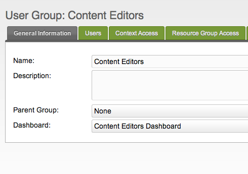

This article describes how to edit a Dashboard, including on how to assign and arrange Widgets for that Dashboard.

First off, find the User Group that you would like to assign the Dashboard to, and edit it. You can do so by "Menu" -> "Access Controls", then right-clicking on the group in the User Groups tree, and clicking "Update User Group".

From there, you can simply click on the "Dashboard" dropdown, and select the Dashboard you want to assign to this User Group. All users in this group that have this group as their Primary Group will load that Dashboard instead of the Default now.

## See Also

1. [Managing Your Dashboard](building-sites/client-proofing/dashboards/managing)
2. [Assigning a Dashboard to a User Group](building-sites/client-proofing/dashboards/usergroups)
3. [Creating a Dashboard Widget](building-sites/client-proofing/dashboards/creating-a-widget)
4. [Dashboard Widget Types](building-sites/client-proofing/dashboards/widget-types)
    1. [Dashboard Widget Type - File](building-sites/client-proofing/dashboards/widget-types/file)
    2. [Dashboard Widget Type - HTML](building-sites/client-proofing/dashboards/widget-types/html)
    3. [Dashboard Widget Type - Inline PHP](building-sites/client-proofing/dashboards/widget-types/inline-php)
    4. [Dashboard Widget Type - Snippet](building-sites/client-proofing/dashboards/widget-types/snippet)
