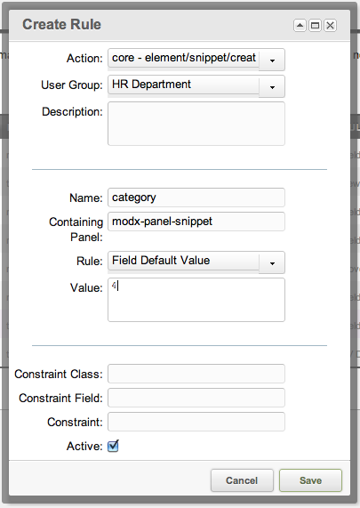

## The Field Default Rule

The Field Default Rule, when set, will automatically set the default value of a field.

This will only work on "create" pages, **not** "update" pages.

## Examples

An example Rule of setting the default Category for a [Snippet](display/revolution20/Snippets "Snippets") for all [Users](display/revolution20/Users "Users") in the User Group HR Department would look like this:



## See Also

``` php
 [[getResources@section? &parents=`122` &context=`revolution`]]
 ```