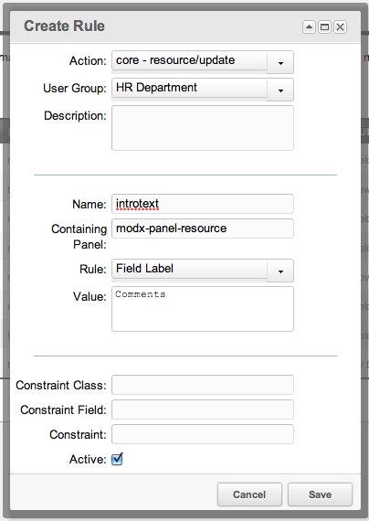

## The Field Label Rule

The Field Label Rule, when set, will change a Label of a field to any text value.

## Examples

An example Rule of changing the introtext's label to "Comments" for the [Users](building-sites/client-proofing/security/users "Users") in the [User Group](building-sites/client-proofing/security/user-groups "User Groups") "Marketing" would look like this:



## See Also

``` php
[[getResources@section? &parents=`123` &context=`revolution`]]
```
