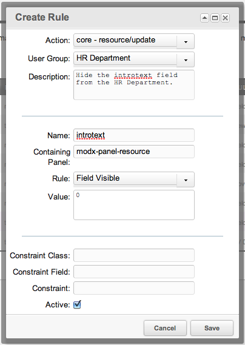

## The Field Visible Rule

The Field Visible Rule, when set, will declare a field "visible" or not to a user.

## Examples

An example Rule of hiding the introtext field from the [Users](building-sites/client-proofing/security/users "Users") in the [User Group](building-sites/client-proofing/security/user-groups "User Groups") "HR Department" would look like this:



## See Also

``` php
[[getResources@section? &parents=`124` &context=`revolution`]]
```
