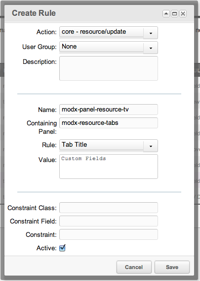

## The Tab Title Rule

The Tab Title Rule will change the title of any Tab.

## Usage

The values for the Rule should be as follows:

- **Name**: The ID of the tab to change.
- **Containing Panel**: The ID of the tabpanel to change.
- **Rule**: Tab Title
- **Value**: The new text to change the tab title to.

For a list of tabs available for each page, see [Form Customization Pages](building-sites/client-proofing/form-customization "Form Customization Pages").

## Examples

An example Rule of changing the title for the Page Settings tab for all [Users](building-sites/client-proofing/security/users "Users") to "Custom Fields" would look like this:



## See Also

``` php
[[getResources@section? &parents=`300` &context=`revolution`]]
```
