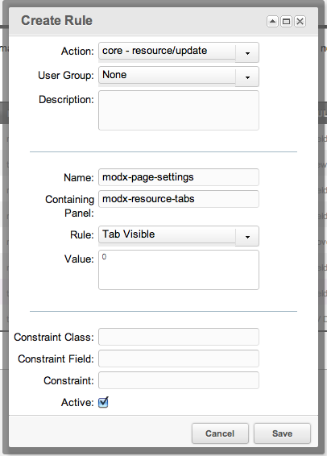

## The Tab Visible Rule

The Tab Visible Rule, if set to 0, will hide a tab from a User.

## Examples

An example Rule of hiding the Page Settings tab for all [Users](building-sites/client-proofing/security/users "Users") would look like this:



## See Also

``` php
[[getResources@section? &parents=`301` &context=`revolution`]]
```
