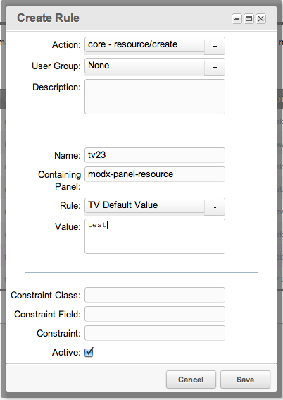

## The TV Default Value Rule

The TV Default Value Rule, if set, will set the default value for a TV.

This only works on "create" Actions, **not** "update" Actions.

## Usage

The values for the Rule should be as follows:

- **Name**: The ID of the TV prefixed with 'tv'; for example, for the TV with ID 23, 'tv23'
- **Containing Panel**: 'modx-panel-resource'
- **Rule**: 'TV Default Value'
- **Value**: The value you want to set as the default.

## Examples

An example Rule of setting the default value for a TV with ID 23 to "test" is:



## See Also

``` php
[[getResources@section? &parents=`313` &context=`revolution`]]
```