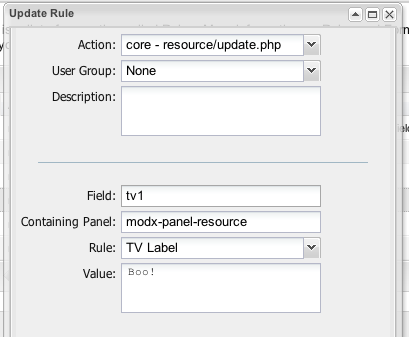

## The TV Title Rule

The TV Title Rule will change the title of a TV.

## Examples

An example Rule of setting the label to "Boo!" for a TV with ID of 1 for all [Users](building-sites/client-proofing/security/users "Users") would look like this:



## See Also

``` php
[[getResources@section? &parents=`314` &context=`revolution`]]
```
