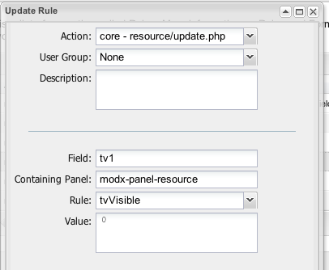

## The TV Visible Rule

The TV Visible Rule, if set to 0, will hide a TV from a User.

## Examples

An example Rule of hiding the a TV with ID of 1 for all [Users](display/revolution20/Users "Users") would look like this:



## See Also

``` php
[[getResources@section? &parents=`315` &context=`revolution`]]
```