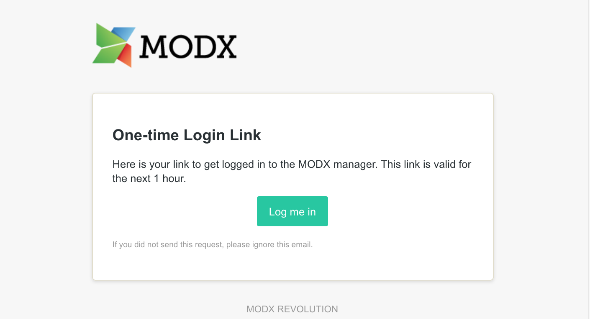

MODX3 has a new feature named "passwordless login", which can be activated by a system setting. Once you have activated that feature, it is no longer needed to enter a password and a username to login. Instead, you simply enter your account's email address, and the system will send you an email with a one-time login link. By clicking on that link you will then be immediately being logged into the manager.

## Benefits of passwordless login

Having the need for a strong password often makes people choose generic pseudo-strong passwords by reusing a proven strong phrase and maybe just adding a number per service. As a site administrator you should not encourage your users to do insecure things. This moves the risk of having an insecure password away from your MODX installation, but of course needs a secure email account for your users. But this is also the case for the traditional username+password login, because this also has the password self-service where you can reset your password via email. 

Additionally, if passwordless login is enabled, no passwords are stored any more in the MODX database. Then there is no more theoretical risk of passwords being stolen by a database breach (regardless of any encryption).

## How to enable passwordless login

In order to activate the passwordless login, you need to set the system setting `passwordless_activated` in the area "Authentication and Security" of the core system settings to "Yes". The next time you login you will be presented the following login screen:

 
Just enter your account's email address and you will receive an email with a
 personal login link.

 
## Configure link expiration

You can configure the expiration time of the login link via the system setting `passwordless_expiration`. By default it is set to 3600 seconds, which should be way enough for everyone to login. If you are paranoid, you can easily set it to a lower value, e.g. 600 to allow usage of the link only for 10 minutes. The validity period will also be shown in the email itself. 

## Additional notes

Be aware that there will be _no error message_ if you enter an unknown email address during login. This is a well-known and intended behavior to prevent user-enumeration attempts.
