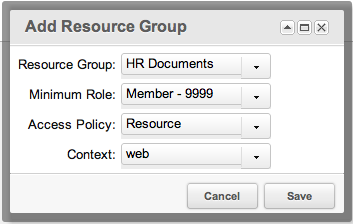
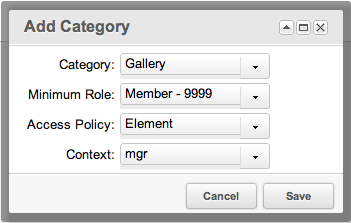
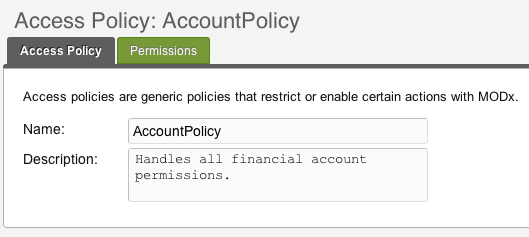
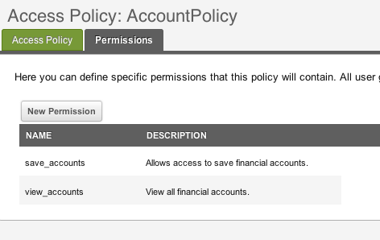

## What is an Access Policy?

An Access Policy is a set of [Permissions](building-sites/client-proofing/security/policies/permissions "Permissions") containing one or many Permissions, as defined in the manager. By default MODX comes with pre-configured Access Policies:

- **Administrator**: Context administration policy with all default permissions.
- **Context Editor**: Context administration policy with limited, content-editing related Permissions, but no publishing Permissions.
- **Context**: A standard Context policy that you can apply when creating Context ACLs for basic read/write and view\_unpublished access within a Context.
- **Element**: MODX Element policy with all attributes.
- **Load Only**: A minimal policy with permission to load an object.
- **Load, List and View**: Provides load, list and view permissions only.
- **Media Source Admin**: Media Source administration policy.
- **Media Source User**: Media Source user policy, with basic viewing and using - but no editing - of Media Sources.
- **Object**: An Object policy with all permissions.
- **Resource**: MODX Resource Policy with all attributes.

If you customize any of the above default Access Policies, duplicate (and rename) them before customizing! If you don't do that all customizations will be lost when updating MODX to a newer version as they get overridden by the setup script.

## Creating and Editing

To create an Access Policy in the manager, navigate to

> Security -> Access Controls -> Access Policies

From there you can add new policies. To edit an Access Policy in the manager, simply right-click the Policy you want to edit.

## Usage

Policies can be used in a myriad of different ways. Here are 3 example usages that come by default in MODX:

### Context Access

Access Policies can be assigned as [Access Control Lists](building-sites/client-proofing/security/policies/acls "ACLs") (ACLs) to a Context and User Group, with a specified Minimum [Role](building-sites/client-proofing/security/roles "Roles"). When done, this means that all the Users in that User Group with at least the Role specified as the Minimum Role can use the Permissions in the Policy in the Context specified in the [ACL](building-sites/client-proofing/security/policies/acls "ACLs").

MODX comes with a default ["Administrator" Policy](building-sites/client-proofing/security/policies/permissions/administrator-policy "Permissions - Administrator Policy") that contains all the [Permissions](building-sites/client-proofing/security/policies/permissions "Permissions") one would use in a Context ACL. It's best to duplicate this policy when creating a custom access policy for restricting manager users.

### Resource Group Access

They can also be Resource ACLs, that limit access to Resources based on Roles and Resource Groups. MODX comes packaged with a default ["Resource" Policy](building-sites/client-proofing/security/policies/permissions/resource-policy "Permissions - Resource Policy") that contains all the basic Permissions one would use in a Resource Group ACL.

An example would be to assign the "Resource" policy to a Resource Group called 'HR Documents'. Then, you would give a User Group called "HR Department" access to this Resource Group via the Resource ACL:

This would restrict all Resources in the "HR Documents" Resource Group to Users only in the "HR Department" group.

### Element Category Access

Elements can be restricted from view by ACLs on Categories. For example, if you had a User Group called 'Developers', and wanted Users in that group to be the only Group that could see Elements in the Category 'Gallery', you would create an ACL like such, in the "Element Category Access" tab when editing the User Group:

This would allow only Users in the "Developers" User Group access to see Elements in the "Gallery" Category.

## Examples

Here's an example custom policy:

and its permissions:

Any User that had access to this Policy would have the permissions 'view\_accounts' and 'save\_accounts'.

## See Also

1. [Users](building-sites/client-proofing/security/users)
2. [User Groups](building-sites/client-proofing/security/user-groups)
3. [Resource Groups](building-sites/client-proofing/security/resource-groups)
4. [Roles](building-sites/client-proofing/security/roles)
5. [Policies](building-sites/client-proofing/security/policies)
   1. [Permissions](building-sites/client-proofing/security/policies/permissions)
        1. [Permissions - Administrator Policy](building-sites/client-proofing/security/policies/permissions/administrator-policy)
        2. [Permissions - Resource Policy](building-sites/client-proofing/security/policies/permissions/resource-policy)
   2. [ACLs](building-sites/client-proofing/security/policies/acls)
   3. [PolicyTemplates](building-sites/client-proofing/security/policies/policytemplates)
6. [Security Tutorials](building-sites/client-proofing/security/security-tutorials)
   1. [Giving a User Manager Access](building-sites/client-proofing/security/security-tutorials/giving-a-user-manager-access)
   2. [Making Member-Only Pages](building-sites/client-proofing/security/security-tutorials/making-member-only-pages)
   3. [Creating a Second Super Admin User](building-sites/client-proofing/security/security-tutorials/creating-a-second-super-admin-user)
   4. [Restricting an Element from Users](building-sites/client-proofing/security/security-tutorials/restricting-an-element-from-users)
   5. [More on the Anonymous User Group](building-sites/client-proofing/security/security-tutorials/more-on-the-anonymous-user-group)
7. [Hardening MODX Revolution](getting-started/maintenance/securing-modx)
8. [Troubleshooting Security](building-sites/client-proofing/security/troubleshooting-security)
   1. [Resetting a User Password Manually](building-sites/client-proofing/security/troubleshooting-security/resetting-a-user-password-manually)
