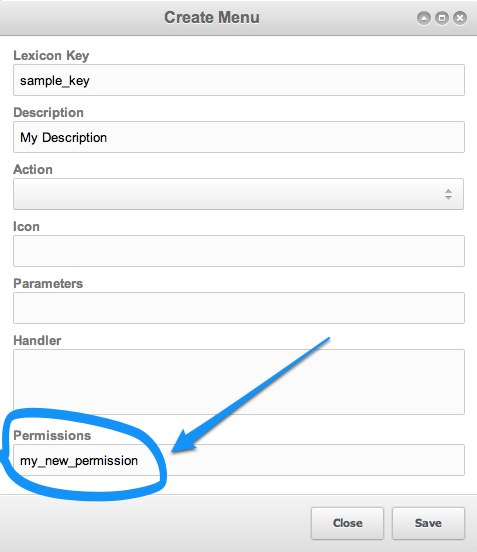

## The Administrator Policy

This policy is packaged into MODX and is given to users on the 'mgr' context who want to have full access to managing MODX content.

## Default Permissions

| Name                        | Description of Access                                                                                                            |
| --------------------------- | -------------------------------------------------------------------------------------------------------------------------------- |
| about                       | The About page.                                                                                                                  |
| access\_permissions         | Any Access Permission-related pages and actions.                                                                                 |
| action\_ok                  |
| actions                     | The [Actions](extending-modx/menus/actions "Actions and Menus") page.                                                            |
| change\_password            | User can change their user password.                                                                                             |
| change\_profile             | User can change their profile.                                                                                                   |
| content\_types              | The [Content Types](building-sites/resources/content-types "Content Types") page.                                                |
| create                      | Basic "create" access on objects.                                                                                                |
| credits                     | View the Credits page.                                                                                                           |
| customize\_forms            | View and manage the [Customizing the Manager](building-sites/client-proofing/form-customization "Customizing the Manager") page. |
| database                    | The System Info page                                                                                                             |
| database\_truncate          | The ability to truncate a database table.                                                                                        |
| delete\_category            | To delete or remove any Categories.                                                                                              |
| delete\_chunk               | To delete or remove any [Chunks](building-sites/elements/chunks "Chunks").                                                       |
| delete\_context             | To delete or remove any [Contexts](building-sites/contexts "Contexts").                                                          |
| delete\_document            | To delete or remove any [Resources](building-sites/resources "Resources").                                                       |
| delete\_eventlog            | To empty the Event Log.                                                                                                          |
| delete\_plugin              | To delete or remove any [Plugins](extending-modx/plugins "Plugins").                                                             |
| delete\_snippet             | To delete or remove any [Snippets](extending-modx/snippets "Snippets").                                                          |
| delete\_template            | To delete or remove any [Templates](building-sites/elements/templates "Templates").                                              |
| delete\_tv                  | To delete or remove any [Template Variables](building-sites/elements/template-variables "Template Variables").                   |
| delete\_role                | To delete or remove any [Roles](building-sites/client-proofing/security/roles "Roles").                                          |
| delete\_user                | To delete or remove any [Users](building-sites/client-proofing/security/users "Users").                                          |
| edit\_category              | To edit any Categories.                                                                                                          |
| edit\_chunk                 | To edit any [Chunks](building-sites/elements/chunks "Chunks").                                                                   |
| edit\_context               | To edit any [Contexts](building-sites/contexts "Contexts").                                                                      |
| edit\_document              | To edit any [Resources](building-sites/resources "Resources").                                                                   |
| edit\_locked                | Allows a user to override a lock and edit a locked Resource.                                                                     |
| edit\_parser                |
| edit\_plugin                | To edit any [Plugins](extending-modx/plugins "Plugins").                                                                         |
| edit\_role                  | To edit any [Roles](building-sites/client-proofing/security/roles "Roles").                                                      |
| edit\_snippet               | To edit any [Snippets](extending-modx/snippets "Snippets").                                                                      |
| edit\_template              | To edit any [Templates](building-sites/elements/templates "Templates").                                                          |
| edit\_tv                    | To edit any [Template Variables](building-sites/elements/template-variables "Template Variables").                               |
| edit\_user                  | To edit any [User](building-sites/client-proofing/security/users "Users").                                                       |
| element\_tree               | The ability to view the Elements Tree on the left nav.                                                                           |
| empty\_cache                | To empty the site cache.                                                                                                         |
| export\_static              | To export the site to static HTML.                                                                                               |
| file\_manager               | To use the file manager, including creating/deleting files.                                                                      |
| file\_tree                  | To view the Files Tree on the left nav.                                                                                          |
| flush\_sessions             | Can flush Sessions across the site.                                                                                              |
| frames                      | To use the MODX Manager UI at all.                                                                                               |
| help                        | To view the Help page.                                                                                                           |
| home                        | To view the Welcome page.                                                                                                        |
| import\_static              | To view or use the Import pages.                                                                                                 |
| languages                   | To edit or view Lexicon Languages.                                                                                               |
| lexicons                    | To edit or view Lexicons and [Internationalization](extending-modx/internationalization "Internationalization").                 |
| list                        | Basic permission to "list" any object. List means to get a collection of objects.                                                |
| load                        | Basic permission to "load" any object, or be able to return it as an instance at all.                                            |
| logout                      | To be able to logout as a user.                                                                                                  |
| logs                        | To view the logs, such as error and manager logs.                                                                                |
| menus                       | To edit or save any top Menu items.                                                                                              |
| messages                    | To send or view any personal Messages.                                                                                           |
| namespaces                  | To edit or view [Namespaces](extending-modx/namespaces "Namespaces").                                                            |
| new\_category               | To create a new Category.                                                                                                        |
| new\_chunk                  | To create a new [Chunk](building-sites/elements/chunks "Chunks").                                                                |
| new\_context                | To create a new [Context](building-sites/contexts "Contexts").                                                                   |
| new\_document               | To create a new [Resources](building-sites/resources "Resources").                                                               |
| new\_plugin                 | To create a new [Plugin](extending-modx/plugins "Plugins").                                                                      |
| new\_role                   | To create a new [Role](building-sites/client-proofing/security/roles "Roles").                                                   |
| new\_snippet                | To create a new [Snippet](extending-modx/snippets "Snippets").                                                                   |
| new\_template               | To create a new [Template](building-sites/elements/templates "Templates").                                                       |
| new\_tv                     | To create a new [Template Variable](building-sites/elements/template-variables "Template Variables").                            |
| new\_user                   | To create a new [User](building-sites/client-proofing/security/users "Users").                                                   |
| packages                    | To use any Transport Packages in the [Package Management](extending-modx/transport-packages "Package Management") system.        |
| property\_sets              | To view and edit [Properties and Property Sets](building-sites/properties-and-property-sets "Properties and Property Sets").     |
| providers                   | To view and edit [Providers](building-sites/extras/providers "Providers") across the site.                                       |
| publish\_document           | To publish or unpublish any Resource.                                                                                            |
| purge\_deleted              | To empty the Recycle Bin.                                                                                                        |
| remove                      | Basic permission to remove any object.                                                                                           |
| remove\_locks               | To remove all existing Locks throughout the site.                                                                                |
| resource\_tree              | To view the Resource Tree in the left nav.                                                                                       |
| save                        | Basic save permission for any object.                                                                                            |
| save\_category              | To save any Categories.                                                                                                          |
| save\_chunk                 | To save any [Chunks](building-sites/elements/chunks "Chunks").                                                                   |
| save\_context               | To save any [Contexts](building-sites/contexts "Contexts").                                                                      |
| save\_document              | To save any [Resources](building-sites/resources "Resources").                                                                   |
| save\_plugin                | To save any [Plugins](extending-modx/plugins "Plugins").                                                                         |
| save\_role                  | To save any [Roles](building-sites/client-proofing/security/roles "Roles").                                                      |
| save\_snippet               | To save any [Snippets](extending-modx/snippets "Snippets").                                                                      |
| save\_template              | To save any [Templates](building-sites/elements/templates "Templates").                                                          |
| save\_tv                    | To save any [Template Variables](building-sites/elements/template-variables "Template Variables").                               |
| save\_user                  | To save any [User](building-sites/client-proofing/security/users "Users").                                                       |
| search                      | To use the Search page.                                                                                                          |
| settings                    | To view and edit any System Settings.                                                                                            |
| steal\_locks                | To "steal" locks, overriding a current lock on a document.                                                                       |
| unlock\_element\_properties | To be able to edit the default properties for any Element.                                                                       |
| view                        | Basic permission to "view" any object.                                                                                           |
| view\_category              | To view any Categories.                                                                                                          |
| view\_chunk                 | To view any [Chunks](building-sites/elements/chunks "Chunks").                                                                   |
| view\_context               | To view any [Contexts](building-sites/contexts "Contexts").                                                                      |
| view\_document              | To view any [Resources](building-sites/resources "Resources").                                                                   |
| view\_eventlog              | To view the Event Log.                                                                                                           |
| view\_offline               |
| view\_plugin                | To view any [Plugins](extending-modx/plugins "Plugins").                                                                         |
| view\_role                  | To view any [Roles](building-sites/client-proofing/security/roles "Roles").                                                      |
| view\_snippet               | To view any [Snippets](extending-modx/snippets "Snippets").                                                                      |
| view\_template              | To view any [Templates](building-sites/elements/templates "Templates").                                                          |
| view\_tv                    | To view any [Template Variables](building-sites/elements/template-variables "Template Variables").                               |
| view\_unpublished           | To view any unpublished [Resources](building-sites/resources "Resources").                                                       |
| view\_user                  | To view any [User](building-sites/client-proofing/security/users "Users").                                                       |
| workspaces                  | To utilize [Package Management](extending-modx/transport-packages "Package Management").                                         |

## Custom Permissions

If you have created your own actions and menu items (e.g. if you have created a [Custom Manager Page](extending-modx/custom-manager-pages "Custom Manager Pages Tutorial")), then you can define custom permission items when you create the menu item (System --> Actions --> Create Menu) that correspond to permissions listed here.

## See Also

1. [Permissions - Administrator Policy](building-sites/client-proofing/security/policies/permissions/administrator-policy)
2. [Permissions - Resource Policy](building-sites/client-proofing/security/policies/permissions/resource-policy)
