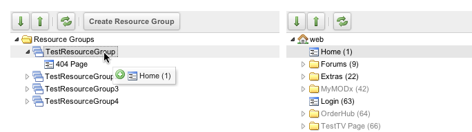
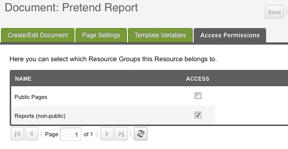

## What is a Resource Group?

A Resource Group is a collection of Resources, e.g. "Members Only" pages. When coupled with User Groups, Resource Groups are used to restrict access to pages and resources. A MODX page can belong to multiple resource groups.

## Usage

You can manage the pages in a Resource Group in two different ways:

### Option 1

Go to Security -> Resource Groups. From there you will see a list of all defined Resource Groups and a tree of Resources.

Drag the Resources from the right tree directly into Resource Groups in the left tree:

### Option 2

When you are editing a Resource directly, click on its "Access Permissions" tab, and check which Resource Groups it is a member of.

## See Also

1. [Users](building-sites/client-proofing/security/users)
2. [User Groups](building-sites/client-proofing/security/user-groups)
3. [Resource Groups](building-sites/client-proofing/security/resource-groups)
4. [Roles](building-sites/client-proofing/security/roles)
5. [Policies](building-sites/client-proofing/security/policies)
    1. [Permissions](building-sites/client-proofing/security/policies/permissions)
        1. [Permissions - Administrator Policy](building-sites/client-proofing/security/policies/permissions/administrator-policy)
        2. [Permissions - Resource Policy](building-sites/client-proofing/security/policies/permissions/resource-policy)
    2. [ACLs](building-sites/client-proofing/security/policies/acls)
    3. [PolicyTemplates](building-sites/client-proofing/security/policies/policytemplates)
6. [Security Tutorials](building-sites/client-proofing/security/security-tutorials)
    1. [Giving a User Manager Access](building-sites/client-proofing/security/security-tutorials/giving-a-user-manager-access)
    2. [Making Member-Only Pages](building-sites/client-proofing/security/security-tutorials/making-member-only-pages)
    3. [Creating a Second Super Admin User](building-sites/client-proofing/security/security-tutorials/creating-a-second-super-admin-user)
    4. [Restricting an Element from Users](building-sites/client-proofing/security/security-tutorials/restricting-an-element-from-users)
    5. [More on the Anonymous User Group](building-sites/client-proofing/security/security-tutorials/more-on-the-anonymous-user-group)
7. [Hardening MODX Revolution](getting-started/maintenance/securing-modx)
8. [Troubleshooting Security](building-sites/client-proofing/security/troubleshooting-security)
    1. [Resetting a User Password Manually](building-sites/client-proofing/security/troubleshooting-security/resetting-a-user-password-manually)
