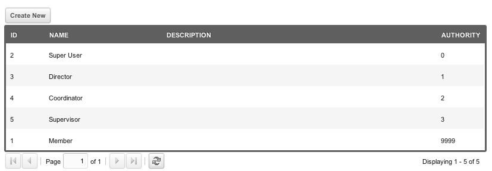
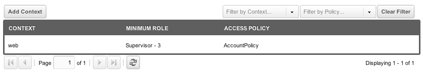

## What is a Role?

A role is a position or status held within a certain situation. In MODx, it can be used to group Users into a position or status within a User Group, e.g. "Editor" or "Front-end Read Only".

Roles in MODx use an integer value called "Authority". **Lower numbers represent a stronger authority.** E.g. a Role with Authority 10 will inherit any and all Group Policies assigned to itself and to any roles defined with Authority 11, but a user Role with Authority 11 does NOT inherit any of the Group Policies from Role 10.

Be sure you clarify your language when talking about Authority because this inverse relationship can lead to some confusing sentences.

It helps to think of "Authority" as ordinal numbers: first, second, third, etc. **Authority=1** is the first authority and trumps **Authority=2** (i.e. the second authority).

You should generally avoid duplicate authority numbers.

## Usage

One common example is to create Roles that mimic a basic employee position structure. Let's say we create the following Roles and Authority levels:

- Administrator - 0
- Director - 1
- Coordinator - 2
- Supervisor - 3
- Employee - 9999

We can then create a User Group called "HR Department". Within that User Group, we'll assign Users to those Roles (you can have multiple Users per Role, as well).

Now, let's say John has a Role of Coordinator. Mark has a Role of Supervisor. We're going to give Mark's "HR Deparment" User Group an Access Policy (which is a set of Permissions) called "AccountPolicy" that has the following Access Permissions in it:

- view\_accounts
- save\_accounts

We've assigned this Policy to the "web" context for our User Group "HR Department". We then set its Minimum Role value to "Supervisor":

This means that Mark has these Permissions, since he's in the User Group, and has at least the Role of "Supervisor" (which is the Role he has, specifically).

But this **also** means that John has these Permissions as well, since he is a "Coordinator" which has a stronger Authority level than "Supervisor". So, John as Coordinator has "inherited" the Permissions than Mark had as Supervisor.

## See Also

1. [Users](building-sites/client-proofing/security/users)
2. [User Groups](building-sites/client-proofing/security/user-groups)
3. [Resource Groups](building-sites/client-proofing/security/resource-groups)
4. [Roles](building-sites/client-proofing/security/roles)
5. [Policies](building-sites/client-proofing/security/policies)
    1. [Permissions](building-sites/client-proofing/security/policies/permissions)
        1. [Permissions - Administrator Policy](building-sites/client-proofing/security/policies/permissions/administrator-policy)
        2. [Permissions - Resource Policy](building-sites/client-proofing/security/policies/permissions/resource-policy)
    2. [ACLs](building-sites/client-proofing/security/policies/acls)
    3. [PolicyTemplates](building-sites/client-proofing/security/policies/policytemplates)
6. [Security Tutorials](building-sites/client-proofing/security/security-tutorials)
    1. [Giving a User Manager Access](building-sites/client-proofing/security/security-tutorials/giving-a-user-manager-access)
    2. [Making Member-Only Pages](building-sites/client-proofing/security/security-tutorials/making-member-only-pages)
    3. [Creating a Second Super Admin User](building-sites/client-proofing/security/security-tutorials/creating-a-second-super-admin-user)
    4. [Restricting an Element from Users](building-sites/client-proofing/security/security-tutorials/restricting-an-element-from-users)
    5. [More on the Anonymous User Group](building-sites/client-proofing/security/security-tutorials/more-on-the-anonymous-user-group)
7. [Hardening MODX Revolution](getting-started/maintenance/securing-modx)
8. [Security Standards](administering-your-site/security/security-standards)
9. [Troubleshooting Security](building-sites/client-proofing/security/troubleshooting-security)
    1. [Resetting a User Password Manually](building-sites/client-proofing/security/troubleshooting-security/resetting-a-user-password-manually)