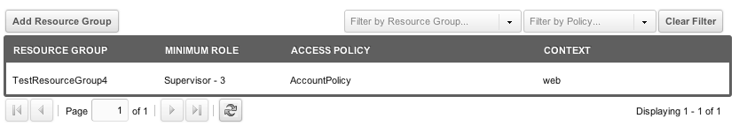

## What is a User Group?

 User Groups are used by MODX to define permissions. Unlike some CMS's, in MODX a User can belong to _multiple_ User Groups.

## Usage

 Permissions in MODX are granted to _User Groups_, not to individual users, so a User must belong to at least one User Group in order to have any permissions. In other words, what a User can or cannot do depends on which User Groups the User belongs to. In other CMS's this concept is sometimes referred to as a "role".

 To edit a User Group's permissions, you need to go to Admin (the little gear icon) -> Access Control Lists, then right-click an existing User Group to update it, or create a new User Group.

 A User Group can define access permissions to four areas:

- **Context Access** -- this is where you would define access to the manager or to a front-end login portal.
- **Resource Group Access** -- this is where you would define access to a Resource Group
- **Element Category Access** -- this is where you could limit access to only certain Chunks or to only certain fields within a resource.
- **Media Source Access** -- this is where you could limit access to certain folders on the filesystem or S3 buckets.

## Managing Members

 To add or remove Users to User Groups you can edit the User Groups when you edit a single User (Manage -> Users) then right-click the User you want to edit and view the "Access Permissions" tab.

 Another way to control this is by going to Admin -> Access Control Lists. From there you will see a tree of User Groups and their respective Users. You can assign a User to a User Group by right-clicking on the User Group and either:

- Adding the User via the context menu item
- Editing the User Group and adding a User on the grid there

### Assigning Policies

 A quick clarification on which policies to use:

- Policies assigned on the Context Access tab should be based on the standard Administrator policy.
- Policies assigned on the Resource Group Access tab should be based on the standard Resource policy.
- Policies assigned on the Element Category Access tab should be based on the standard Element policy.

## Roles in User Groups

 Users can have specific Roles within a User Group, should you choose. They can also exist in the User Group without a Role. Roles allow you to fine-tune your permissions more than in previous MODx versions.

 Say you want to only allow Supervisors in the "HR Department" User Group access to some Resources; no problem. Just create a Role called "Supervisor", set its authority to some number below 9999 (let's say 3), and then add in the Users to the User Group "HR Department" (via the User Group editing screen), setting any would-be supervisors to the Supervisor Role.

 Then, you'll just add a Resource Policy (the packaged-in-with-modx one will do fine) to the Resource Group you want to restrict access to. It will look something like this:

 

 And you've got a role-based access permission! This specific ACL will limit all Resources (aka Documents) in the web context and in the resource group "TestResourceGroup4" to only Users in the "HR Department" User Group with at least a Role of Supervisor. Roles with lower authority numbers would also inherit access - say you had a Coordinator Role with an authority of 2; Users in this User Group would have access to this ACL as well.

### Assigning User Groups and Roles via the MODX API

 When working with the modUser object in the MODX API, you can assign access permissions via modUser::[joinGroup](http://api.modx.com/revolution/2.1/_model_modx_moduser.class.html#%5CmodUser::joinGroup()). Using this method, you can add a user directly to a User Group, and optionally assign a Role.

``` php
<?php
// Get modUser object
$user = $modx->getObject('modUser', array('username' => $username));
if( $user ){
    // Assign new user to User Group / Role
    $user->joinGroup('UserGroupNameOrId','OptionalRoleNameOrId');}
?>
```

## See Also

1. [Users](building-sites/client-proofing/security/users)
2. [User Groups](building-sites/client-proofing/security/user-groups)
3. [Resource Groups](building-sites/client-proofing/security/resource-groups)
4. [Roles](building-sites/client-proofing/security/roles)
5. [Policies](building-sites/client-proofing/security/policies)
    1. [Permissions](building-sites/client-proofing/security/policies/permissions)
        1. [Permissions - Administrator Policy](building-sites/client-proofing/security/policies/permissions/administrator-policy)
        2. [Permissions - Resource Policy](building-sites/client-proofing/security/policies/permissions/resource-policy)
    2. [ACLs](building-sites/client-proofing/security/policies/acls)
    3. [PolicyTemplates](building-sites/client-proofing/security/policies/policytemplates)
6. [Security Tutorials](building-sites/client-proofing/security/security-tutorials)
    1. [Giving a User Manager Access](building-sites/client-proofing/security/security-tutorials/giving-a-user-manager-access)
    2. [Making Member-Only Pages](building-sites/client-proofing/security/security-tutorials/making-member-only-pages)
    3. [Creating a Second Super Admin User](building-sites/client-proofing/security/security-tutorials/creating-a-second-super-admin-user)
    4. [Restricting an Element from Users](building-sites/client-proofing/security/security-tutorials/restricting-an-element-from-users)
    5. [More on the Anonymous User Group](building-sites/client-proofing/security/security-tutorials/more-on-the-anonymous-user-group)
7. [Hardening MODX Revolution](getting-started/maintenance/securing-modx)
8. [Security Standards](administering-your-site/security/security-standards)
9. [Troubleshooting Security](building-sites/client-proofing/security/troubleshooting-security)
    1. [Resetting a User Password Manually](building-sites/client-proofing/security/troubleshooting-security/resetting-a-user-password-manually)
