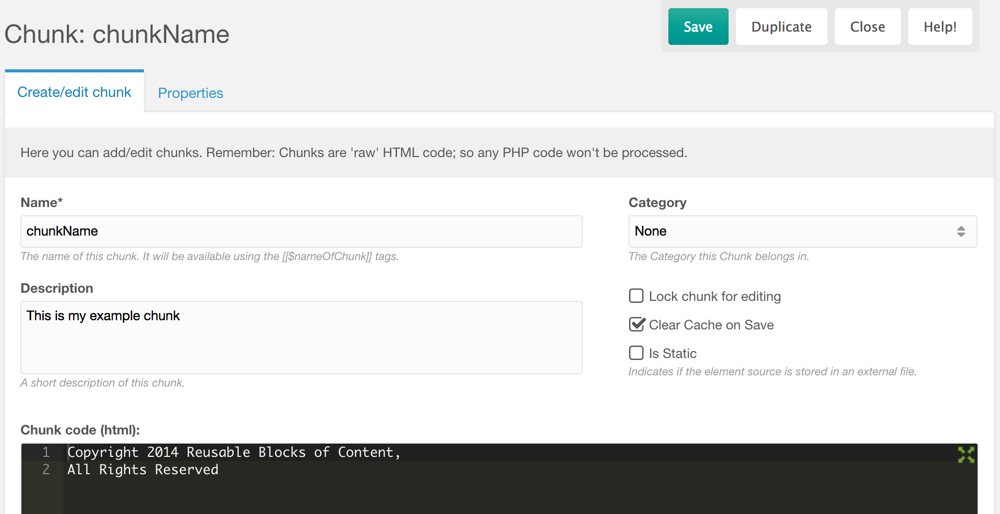

Chunks are bits of static text which you can reuse across your site, similar in function to include files or "blocks" in other content management systems. Common examples of Chunks might be your contact information or a copyright notice. Although Chunks cannot contain any logic directly, they can however contain calls to [Snippets](extending-modx/snippets "Snippets"), which are executable bits of PHP code which produce dynamic output.

## Create

Before you can use a Chunk, you must first create and name one by pasting text into the MODx manager (Elements --> Chunks --> New Chunk):



## Usage

To use the Chunk, you reference it by name in your templates or in your page content.

``` php
[[$chunkName]]
```

That reference is then replaced with the contents of the Chunk.

You can also pass properties to a Chunk. Say you had a chunk named 'intro' with the contents:

> Hello, `[[+name]]`. You have `[[+messageCount]]` messages.

You could fill those values with:

``` php
[[$intro? &name=`George` &messageCount=`12`]]
```

Which would output:

> Hello, George. You have 12 messages.

You could even take it one step further, by adding a [Template Variable](building-sites/elements/template-variables "Template Variables") that allows the user to specify their name per Resource:

``` php
[[!$intro? &name=`[[*usersName]]` &messageCount=`[[*messageCount]]`]]
```

or in the Chunk itself:

``` php
Hello, [[*usersName]]. You have [[*messageCount]] messages.
```

## Processing Chunk via the API

Chunks are also frequently used to format the output of Snippets. A Chunk can be processed from a Snippet using the process() function; for example, given the following Chunk named 'rowTpl':

``` php
<tr class="[[+rowCls]]" id="row[[+id]]">
<td>[[+pagetitle]]</td>
<td>[[+introtext]]</td>
</tr>
```

the following Snippet code retrieves it and processes it with an array of properties for all published Resources, and returns formatted results as a table, setting the class to "alt" if for even rows:

``` php
$resources = $modx->getCollection('modResource',array('published' => true));
$i = 0;
$output = '';
foreach ($resources as $resource) {
  $properties = $resource->toArray();
  $properties['rowCls'] = $i % 2 ? '' : 'alt';

  $output .= $modx->getChunk('rowTpl',$properties);
  $i++;
}
return '<table><tbody>'.$output.'</tbody></table>';
```

### Modifying a Chunk Via the API

Chunks can also be manipulated by the MODx API:

``` php
<?php
/* create a new chunk, give it some content and save it to the database */
$chunk = $modx->newObject('modChunk');
$chunk->set('name','NewChunkName');
$chunk->setContent('<p>This is my new chunk!</p>');
$chunk->save();

/* get an existing chunk, modify the content and save changes to the database */
$chunk = $modx->getObject('modChunk', array('name' => 'MyExistingChunk'));
if ($chunk) {
    $chunk->setContent('<p>This is my existing chunks new content!</p>');
    $chunk->save();
}

/* get an existing chunk and delete it from the database */
$chunk = $modx->getObject('modChunk', array('name' => 'MyObsoleteChunk'));
if ($chunk) $chunk->remove();
?>
```

## See Also

- [modChunk](extending-modx/core-model/modchunk "modChunk")
