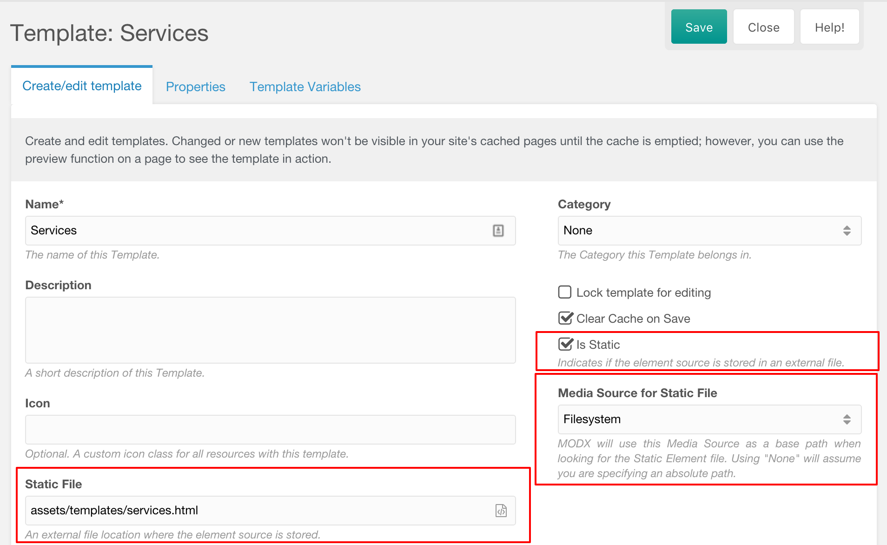

Since MODX Revolution 2.2 you can create Static Elements to make managing your elements easier. This feature is available for all elements, including Templates, Chunks, Snippets and Plugins.

A static element is an element which gets its content from a file. When edited via the manager, the file will get updated. Similarly, when you edit the file via an IDE, it will get updated in MODX the next time the element is requested.

## Creating a Static Element

To create an element as a static element, simply check the _Is Static_ checkbox, select a Media Source, and add the path to the file relative to that media source to the _Static File_ input. You can also click the icon in the _Static File_ input to open the MODX Browser to select the file, rather than entering it manually.

This process is the same for all types of elements.

### Creating a Static Element without a Media Source

Alternatively, you can create a static element and select `None` as the Media Source. In this case, you can add a path relative to the MODX core components path (`MODX_CORE_PATH . 'components/'`) in the _Static File_ input, or you can create a system setting with the key `element_static_path` which will set the location your paths will be relative to.

## Files vs. Database

Please be aware that MODX still stores the contents in the database as well, in order for the element to be processed normally. MODX only checks the contents of the file when the element is requested uncached, so be sure to clear the cache while developing. For this reason you might find static elements to be most useful when working on uncached snippets or plugins, and slightly less useful on templates and chunks.

To improve the editing experience with static elements, there are several Extras available that can help automatically create the elements in the MODX database, or that automatically clear the cache for you.

## Automatic static elements creation

As of MODX 2.7 it is possible to automate the process of generating static elements in the core. It takes away the manual steps of creating a static element, such as marking an element as static, selecting your static elements media source and it automatically generates the filepath name for your static file.

When an element is removed or renamed, the associated file is removed as well.

### Setting up automatic static elements

1. Go to System > System Settings. Select the Static Elements topic.
2. Turn on automating static elements for each element type you want to use automate the static elements workflow for. For example, enable the `static_elements_automate_snippets` setting to use it for snippets, and `static_elements_automate_chunks` to use it for chunks.
3. Select the default media source to use for static elements in the `static_elements_default_mediasource` setting.
4. Provide your static elements basepath, which is where the files will go, in the `static_elements_basepath` setting. For example: `components/static/elements/`.
5. Optionally select a default category to use for your static elements in the `static_elements_default_category` setting.

### File structure

Files will be created at the path: `{static_elements_basepath}/{type}/{category}/{filename}.{extension}` within the specified media source. For example: `components/site/elements/chunks/html/footer.chunk.tpl`.
