There are a number of built-in template variable (TV) types. Be aware that:

- Built-in input types not found on this page are deprecated or have been removed and may not work in the current version of MODX.
- For TV types containing user-defined, selectable lists (listbox, checkbox, radio, etc.), it's best to enter list definitions having multiple values on a single line with no carriage returns.

## Input Types

### Auto-Tag (autotag)

<details>
    <summary><em>JSON Input Options Template</em></summary>

```json
{
    "allowBlank": "true",
    "parent_resources": ""
}
```

</details>
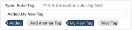

This TV type is a compound field with a text field for tag entry and rows of clickable pre-existing tags. It can be useful for blog content, Resources that can belong to multiple categories, or anytime you need a list of tags that have been used before. Every time you edit or create a Resource with access to an Auto-Tag TV, you will see rows of tags that have been used before. You can easily click on these tags to assign them to the current Resource.

To make Auto-Tag TVs useful in the front end, you will need to set the [output type](building-sites/elements/template-variables/output-types) to “Delimiter” and specify a delimiter of your choice, and/or use an output filter to present them in the way you prefer. 

#### Linking Tags to Resources

To output tags so each one links to a certain Resource and passes the tag in the URL (as a GET parameter), you can use an output filter (Snippet). For example:

```php
<?php

// In case the TV is empty
if ($input == '') {
    return 'Error';
}

$output = [];

// Based on a delimiter of "," this will split each one up in an array
$tags = array_map('trim', explode(',', $input));

// Loop through tags, adding each to an output array with a link to Resource 9 and the tag as a get parameter
foreach ($tags as $key => $value) {
    $url = $modx->makeurl(9, '', ['tag' => $value]);
    $output[] = <<<LINK
    <a href="{$url}">{$value}</a>
    LINK;
}

// Convert the output array to a string
return implode(', ', $output);

```

### Check Box (checkbox)

<details>
    <summary><em>JSON Input Options Template</em></summary>

```json
{
    "allowBlank": "true",
    "displayAsSwitch": "false",
    "columns": "1",
    "columnDirection": "vertical",
    "columnWidth": "medium",
    "columnWidth": "false"
}
```

</details>
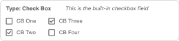

This TV type renders one or more checkbox fields based on a list of options you define.

#### Single Checkbox

The most basic usage of this type of field is a single checkbox, often used for confirmation of some condition. Use the following sample configuration to control the checkbox’s initial state:

| Config Field | Value <br>(default checked) | Value <br>(default unchecked) |
| ---- | ---- | ---- |
| Checkbox Options | `My Option==1` | `My Option==1` |
| Default Option(s) | `1` | `0` |
|||


Although the values of `1` and `0` are a natural choice for this type of field, any values can be used. As long as the value following the `==` matches the *Default Option(s)* value, the checkbox will be checked. 

#### Multiple Checkboxes

If you want to set default of a check box template variable to multiple values, you have to separate the values with the "||" delimiter.

##### Basic Definition

In their simplest form, lists are defined using labels separated by double-pipes. In this format, the label is also the value. Using the following sample configuration, three checkboxes would be rendered with “Option B” checked by default.

| Config Field | Value |
| ---- | ---- |
| Checkbox Options | `Option A\|\|Option B\|\|Option C` |
| Default Option(s) | `Option B` |
|||

##### Label==Value Definition (with multiple default selections)

You can distinguish between labels and values using double-equals (`==`) and between each option using double-pipes (`||`). Using the following sample configuration, three checkboxes would be rendered with both “Option A” and “Option C” checked by default.

| Config Field | Value |
| ---- | ---- |
| Checkbox Options | `Option A==1\|\|Option B==2\|\|Option C==3` |
| Default Option(s) | `1\|\|3` |
|||

##### Dynamic Definition (using mySQL query)

| Config Field | Value |
| ---- | ---- |
| Checkbox Options | `@SELECT pagetitle, id FROM modx_site_content WHERE parent=35` |
| Default Option(s) | `(empty)` (no default) |
|||

##### Manually-Defined Options


```php
option1==value1||option2==value2
```

##### Dynamically-Defined Options

The Check Box input type allows multiple checkboxes to be displayed with a single TV. Set input option values in the `option1==value1||option2==value2` format. To declare default checked checkboxes, supply the default value field with the option names, delimited by two pipes (||). You can enter a [@SELECT](building-sites/elements/template-variables/bindings/select-binding "SELECT Binding") statement for your **Checkbox Options** to generate items from your database, for example: 

```sql
@SELECT pagetitle, id FROM modx_site_content WHERE parent=35
```

If you are using multiple checkboxes like this, you will probably need to set the **Output Type** to "Delimiter" (*e.g.*, a comma) so you can distinguish the values contained in each checkbox.


### Date (date)

<details>
    <summary><em>JSON Input Options Template</em></summary>

```json
{
    "allowBlank": "true",
    "disabledDates": "",
    "disabledDays": "",
    "minDateValue": "",
    "minTimeValue": "",
    "maxDateValue": "",
    "maxTimeValue": "",
    "startDay": "0",
    "timeIncrement": "15",
    "hideTime": "false"
}
```

</details>
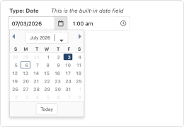

This TV type provides a picker widget, allowing you to set a date and/or a time.

If you’d like your TV to have a specific date selected by default, you can choose from MODX’s preset options or enter a custom option in the *Default Date and Time* field.

<hr>

#### Preset Relative Date Options

| Keyword | Result                                                                                 |
| ------------- | ---------------------------------------------------------------------------------------- |
| `yesterday`   | Displays the day before todays date, time 12:00pm                                        |
| `today`       | Displays todays date, time 12:00pm                                                       |
| `now`         | Displays todays date, current time                                                       |
| `tomorrow`    | Displays the day after todays date, time 12:00pm                                         |

<br>

#### Sample Custom Date Options

| Value | Result                                                                                 |
| ------------- | ---------------------------------------------------------------------------------------- |
| `+X`          | X-hours BACK from the current time <br>(*e.g.*, `+72` means 3 days ago) |
| `-X`          | X-hours IN THE FUTURE from the current time <br>(*e.g.*, `-72` means 3 days from now)   |
| `YYYY-MM-DD HH:MM`          | Using this exact format, selects a specific date and time <br>(*e.g.*, `2026-07-01 14:00` selects July 1, 2026 at 2 pm)   |

<hr>
<br>

Be careful when using the `+X` and `-X` patterns: While intuitively “-” would represent going back in time and “+” going forward, this is not the case. This is due to the date/time value being calulated using this basic fixed mathematical expression:

```
Base Time (now) - Differential Value (X)
```

So using basic math, to add 72 hours to the *Base Time* you need to plug a negative *Differential Value* into the equation, *i.e.*:

```
Base Time - (-72)
```

Conversely, to subtract 72 hours from the *Base Time* you need to plug a positive *Differential Value* into the equation, *i.e.*:

```
Base Time - (+72)
```

#### Formatting the Rendered Value

You use the [Date TV Output Type](making-sites-with-modx/customizing-content/template-variables/template-variable-output-types/date-tv-output-type "Date TV Output Type") to change the format of the Date returned.

### Email

<details>
    <summary><em>JSON Input Options Template</em></summary>

```json
{
    "allowBlank": "true",
    "maxLength": "",
    "minLength": ""
}
```

</details>
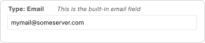

This TV type is a text field that automatically validates its value against a preset email address pattern. To validate against your own custom pattern, create a Text TV instead and enter your pattern in the *Regular Expression Validator* field.

### File

<details>
    <summary><em>JSON Input Options Template</em></summary>

```json
{
    "allowBlank": "true"
}
```

</details>
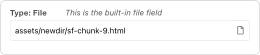

This TV type creates a file input field to browse the server for a file. Files can be uploaded through the MODX File Manager. A TV’s optional *Default File* is also selectable using the File Manager.

### Hidden

A hidden field does not show up in the manager, so it's rare that you'd use this option. Some example usages include:

- Making a default value available to all pages
- Storing a Snippet that takes a page’s ID as input
- Storing a calculated value based on other fields’ values

### Image

<details>
    <summary><em>JSON Input Options Template</em></summary>

```json
{
    "allowBlank": "true"
}
```

</details>

<p><small>Photo courtesy of Victor Serban, Unsplash</small></p>

This TV type creates a file input field to browse the server for an image. Images can be uploaded through the MODX File Manager. A TV’s optional *Default Image* is also selectable using the File Manager.

To associate this TV with a Media Source other than the default one, you can do so by visiting the “Media Sources” tab while in the TV editor view. This tab lists all Contexts this TV is available to and presents a dropdown menu to assign a specific Media Source to each (double-click a Source name in the grid to access its menu).

To learn about the various Media Source settings that influence where this TV’s files are located and determine their validity (*i.e.*, file storage paths, allowed file types/extensions, upload limits, etc.), *see* the [Media Sources](building-sites/media-sources "Media Sources") documentation page.

By default, this input type returns the link (to be used as `src` attribute) to the image. As an alternative to constructing the `` tag for this TV in your front-end template, you can select [“Image”](making-sites-with-modx/customizing-content/template-variables/template-variable-output-types/image-tv-output-type) in *Output Options*; this will return a full image tag that includes the attributes you specify, *e.g.*:

```html

```

To be clear, `src` is included in the example code above for completeness and is not a part of the editable *Output Options*.

### Listbox (Single-Select) (listbox)

<details>
    <summary><em>JSON Input Options Template</em></summary>

```json
{
    "allowBlank": "true",
    "title": "",
    "typeAhead": "false",
    "typeAheadDelay": "250",
    "forceSelection": "false",
    "listEmptyText": ""
}
```

</details>
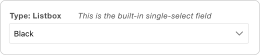

This TV type produces a select field where only a single option can be selected. The methods of defining its options are shown in the Listbox (Multi-Select) section below.

### Listbox (Multi-Select) (listbox-multiple)

<details>
    <summary><em>JSON Input Options Template</em></summary>

```json
{
    "allowBlank": "true",
    "stackItems": "false",
    "preserveSelectionOrder": "false",
    "title": "",
    "typeAhead": "false",
    "typeAheadDelay": "250",
    "forceSelection": "false",
    "listEmptyText": ""
    
}
```

</details>
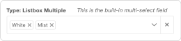

This TV type produces a custom select field where one or more options can be selected. Selections are presented as a row of dismissable options. As with the other chooser-type TVs, this field can be powered by using a `@SELECT` binding in its “Dropdown List Options” field. Its *Output Options* "Output Type" should almost always be set to Delimiter to distinguish between values.

#### Simple Usage

Just like with the Checkbox options, you can simply specify a list of values separated by double-pipes:

```
Man||Bear||Pig
```

#### Separate Options/Values

Often it's nice to have a more readable label. You can display something nice and still store a different value using the double-equals and double-pipes format used by checkboxes:

```
Option 1==value1||Option 2==value2
```

### Number

<details>
    <summary><em>JSON Input Options Template</em></summary>

```json
{
    "allowBlank": "true",
    "minValue": "",
    "maxValue": "",
    "allowDecimals": "false",
    "decimalPrecision": "2",
    "strictDecimalPrecision": "false",
    "decimalSeparator": "."
}
```

</details>
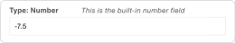

This TV type simulates a real number field using a special text field with pre-defined and user-defined constraints: Only the digits 0 to 9, a minus sign (-), and a period (*i.e.*, decimal point) are accepted.

#### Usage Notes

- If you want trailing zeros to be preserved (*i.e.*, 4.50 doesn’t get trimmed to 4.5), set “Strict Decimal Precision” to “Yes.” This can be helpful for currency fields.
- To prevent negative values, set the TV’s “Min Value” to 0 (or greater)

#### Unsupported Values and Features

- Complex numbers (*e.g.*, radicals “2^10,” scientific notation “2.8e6,” etc.)
- Number-specific special controls like `step` and the ability to change the entered value via the up and down arrow keys

### Radio Options (radio)

<details>
    <summary><em>JSON Input Options Template</em></summary>

```json
{
    "allowBlank": "true",
    "columns": "1"
}
```

</details>
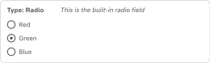

This TV type displays a list of radio button options. Unlike Check Box TVs, only a single selection can be made when using a Radio Options TV.

#### Simple Usage

Using the configuration below, this TV would initially display as shown in the image above.

| Input Option | Value |
| ---- | ---- |
| Radio Button Options | `Red==1\|\|Green==2\|\|Blue==3` |
| Default Option | `2` |
|||

#### Advanced Usage

Radio Options values are not restricted to just hard-coded text and numbers; you can incorporate Chunks and/or TVs that output more complex content as a value (without the aid of an Extra or custom Snippet). For example, to build a sidebar selector:

| Input Option | Value |
| ---- | ---- |
| Radio Button Options | `[[$my_related_chunk]]\|\|Content==[[*sidebar-txt]]\|\|Twitter==[[$my_twitter_chunk]]` |
| Default Option | `[[$my_related_chunk]]` |
|||

### Resource List (resourcelist)

<details>
    <summary><em>JSON Input Options Template</em></summary>

```json
{
    "allowBlank": "1",
    "showNone": "1",
    "parents": "",
    "depth": "10",
    "includeParent": "1",
    "limitRelatedContext": "0",
    "where": "[{\"isfolder: = \":\"1\"},{\"hidemenu\":\"0\",\"OR:hidemenu:=\":\"1\"}]",
    "limit": "0"
}
```

</details>
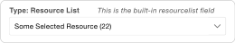

This TV type is a specialized single-select field that displays a dropdown list of child Resources of a given Resource ID. The value stored will be the ID of the selected child Resource.

This is similar to using a [@SELECT](building-sites/elements/template-variables/bindings/select-binding "SELECT Binding") binding in a Listbox, but the Resource List will traverse the entire resource browser, whereas with a @SELECT binding, you'd have to update your query to list children of each parent.

This input type also accepts Where Conditions to filter the list. Two example values are shown below:

```php
[{"template:=":"4"}]
```

```php
[{"pagetitle:!=":"Home"}]
```

### RichText

<details>
    <summary><em>JSON Input Options Template</em></summary>

```json
{
    "allowBlank": "1",
    "showNone": "1",
    "parents": "",
    "depth": "10",
    "includeParent": "1",
    "limitRelatedContext": "0",
    "where": "[{\"isfolder: = \":\"1\"},{\"hidemenu\":\"0\",\"OR:hidemenu:=\":\"1\"}]",
    "limit": "0"
}
```

</details>
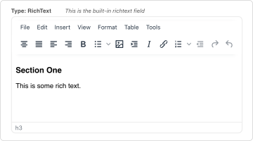

When a Rich Text editor (*e.g.*, TinyMCE Rich Text Editor, CKEditor, Redactor, etc.) is installed, this TV type becomes available and produces a small <abbr title="What you see is what you get">WSYIWYG</abbr> field for creating html-formatted text.

### Tag

<details>
    <summary><em>JSON Input Options Template</em></summary>

```json
{
    "allowBlank": "1"
}
```

</details>
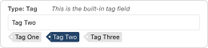

This TV type present rows of clickable tags whose initial values are pre-defined in the TV’s **Tag Options**. Like the Auto-Tag TV, this compound field allows the addition of new comma-separated tags in the text input. However, these additions are only available in the Resource in which they are made. (Note that this TV type’s configuration is very similar to that of Check Box TVs.)

To make Tag TVs useful in the front end, you will need to set the [output type](building-sites/elements/template-variables/output-types) to “Delimiter” and specify a delimiter of your choice, and/or use an output filter to present them in the way you prefer.

### Text

<details>
    <summary><em>JSON Input Options Template</em></summary>

```json
{
    "allowBlank": "true",
    "maxLength": "",
    "minLength": "",
    "regex": "",
    "regexText": ""
}
```

</details>
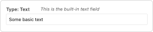

This TV type produces a standard text field.

### Textarea

<details>
    <summary><em>JSON Input Options Template</em></summary>

```json
{
    "allowBlank": "true",
    "inputHeight": "140",
    "textareaGrow": "false",
    "textareaResizable": "false"
}
```

</details>
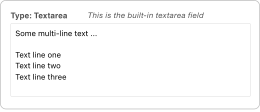

This TV type produces a standard *textarea* field, with a height of 15 rows. It's the same size as the HTML Area fields, but without a WYSIWYG editor.

### URL

<details>
    <summary><em>JSON Input Options Template</em></summary>

```json
{
    "allowBlank": "true"
}
```

</details>
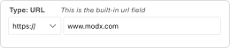

This TV type produces a composite field with a dropdown option to select the protocol—(none), <http://>, <https://>, <ftp://>, or <mailto:>—and a text field for the remainder of the URL. Note that there is no preset validation for this field. To create a field that ensures the correctness of the URL entered, use a Text TV with a *Regular Expression Validator* rule.

#### Usage Note

You may paste full URLs into the text part of this field; the protocol will automatically be separated out and selected in the dropdown when the object this TV is a part of, usually a Resource, is saved.

## Dynamically-Defined Input Options

First, please note that this section refers to the definition of the TV itself, not the user-defined, selectable options (key-value pairs) of a listbox or similar input.

When defining a TV in a way other than manager’s standard built-in editing form (_e.g._, within the MIGX Extra), a JSON configuration object can be used to define its input options. The input is ultimately rendered to the Resource form by the Smarty templating engine. However, Smarty tags cannot be used within this JSON object to change options on the fly. An alternative strategy that works is to use a Snippet to insert dynamic values. For example:

This won’t work:

```json
{
    "maxDateValue":"{$smarty.now|date_format:'%Y-%m-%d'}",
    "allowBlank":true,
    "hideTime":true
}
```

But, this _will_ work:

```json
{
    "maxDateValue":"[[!tv-option--get-max-date]]",
    "allowBlank":true,
    "hideTime":true
}
```

where the Snippet `tv-option--get-max-date`  contains:

```php
<?php
return date('Y-m-d', time());
```
