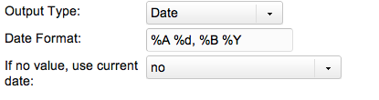

## Date TV Output Type

This type allows you to output any TV input as a Date, formatted in the way you want.

## Output Properties

It's output properties look like:

| Name        | Description                                                                                                  |
| ----------- | ------------------------------------------------------------------------------------------------------------ |
| Date Format | A format string similar to the [PHP strftime method](http://php.net/strftime).                               |
| Default     | If no value is set for the TV, use the current time? This defaults to 'no', which will output a blank value. |

## Examples

| Format String | Example Output        |
| ------------- | --------------------- |
| %A %d, %B %Y  | Friday 01, April 2011 |
| %Y-%m-%d      | 2011-04-01            |
| %b %e, %Y     | Apr 1, 2011           |

## See Also

1. [Date TV Output Type](building-sites/elements/template-variables/output-types/date)
2. [Delimiter TV Output Type](building-sites/elements/template-variables/output-types/delimiter)
3. [HTML Tag TV Output Type](building-sites/elements/template-variables/output-types/html)
4. [Image TV Output Type](building-sites/elements/template-variables/output-types/image)
5. [URL TV Output Type](building-sites/elements/template-variables/output-types/url)