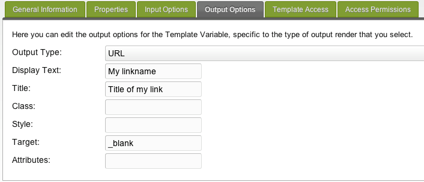

## URL TV Output Type

This output-type allows you to wrap an link (a-tag) around the input (normally should be input-type: "text").

## Output Options

It's output options look like:

| Name         | Description                                                     |
| ------------ | --------------------------------------------------------------- |
| Output type  | The option to be outputted to the frontend. Value: URL          |
| Display text | text that is displayed as link text instead of the URL          |
| Title        | title tag for the link-title                                    |
| Class        | CSS class to attach the img tag                                 |
| Style        | Any CSS style-attributes to add to the tag                      |
| Target       | target of the link, should be left blank but could be "\_blank" |
| Attributes   | any other HTML-attributes you want to add to the tag            |

## See Also

1. [Date TV Output Type](building-sites/elements/template-variables/output-types/date)
2. [Delimiter TV Output Type](building-sites/elements/template-variables/output-types/delimiter)
3. [HTML Tag TV Output Type](building-sites/elements/template-variables/output-types/html)
4. [Image TV Output Type](building-sites/elements/template-variables/output-types/image)
5. [URL TV Output Type](building-sites/elements/template-variables/output-types/url)
