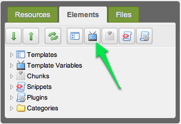
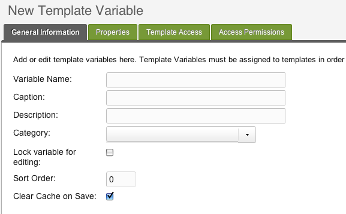
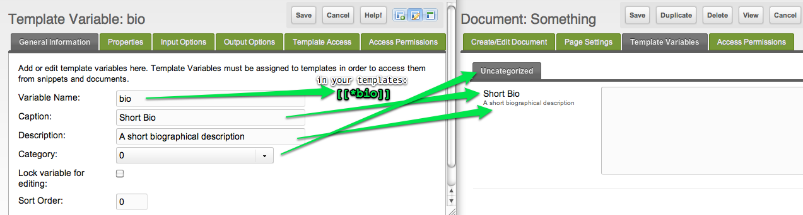
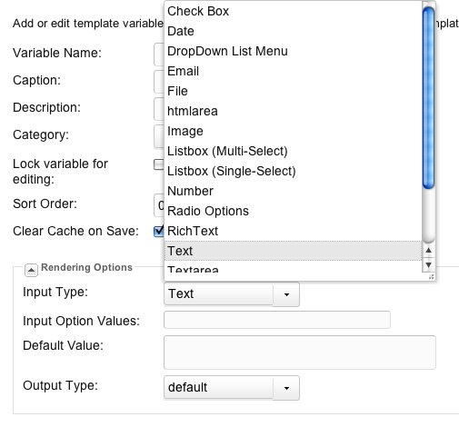
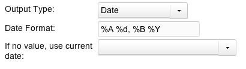

This page outlines how to create a Template Variable in MODX Revolution. A Template Variable, in a nutshell, is a custom field. To read more about what about what a Template Variable is, see the page on [Template Variables](building-sites/elements/template-variables "Template Variables").

## Explanation

 When we say "Create a Template Variable", there are two possible actions that we might be talking about: we can be referring to the action of adding some text or content to one of our existing custom fields when we edit a MODX page (i.e. a Resource), OR we can be referring to the action of defining this field so that it is available to our MODX resources. This page is all about the latter. In the first case, we would be creating an _instance_ of the Template Variable, whereas the second case is all about defining the Template Variable blueprint, which determines how each instance will behave.

 **A Class of Field**
 When you create a Template Variable, you are really defining a _class_ of custom field; it acts as a blueprint for all instances of this custom field.

## Creating the Template Variable

### 1. Log into the MODX manager

 Just to be clear, you must be logged into the MODX manager as an Administrator (or similar) for this to work!

### 2. Add the Template Variable

 On the left-hand resource-tree pane, click on the **Elements** tab

 

### 3. Define the General Information

 When we define a TV, we have to define a lot of information about the behavior of this custom field. The "General Information" tab contains the basic information for this variable.

 

- **Variable Name**: This corresponds to the placeholders that will be used in your templates, e.g. **bio** = `[[*bio]]`. _This name should be **unique**_!
- **Caption**: This is the primary label for your variable that appears when you edit a resource that uses this TV
- **Description**: This is the secondary label for your variable
- **Category**: This affects which sub-tab the variable appears on
- **Sort Order**: If you're using more than one TV, this will determine which appear at the top (1 = top, bigger numbers sink to the bottom)

 

 In the picture, you can see how the settings will correspond to your pages's editor fields.

 The name should be unique!

### 4. Define the Input Options

 Next, click on the **Input Options** tab: you need to choose which kind of field this will be, e.g. a text field, a dropdown field, a WYSIWYG, etc. See the page for See the [Template Variable Input Types](making-sites-with-modx/customizing-content/template-variables/template-variable-input-types "Template Variable Input Types") for a full list of possible input types.

- **Input Type**: Your field might be a simple text field, a dropdown, a reference to another page, or many other types of field.
- **Input Options**: Some Input Types ignore this field, but others may require it. E.g. a dropdown list requires a list of possible values. Again, see the page on [Template Variable Input Types](making-sites-with-modx/customizing-content/template-variables/template-variable-input-types "Template Variable Input Types") for more info.
- **Default**: this affects what the default value for the field will be. This can be a simple value, or it can utilize one of the MODX [Bindings](building-sites/elements/template-variables/bindings "Bindings") to do things like select a value from the database or inherit a value from a parent page.

 

### 5. Configure Template Access

 Click the **Template Access** tab: you must define which template(s) will actually use this custom field that you've defined – once you've defined this custom field, you can choose which template(s) can actually use it.

 Any time you create a Resource that uses a template to which a TV has been attached, the TV will be available for editing. **Make sure you attached the TV to at least one template.**

### 6. Save the TV definition.

 When you edit a page that uses a template associated to this TV, you'll be able to add data to that TV field.

### 7. Use it: Create a Resource

 Now that you've defined your TV and you've added it to a template, add a MODX Resource (e.g. right-click in the document tree and choose **Create --> Create Resource Here**). Select a template that uses this TV.

### 8. Edit the Value

 Once your MODX Resource (i.e. page) is using the template that contains your template variable, you can add data to this attribute by clicking on the page's "Template Variables" tab.

- - - - - -

## Advanced Usage

 IN PROGRESS ...

 You may have noticed we skipped over a fair number of tabs in the initial walk through. Template Variables offer for some more complex functionality that you don't need for simple scenarios.

## Output Rendering Options

 Next, we'll select the output rendering options. We'll select 'Date' as well, and as you'll note, below this box (depending on the Output Render selected) some form fields will show:

 

 Allowing us to edit more fine-grained options for that Output Render.

## Properties

 From there, we can specify any default properties we want for the TV. "How can you use properties on a TV?", you might ask. Well, let's say we're doing a textarea TV named "viewingSS". In our content, we've got this:

 ``` php
Viewing: [[+subsection]]
```

 We can add a list property 'subsection' to the grid, and then allow that property to be overridden via property sets. Say we created a Property Set named 'CarsSectionTVPS' (PS for Property Set). In it, we set the 'subsection' property to "Cars". We'd then attach it to the TV in our Resource, or Template, or whereever we are using it like so:

 ``` php
[[*viewingSS@CarsSectionTVPS]]
```

 This would output in the place of the TV:

> Viewing: Cars

## Template and Resource Group Access

 We can assign TVs to [Templates](building-sites/elements/templates "Templates"), as well. This allows those Resources assigned to those [Templates](building-sites/elements/templates "Templates") to edit the TVs for each Resource.

 Also, TVs can be restricted to certain Resource Groups, selectable in the grid labeled "Access Permissions".

## See Also

1. [Creating a Template Variable](building-sites/elements/template-variables/step-by-step)
2. [Bindings](building-sites/elements/template-variables/bindings)
3. [CHUNK Binding](building-sites/elements/template-variables/bindings/chunk-binding)
4. [DIRECTORY Binding](building-sites/elements/template-variables/bindings/directory-binding)
5. [EVAL Binding](building-sites/elements/template-variables/bindings/eval-binding)
6. [FILE Binding](building-sites/elements/template-variables/bindings/file-binding)
7. [INHERIT Binding](building-sites/elements/template-variables/bindings/inherit-binding)
8. [RESOURCE Binding](building-sites/elements/template-variables/bindings/resource-binding)
9. [SELECT Binding](building-sites/elements/template-variables/bindings/select-binding)
10. [Template Variable Input Types](building-sites/elements/template-variables/input-types)
11. [Template Variable Output Types](building-sites/elements/template-variables/output-types)
12. [Date TV Output Type](building-sites/elements/template-variables/output-types/date)
13. [Delimiter TV Output Type](building-sites/elements/template-variables/output-types/delimiter)
14. [HTML Tag TV Output Type](building-sites/elements/template-variables/output-types/html)
15. [Image TV Output Type](building-sites/elements/template-variables/output-types/image)
16. [URL TV Output Type](building-sites/elements/template-variables/output-types/url)
17. [Adding a Custom TV Type - MODX 2.2](extending-modx/custom-tvs)
18. [Adding a Custom TV Input Type](_legacy/making-sites-with-modx/adding-a-custom-tv-input-type)
19. [Adding a Custom TV Output Type](_legacy/making-sites-with-modx/adding-a-custom-tv-output-type)
20. [Creating a multi-select box for related pages in your template](building-sites/tutorials/multiselect-related-pages)
21. [Accessing Template Variable Values via the API](extending-modx/snippets/accessing-tvs)
