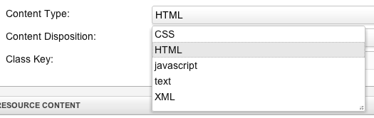
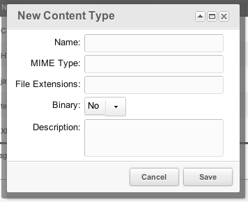

## What are Content Types?

Content types are specific filesystem types for your resources. They are associated with file extensions and tell the MODX Parser what type of extension to render the page with.

For example, a [Resources](building-sites/resources "Resources") with an alias of 'test' and Content Type "CSS" that has a file extension of ".css" will render as:

> test.css

instead of test.html. This allows you to create any type of file from [Resources](building-sites/resources "Resources").

## Usage

When editing a Resource, simply select the Content Type that you'd like to use:

Then save the [Resources](building-sites/resources "Resources"). This will automatically associate that [Resources](building-sites/resources "Resources") with the selected Content Type.

### Creating New Content Types

First, go to Content -> Content Types. You'll see a grid populated with all the current Content Types. Click on 'New Content Type', and a window will appear:

The fields that appear are as follows:

- **Name** - This is the name of the Content Type. It is mainly for organizational and labeling purposes, and does not affect the function of the type.
- **MIME Type** - Here you can set the MIME Type for the extension, which will tell the browser what type of file the [Resources](building-sites/resources "Resources") is. A list of available MIME Types can be found [here](http://www.iana.org/assignments/media-types/) or [here](http://www.feedforall.com/mime-types.htm).
- **File Extensions** - This is the file extension to render the Resource as. Include the dot, e.g. ".doc"
- **Icon** - Optional CSS class for the Resource tree icon (MODX 3.0+). Examples: `icon-css`, `icon-json`, `icon-pdf`, or a Font Awesome class such as `icon-home` / `fa-home`. Leave empty to fall back to the Template icon or the default resource icon.
- **Binary** - Is the file type text/ascii or binary?
- **Description** - An optional field for your own descriptive purposes.

From there, click "save" and the Content Type will appear in the grid.

### Resource tree icons (MODX 3.0+)

MODX builds tree icons from CSS classes returned by the Resource. Prefer this order when you pick an icon:

1. **Template** Manager Icon Class, if set on the Template.
2. **Content Type** Icon, if set on the Content Type and no Template icon wins visually for your theme.
3. Default `mgr_tree_icon_{classKey}` (for example `tree-resource`), plus weblink / symlink / static-resource icons when those types apply.

Core Content Types ship with useful defaults for non-HTML MIME types (`icon-xml`, `icon-css`, `icon-js`, `icon-json`, `icon-pdf`, and similar). HTML usually keeps an empty Icon so the normal document / folder icon remains.

You can edit Icon inline in the Content Types grid or in the create/update window. Protected system types still allow Icon (and file extensions) to change.

See also [Templates](building-sites/elements/templates) for the Template Manager Icon Class field.

**About Aliases**
When you create resources, the File Extension you choose for your content type will be what's appended to the alias of that resource (if you have friendly URLs enabled)

## See Also

- [Resources](building-sites/resources "Resources")
