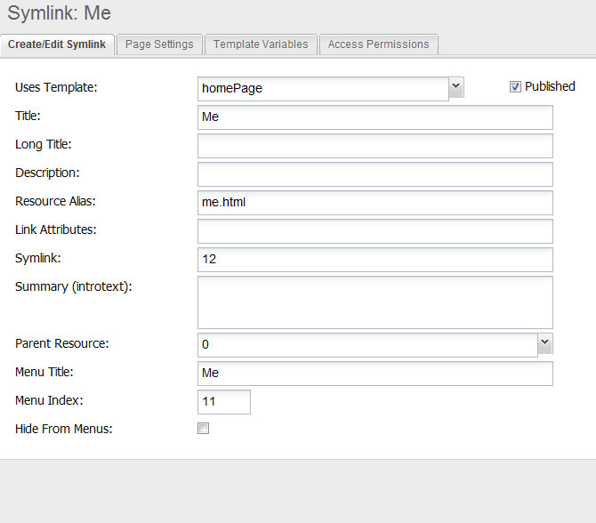

## Understanding a Symlink

A MODX Revolution symlink simply takes the content of one resource and displays it in another. You can add a new template or what ever changes you may want to the symlink, and you can place it anywhere within the site, but you can not add additional content to it. You can create multiple Symlinks that point to the same resource, but each Symlink will have its own unique URL. Another way to think of this feature is to imagine that you have added a normal resource to MODX, but you've pasted a Snippet into the content – the Snippet grabs only the content from the other page.

## How do I use this feature?

1\) Create the symlink with a name, an alias and a reference to the "master" document itself.
2\) If you do not see it -- try clearing the site cache / document cache.

## Example:

For my site this example would feed the contents of my college degrees page to the me.html

## Why Symlink?

- A document needs moved in the structure and google has it listed at the old location
- A document may actually and logically belong in more than one place in a site
- You quickly and simply want to provide a short and simple url to a document located many levels deep in a site
- You want to deal with various spellings of a document: foursquare, 4square, forsquare and have them all point to the same content (each of these would be a separate symlink)
- Most web site host control panels allow for subdomains. By creating a subdomain in the control panel and then a symlink in the root of the website to content burried further down, you could create a "doorway" page or a fast means to getting to a group of related content.
