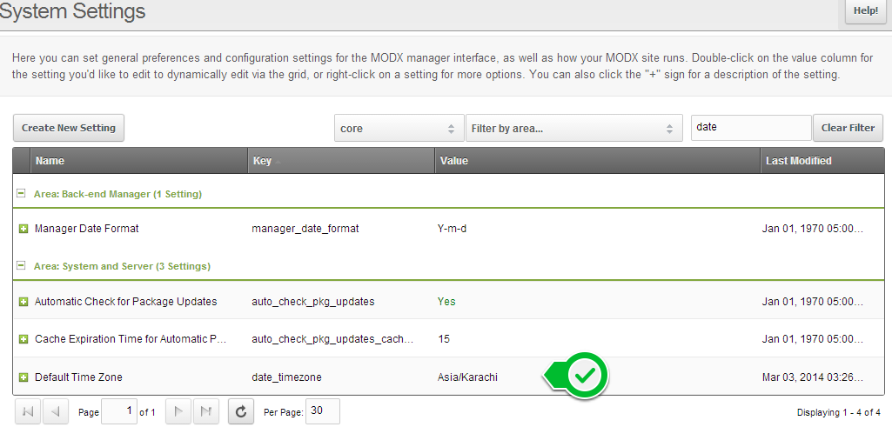

**Name**: Default Time Zone  
**Type**: String  
**Default**: If empty and the PHP date.timezone ini setting is not set in your environment, UTC will be assumed.  
**Available In**: Revolution 2.2+

Controls the default timezone setting for PHP date functions, if not empty. If empty and the PHP `date.timezone` ini setting is not set in your environment, UTC will be assumed.

