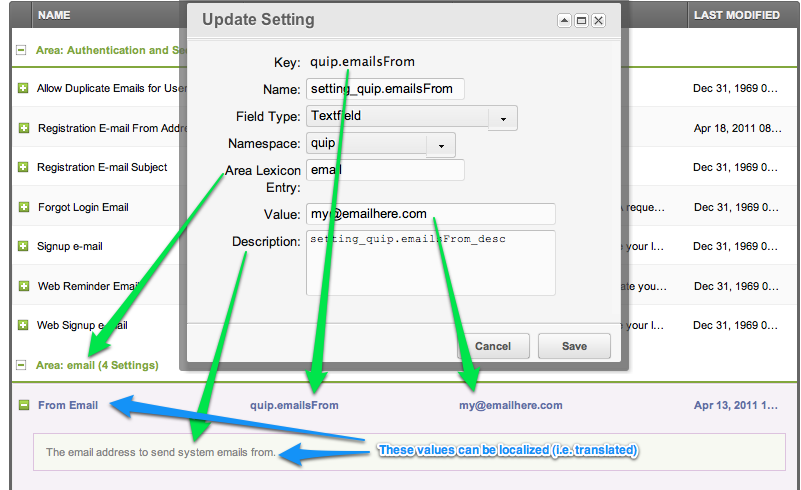

MODX comes with a flexible amount of system settings. They are found in System -> System Settings, and can easily be edited and changed. All system settings are available in your templates by using the `[[++placeholder]]` notation. See [Template Tags](building-sites/tag-syntax/common) for more information.

## Overriding Settings (Inheritance)

While this document mostly talks about _System_ Settings, MODX comes with a very powerful inheritance system that allows you to override settings at the context, usergroup, or user setting.

Basically, when a setting is requested in the session of a specific user, the settings are checked in the following order:

1. User Setting
2. Usergroup Setting
3. Context Setting (Note that in the manager, the context is usually `mgr`)
4. System setting

## Creating new System Settings (via the GUI)

To create a new system setting, click the "Create New Settings" link under System -> System Settings.



### Parameters

-   Key: This is ultimately the unique name of your `[[++placeholder]]`
-   Name: This is the label displayed in the "Name" column while viewing all system settings. This value can be localized (see below).
-   Field Type: There are currently 3 supported input types: TextField, TextArea, Yes/No
-   Namespace: as with [Custom Manager Pages](extending-modx/custom-manager-pages "Custom Manager Pages"), the namespace defines a folder inside core/components/.
-   Area Lexicon Entry: this value affects the grouping of system settings; create multiple system settings that share the "Area Lexicon Entry" and they will be grouped together.
-   Value: The default value.
-   Description: This value can be localized (see below).

### Localization

The values used to describe system settings can be optionally localized (i.e. translated) by referencing a specific localization file. The lexicon keys follow a specific format:

-   Name: `setting_` + _Key_
-   Description: `setting_` + _Key_ + `_desc`

For example, if we look at Quip's `[[++quip.emailsFrom]]` setting, we see that it uses the the **quip** namespace. The expected folder structure is to look for localization files in the namespace's folder, then in a "lexicon" folder, then in folders divided by language codes, and then in the **default.inc.php** file, for example **core/components/quip/lexicon/en/default.inc.php**

In our Quip example, we see a name of _setting_quip.emailsFrom_ and a description of _setting_quip.emailsFrom_desc_. These two values correspond to keys in the **\$\_lang** array inside of **default.inc.php**:

```php
$_lang['setting_quip.emailsFrom'] = 'From Email';
$_lang['setting_quip.emailsFrom_desc'] = 'The email address to send system emails from.';
```

We encourage you to right-click an existing system setting and choose to "Update System Setting" to get an idea of how this works.

### Getting a System Setting (programmatically)

To get a setting value from a snippet, plugin, or other PHP-code, you use the [getOption](extending-modx/xpdo/class-reference/xpdoobject/configuration-accessors/getoption "getOption") function and passing it the unique key for the option, for example:

```php
$siteStartId = $modx->getOption('site_start');
```

In WordPress, the comparable API function is **get_option()**.

This function retrieves the value from the settings cache.

### Saving a System Setting (programmatically)

Here's where things get a little bit more complicated: when we retrieve the value using [getOption](extending-modx/xpdo/class-reference/xpdoobject/configuration-accessors/getoption "getOption"), we are retrieving the object from the settings cache. This has the distinct advantage of speed, but it means that we essentially have a read-only copy of the setting's value.

While there is a setOption method available; that only updates the in-memory setting cache.

This is for architectural reasons: the system settings are meant to defined as _configurations_, **NOT runtime dynamic values**. They are typically set at the time of install and then not often updated. However, there may be legitimate times when you need to update system settings programmatically, e.g. perhaps you have written a [Custom Manager Page](extending-modx/custom-manager-pages "Custom Manager Pages Tutorial") that offers a customized form to your users for its system settings.

If we want to update a system setting, we use the powerful xPDO [getObject](extending-modx/xpdo/class-reference/xpdo/xpdo.getobject "xPDO.getObject") function. So let's revisit our retrieval of a simple site setting and compare it side by side with the more verbose (and more flexible) xPDO counterpart:

```php
echo $modx->getOption('site_name');
// prints the same thing as this:
$setting = $modx->getObject('modSystemSetting', 'site_name');
if ($setting) {
    echo $setting->get('value');
}
```

The difference is that using **getObject** retrieves the object from the database uncached, and we can do far more things with an object, including saving that object. So here's how we would retrieve and save a system setting:

```php
$setting = $modx->getObject('modSystemSetting', 'site_name');
$setting->set('value', 'My New Site Name');
$setting->save();
```

However, note that this does not clear the settings cache, so any subsequent calls to **getOption** will still return the older cached version of the setting.

To rectify this in MODX, you have to clear the cache. At the very least the system_settings cache, but if you're using the setting value in a snippet or other code affecting the front-end, the resource cache too:

```php
$cacheRefreshOptions =  [
    'system_settings' => [],
    'resource' => [],
];
$modx->cacheManager->refresh($cacheRefreshOptions);
```

In WordPress, the comparable API function is **update_option()**.

### Retrieving a Setting's Meta Data

Once we start retrieving the _Objects_ that represent the system settings instead of just their value, we can see all of the meta data for any given setting (i.e. all of the attributes). Look at this code as an example:

```php
$Setting = $modx->getObject('modSystemSetting', 'site_name');
print_r( $Setting->toArray() );
/*
prints out something like this:
Array (
        [key] => site_name
        [value] => My Skiphop Site
        [xtype] => textfield
        [namespace] => core
        [area] => site
        [editedon] => 2010-10-24 21:53:55
)
*/
```

Once you understand how to manipulate objects using MODX and xPDO, you'll be able to retrieve and modify just about everything inside of MODX, because just about everything is an object.

## Retrieving a list of Related Settings

If you have noticed in the GUI above, MODX allows for some very logical grouping of system settings. The most useful groupings are **area** and by the prefix of the **key**. Using xPDO's [getCollection](extending-modx/xpdo/class-reference/xpdo/xpdo.getcollection "xPDO.getCollection") method, we can easily supply some search criteria to get the settings that we want.

Here's how we would pull up all settings from the 'Mail' area:

```php
$relatedSettings = $modx->getCollection('modSystemSetting', array('area'=>'Mail'));
foreach ( $relatedSettings as $Setting ) {
        print $Setting->get('value');
}
```

This leads us naturally to one of xPDO's other features: the [xPDOQuery](extending-modx/xpdo/class-reference/xpdoquery "xPDOQuery") object. We can use it to pass more complex criteria to our **getCollection call**. Here's how we would pull up all settings that used the prefix of "quip.":

```php
$query = $modx->newQuery('modSystemSetting');
$query->where(array('key:LIKE' => 'quip.%') );
$relatedSettings = $modx->getCollection('modSystemSetting', $query);
foreach ( $relatedSettings as $Setting ) {
        print $Setting->get('value');
}
```

You may not have been expecting an introduction to xPDO while you were simply trying to retrieve and set system settings, but it's in there.

## Creating a System Setting Programmatically

You may desire to create a System Setting programmatically in order to provide your users with a cleaner UX/UI. In your code, you can put something like the following:

```php
$MySetting = $modx->newObject('modSystemSetting');
$MySetting->set('key', 'mykey');
$MySetting->set('value', 'my_value');
$MySetting->set('xtype', 'textfield');
$MySetting->set('namespace', 'my_namespace');
$MySetting->set('area', 'MyArea');
$MySetting->save();
// Clear the cache:
$cacheRefreshOptions =  array( 'system_settings' => array() );
$modx->cacheManager->refresh($cacheRefreshOptions);
```

Note that you must create lexicon entries that match your key name (see the section above on Localization):

-   Name: `setting_` + _Key_
-   Description: `setting_` + _Key_ + `_desc`

So in this example, you would need to add the following lexicon entries to a lexicon that you have loaded:

```php
$_lang['setting_mykey'] = 'Name of My Setting';
$_lang['setting_mykey_desc'] = 'Description of my key';
```

MODX will populate the values for the name and description based on those lexicon entries.

You may find it useful to reference your localized language strings inside your Templates or CMPs. You can do this via a lexicon tag, but you must specify the "setting" topic, e.g.

```php
[[!%setting_emailsender? &topic=`setting` &namespace=`core` &language=`en`]]
```

## Types of System Settings

The **xtype** attribute defines what type of field the GUI will use when rendering the interface for this field:

-   **combo-boolean** : stored values are 1 and 0; the GUI will display "Yes" and "No"
-   **textfield** : standard text field
-   **textarea** : standard textearea
-   **text-password** : standard password field (input is masked)
-   **numberfield** : used for entering numbers
-   **modx-combo-language** : allows user to select a language
-   **modx-combo-source** :
-   **modx-combo-template** : allows user to select a template
-   **modx-combo-content-type** : allows user to select a content type
-   **modx-combo-charset** : allows user to select a character set
-   **modx-combo-rte** : like the textarea, but with formatting controls
-   **modx-combo-context** : allows user to select a context
-   **modx-combo-namespace** : allows user to select a namespace

## Settings List

A description of each setting follows:

1. [access_category_enabled](building-sites/settings/access_category_enabled)
2. [access_context_enabled](building-sites/settings/access_context_enabled)
4. [access_resource_group_enabled](building-sites/settings/access_resource_group_enabled)
5. [allow_duplicate_alias](building-sites/settings/allow_duplicate_alias)
6. [allow_forward_across_contexts](building-sites/settings/allow_forward_across_contexts)
7. [allow_multiple_emails](building-sites/settings/allow_multiple_emails)
8. [allow_tags_in_post](building-sites/settings/allow_tags_in_post)
9. [archive_with](building-sites/settings/archive_with)
10. [auto_check_pkg_updates](building-sites/settings/auto_check_pkg_updates)
11. [auto_check_pkg_updates_cache_expire](building-sites/settings/auto_check_pkg_updates_cache_expire)
12. [auto_menuindex](building-sites/settings/auto_menuindex)
13. [automatic_alias](building-sites/settings/automatic_alias)
14. [base_help_url](building-sites/settings/base_help_url)
15. [blocked_minutes](building-sites/settings/blocked_minutes)
16. [cache_action_map](building-sites/settings/cache_action_map)
17. [cache_context_settings](building-sites/settings/cache_context_settings)
18. [cache_db](building-sites/settings/cache_db)
19. [cache_db_expires](building-sites/settings/cache_db_expires)
20. [cache_db_session](building-sites/settings/cache_db_session)
21. [cache_default](building-sites/settings/cache_default)
22. [cache_disabled](building-sites/settings/cache_disabled)
23. [cache_format](building-sites/settings/cache_format)
24. [cache_handler](building-sites/settings/cache_handler)
25. [cache_json](building-sites/settings/cache_json)
26. [cache_json_expires](building-sites/settings/cache_json_expires)
27. [cache_lang_js](building-sites/settings/cache_lang_js)
28. [cache_lexicon_topics](building-sites/settings/cache_lexicon_topics)
29. [cache_noncore_lexicon_topics](building-sites/settings/cache_noncore_lexicon_topics)
30. [cache_resource](building-sites/settings/cache_resource)
31. [cache_resource_expires](building-sites/settings/cache_resource_expires)
32. [cache_scripts](building-sites/settings/cache_scripts)
33. [cache_system_settings](building-sites/settings/cache_system_settings)
34. [clear_cache_refresh_trees](building-sites/settings/clear_cache_refresh_trees)
35. [compress_css](building-sites/settings/compress_css)
36. [compress_js](building-sites/settings/compress_js)
37. [context_tree_sort](building-sites/settings/context_tree_default_sort)
38. [context_tree_sortby](building-sites/settings/context_tree_sortby)
39. [context_tree_sortdir](building-sites/settings/context_tree_sortdir)
40. [concat_js](building-sites/settings/concat_js)
41. [container_suffix](building-sites/settings/container_suffix)
42. [cultureKey](building-sites/settings/culturekey)
43. [custom_resource_classes](building-sites/settings/custom_resource_classes)
44. [default_media_source_type](building-sites/settings/default_media_source_type)
45. [default_username](building-sites/settings/default_username)
46. [default_per_page](building-sites/settings/default_per_page)
47. [default_template](building-sites/settings/default_template)
48. [editor_css_path](building-sites/settings/editor_css_path)
49. [editor_css_selectors](building-sites/settings/editor_css_selectors)
50. [emailsender](building-sites/settings/emailsender)
51. [emailsubject](building-sites/settings/emailsubject)
52. [enable_dragdrop](building-sites/settings/enable_dragdrop)
53. [error_page](building-sites/settings/error_page)
54. [extension_packages](building-sites/settings/extension_packages)
55. [failed_login_attempts](building-sites/settings/failed_login_attempts)
56. [fe_editor_lang](building-sites/settings/fe_editor_lang)
57. [feed_modx_news](building-sites/settings/feed_modx_news)
58. [feed_modx_news_enabled](building-sites/settings/feed_modx_news_enabled)
59. [feed_modx_security](building-sites/settings/feed_modx_security)
60. [feed_modx_security_enabled](building-sites/settings/feed_modx_security_enabled)
61. [filemanager_path](building-sites/settings/filemanager_path)
62. [filemanager_path_relative](building-sites/settings/filemanager_path_relative)
63. [filemanager_url](building-sites/settings/filemanager_url)
64. [filemanager_url_relative](building-sites/settings/filemanager_url_relative)
65. [forgot_login_email](building-sites/settings/forgot_login_email)
66. [forward_merge_excludes](building-sites/settings/forward_merge_excludes)
67. [friendly_alias_lowercase_only](building-sites/settings/friendly_alias_lowercase_only)
68. [friendly_alias_max_length](building-sites/settings/friendly_alias_max_length)
69. [friendly_alias_restrict_chars](building-sites/settings/friendly_alias_restrict_chars)
70. [friendly_alias_restrict_chars_pattern](building-sites/settings/friendly_alias_restrict_chars_pattern)
71. [friendly_alias_strip_element_tags](building-sites/settings/friendly_alias_strip_element_tags)
72. [friendly_alias_translit](building-sites/settings/friendly_alias_translit)
73. [friendly_alias_translit_class](building-sites/settings/friendly_alias_translit_class)
74. [friendly_alias_translit_class_path](building-sites/settings/friendly_alias_translit_class_path)
75. [friendly_alias_trim_chars](building-sites/settings/friendly_alias_trim_chars)
76. [friendly_alias_urls](building-sites/settings/friendly_alias_urls)
77. [friendly_alias_word_delimiter](building-sites/settings/friendly_alias_word_delimiter)
78. [friendly_alias_word_delimiters](building-sites/settings/friendly_alias_word_delimiters)
79. [friendly_url_prefix](building-sites/settings/friendly_url_prefix)
80. [friendly_url_suffix](building-sites/settings/friendly_url_suffix)
81. [friendly_urls](building-sites/settings/friendly_urls)
82. [global_duplicate_uri_check](building-sites/settings/global_duplicate_uri_check)
83. [hidemenu_default](building-sites/settings/hidemenu_default)
84. [link_tag_scheme](building-sites/settings/link_tag_scheme)
85. [mail_charset](building-sites/settings/mail_charset)
86. [mail_encoding](building-sites/settings/mail_encoding)
87. [mail_smtp_auth](building-sites/settings/mail_smtp_auth)
88. [mail_smtp_autotls](building-sites/settings/mail_smtp_autotls)
89. [mail_smtp_helo](building-sites/settings/mail_smtp_helo)
90. [mail_smtp_hosts](building-sites/settings/mail_smtp_hosts)
91. [mail_smtp_keepalive](building-sites/settings/mail_smtp_keepalive)
92. [mail_smtp_pass](building-sites/settings/mail_smtp_pass)
93. [mail_smtp_port](building-sites/settings/mail_smtp_port)
94. [mail_smtp_prefix](building-sites/settings/mail_smtp_prefix)
95. [mail_smtp_single_to](building-sites/settings/mail_smtp_single_to)
96. [mail_smtp_timeout](building-sites/settings/mail_smtp_timeout)
97. [mail_smtp_user](building-sites/settings/mail_smtp_user)
98. [mail_use_smtp](building-sites/settings/mail_use_smtp)
99. [manager_date_format](building-sites/settings/manager_date_format)
100. [manager_direction](building-sites/settings/manager_direction)
101. [manager_favicon_url](building-sites/settings/manager_favicon_url)
102. [manager_lang_attribute](building-sites/settings/manager_lang_attribute)
103. [manager_language](building-sites/settings/manager_language)
104. [manager_theme](building-sites/settings/manager_theme)
105. [manager_time_format](building-sites/settings/manager_time_format)
106. [modx_charset](building-sites/settings/modx_charset)
107. [new_file_permissions](building-sites/settings/new_file_permissions)
108. [new_folder_permissions](building-sites/settings/new_folder_permissions)
109. [password_generated_length](building-sites/settings/password_generated_length)
110. [password_min_length](building-sites/settings/password_min_length)
111. [phpthumb_allow_src_above_docroot](building-sites/settings/phpthumb_allow_src_above_docroot)
112. [phpthumb_cache_maxage](building-sites/settings/phpthumb_cache_maxage)
113. [phpthumb_cache_maxfiles](building-sites/settings/phpthumb_cache_maxfiles)
114. [phpthumb_cache_maxsize](building-sites/settings/phpthumb_cache_maxsize)
115. [phpthumb_cache_source_enabled](building-sites/settings/phpthumb_cache_source_enabled)
116. [phpthumb_document_root](building-sites/settings/phpthumb_document_root)
117. [phpthumb_error_bgcolor](building-sites/settings/phpthumb_error_bgcolor)
118. [phpthumb_error_fontsize](building-sites/settings/phpthumb_error_fontsize)
119. [phpthumb_error_textcolor](building-sites/settings/phpthumb_error_textcolor)
120. [phpthumb_far](building-sites/settings/phpthumb_far)
121. [phpthumb_imagemagick_path](building-sites/settings/phpthumb_imagemagick_path)
122. [phpthumb_nohotlink_enabled](building-sites/settings/phpthumb_nohotlink_enabled)
123. [phpthumb_nohotlink_erase_image](building-sites/settings/phpthumb_nohotlink_erase_image)
124. [phpthumb_nohotlink_text_message](building-sites/settings/phpthumb_nohotlink_text_message)
125. [phpthumb_nohotlink_valid_domains](building-sites/settings/phpthumb_nohotlink_valid_domains)
126. [phpthumb_nooffsitelink_enabled](building-sites/settings/phpthumb_nooffsitelink_enabled)
127. [phpthumb_nooffsitelink_erase_image](building-sites/settings/phpthumb_nooffsitelink_erase_image)
128. [phpthumb_nooffsitelink_require_refer](building-sites/settings/phpthumb_nooffsitelink_require_refer)
129. [phpthumb_nooffsitelink_text_message](building-sites/settings/phpthumb_nooffsitelink_text_message)
130. [phpthumb_nooffsitelink_valid_domains](building-sites/settings/phpthumb_nooffsitelink_valid_domains)
131. [phpthumb_nooffsitelink_watermark_src](building-sites/settings/phpthumb_nooffsitelink_watermark_src)
132. [phpthumb_zoomcrop](building-sites/settings/phpthumb_zoomcrop)
133. [principal_targets](building-sites/settings/principal_targets)
134. [proxy_auth_type](building-sites/settings/proxy_auth_type)
135. [proxy_host](building-sites/settings/proxy_host)
136. [proxy_password](building-sites/settings/proxy_password)
137. [proxy_port](building-sites/settings/proxy_port)
138. [proxy_username](building-sites/settings/proxy_username)
139. [publish_default](building-sites/settings/publish_default)
140. [rb_base_dir](building-sites/settings/rb_base_dir)
141. [rb_base_url](building-sites/settings/rb_base_url)
142. [request_controller](building-sites/settings/request_controller)
143. [request_param_alias](building-sites/settings/request_param_alias)
144. [request_param_id](building-sites/settings/request_param_id)
145. [resource_tree_node_name](building-sites/settings/resource_tree_node_name)
146. [resource_tree_node_tooltip](building-sites/settings/resource_tree_node_tooltip)
147. [richtext_default](building-sites/settings/richtext_default)
148. [search_default](building-sites/settings/search_default)
149. [server_offset_time](building-sites/settings/server_offset_time)
150. [server_protocol](building-sites/settings/server_protocol)
151. [session_cookie_domain](building-sites/settings/session_cookie_domain)
152. [session_cookie_lifetime](building-sites/settings/session_cookie_lifetime)
153. [session_cookie_path](building-sites/settings/session_cookie_path)
154. [session_cookie_secure](building-sites/settings/session_cookie_secure)
155. [session_enabled](building-sites/settings/session_enabled)
156. [session_handler_class](building-sites/settings/session_handler_class)
157. [session_name](building-sites/settings/session_name)
158. [settings_version](building-sites/settings/settings_version)
159. [signupemail_message](building-sites/settings/signupemail_message)
160. [site_name](building-sites/settings/site_name)
161. [site_start](building-sites/settings/site_start)
162. [site_status](building-sites/settings/site_status)
163. [site_unavailable_message](building-sites/settings/site_unavailable_message)
164. [site_unavailable_page](building-sites/settings/site_unavailable_page)
165. [static_elements_basepath](building-sites/settings/static_elements_basepath)
166. [static_elements_default_category](building-sites/settings/static_elements_default_category)
167. [static_elements_default_mediasource](building-sites/settings/static_elements_default_mediasource)
168. [static_elements_automate_chunks](building-sites/settings/static_elements_automate_chunks)
169. [static_elements_automate_plugins](building-sites/settings/static_elements_automate_plugins)
170. [static_elements_automate_snippets](building-sites/settings/static_elements_automate_snippets)
171. [static_elements_automate_templates](building-sites/settings/static_elements_automate_templates)
172. [static_elements_automate_tvs](building-sites/settings/static_elements_automate_tvs)
173. [strip_image_paths](building-sites/settings/strip_image_paths)
174. [symlink_merge_fields](building-sites/settings/symlink_merge_fields)
175. [tree_default_sort](building-sites/settings/tree_default_sort)
176. [tree_root_id](building-sites/settings/tree_root_id)
177. [tvs_below_content](building-sites/settings/tvs_below_content)
178. [udperms_allowroot](building-sites/settings/udperms_allowroot)
179. [ui_debug_mode](building-sites/settings/ui_debug_mode)
180. [unauthorized_page](building-sites/settings/unauthorized_page)
181. [upload_maxsize](building-sites/settings/upload_maxsize)
182. [use_alias_path](building-sites/settings/use_alias_path)
183. [use_browser](building-sites/settings/use_browser)
184. [use_editor](building-sites/settings/use_editor)
185. [use_multibyte](building-sites/settings/use_multibyte)
186. [welcome_screen](building-sites/settings/welcome_screen)
187. [welcome_screen_url](building-sites/settings/welcome_screen_url)
188. [which_editor](building-sites/settings/which_editor)
189. [which_element_editor](building-sites/settings/which_element_editor)
190. [xhtml_urls](building-sites/settings/xhtml_urls)
