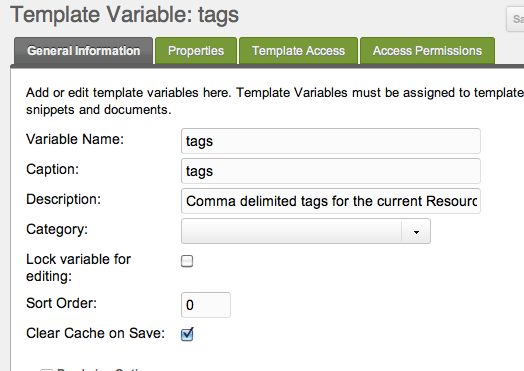
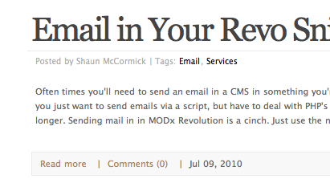
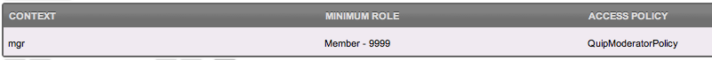
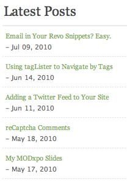
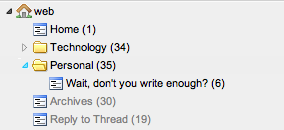

## Requirements

1. Extension requirements may call for FURL use and ".html" be changed to "/" : Content -> Content Types -> HTML (.html) -> /

## Creating a Blog in MODX Revolution

This tutorial will help you setup a flexible, powerful blogging solution in MODX Revolution. Since MODX Revolution is not blogging software, but rather a full-blown Content Application Platform, it doesn't come pre-packaged with a cookie-cutter blogging solution. You'll need to setup your blog how you want it.

Fortunately, the tools to do so are already there for your taking. This tutorial will walk you through how to set them up. It's recommended that you're familiar with Revolution's [Tag Syntax](building-sites/tag-syntax "Tag Syntax") before we start.

One thing before we start, though - this tutorial is extensive, and will show you how to set up a powerful blog with posting, archiving, tagging, commenting and more. If you don't need any specific part, just skip that part. MODX is modular, and your blog can function in any scope you like. And, again, this is only one way to do it - there are tons of ways to setup a blog in MODX Revolution.

This tutorial was originally based on the blog setup at [splittingred.com](http://splittingred.com/), but their site has since been updated.

## Getting the Needed Extras

First off, you'll want to go ahead and download and install some Extras that we'll be using in our Blog. The following is a list of most commonly-used Extras:

### Needed Extras

-   [getResources](/extras/getresources "getResources") - For listing posts, pages and other Resources.
-   [getPage](/extras/getpage "getPage") - For pagination of listings.
-   [Quip](/extras/quip "Quip") - For anything and everything in commenting.
-   [tagger](/extras/tagger "tagger") - For managing tags and doing tag-based navigation.
-   [Archivist](/extras/archivist "Archivist") - For managing your Archives section.

### Optional Extras

-   [Breadcrumbs](/extras/breadcrumbs "Breadcrumbs") - For displaying a breadcrumb navigation trail.
-   [Gallery](/extras/gallery "Gallery") - For managing photo Galleries.
-   [SimpleSearch](/extras/simplesearch "SimpleSearch") - For adding a simple search box to your site.
-   [getFeed](/extras/getfeed "getFeed") - If you want to grab other feeds in your site, such as a Twitter feed.
-   [Login](/extras/login "Login") - If you want to restrict commenting to logged in users only, you'll need this.

## Creating your Blog Post Template

First off, you'll want to have a Template that's geared just for Blog Posts. Why? Well, if you want comments and special formatting or page displays for your blog, you'll probably not want to have to do that for each Blog Post. So, the best route is to setup your own blog post template. This tutorial already assumes you have a base Template for your normal pages on the site - we'll reference that later on as 'BaseTemplate'.

We'll create one called 'BlogPostTemplate'. Our content looks something like this:

```php
[[$pageHeader]]
<main id="post-[[*id]]">
  <a href="#content" class="visually-hidden">skip to main content</a>
  <h2>
	<a href="[[~[[*id]]]]">[[*pagetitle]]</a>
  </h2>
  <p class="post-info">
    Posted on <time datetime="[[*publishedon:strtotime:date=`%Y-%m-%d`]]">[[*publishedon:strtotime:date=`%b %d, %Y`]]</time> |
    [[*tags:notempty=`
       | Tags: [[!tolinks? &items=`[[*tags]]` &tagKey=`tag` &target=`1`]]
    `]]
    <a href="[[~[[*id]]]]#comments">
      Comments ([[!QuipCount? &thread=`blog-post-[[*id]]`]])
	</a>
  </p>
  <article id="content">
	<p>[[*introtext]]</p>
    <hr />
    [[*content]]
  </article>
  <aside id="tags">
    [[*tags:notempty=`
	  <span class="tags">
	    Tags: [[!tolinks? &items=`[[*tags]]` &tagKey=`tag` &target=`1`]]
	  </span>
    `]]
  </aside>
  <hr />
  <section id="comments">
    [[!Quip?
      &thread=`blog-post-[[*id]]`
      &replyResourceId=`123`
      &closeAfter=`30`
    ]]
    <hr />
    [[!QuipReply?
      &thread=`blog-post-[[*id]]`
      &notifyEmails=`my@email.com`
      &moderate=`1`
      &moderatorGroup=`Moderators`
      &closeAfter=`30`
    ]]
  </section>
</main>
[[$pageFooter]]
```

So let's examine the Template, shall we? As we go, remember this - you can move any of these pieces around, change their parameters, and adjust their placing. This is solely a base structure - if you want your tags at the bottom, for instance, move them there! MODX doesn't restrict you from doing that.

### Header and Footer

First off, you'll notice that I have two chunks: "pageHeader" and "pageFooter". These chunks contain my common HTML tags that I would put in the footer and header across my site, so I can use them in different templates. Useful if I don't want to have to update any header/footer changes in each of my Templates - I can just do it in one chunk. After that, I put the pagetitle of my Resource, and make it a link that takes you to the same page.

### The Post Info

Next we get into the "info" of the post - basically the author and tags for the post. Let's look in detail:

```php
<p class="post-info">
  Posted on <time datetime="[[*publishedon:strtotime:date=`%Y-%m-%d`]]">[[*publishedon:strtotime:date=`%b %d, %Y`]]</time>
  [[*tags:notempty=`
     | Tags: [[!tolinks? &items=`[[*tags]]` &tagKey=`tag` &target=`1`]] |
  `]]
  <a href="[[~[[*id]]]]#comments">
    Comments ([[!QuipCount? &thread=`blog-post-[[*id]]`]])
  </a>
</p>
```

The first part takes the publishedon resource field, and [formats](/building-sites/tag-syntax/date-formats) it into a nice, pretty date. The `<time>` tag gives more context to search engines and screen readers, [MDN](https://developer.mozilla.org/en-US/docs/Web/HTML/Element/time).

Secondly, we then display a tag listing for this Blog Post. You can see how we reference a "tags" Template Variable - we haven't created this just yet, so dont worry - and then pass it as a property to the 'tolinks' snippet. The tolinks snippet comes with [tagLister](/extras/taglister "tagLister"), and translates delimited tags into links. This means our tags become clickable! We've specified a 'target' Resource of 1, or our home page. If your blog was in another page besides home, you'd change the ID number there.

And finally, we load a quick count of the number of comments, along with a clickable anchor tag link to load them. Note how our '&thread' property in the QuipCount snippet call (and later on in the Quip call) uses 'blog-post-`[[*id]]`'. This means that MODX will automatically create a new thread for each new Blog Post we create. Neat!

### The Post Content

Okay, back to our Template. We're in the content section now - note how we start with `[[*introtext]]`. This is a useful MODX Resource field - think of it like a beginning excerpt for a blog post, that will show up on our main page when we're listing the latest blog posts.

### Adding Comments to Posts

Okay, now we're in the comments part of BlogPostTemplate. As you can see here, we're using [Quip](/extras/quip "Quip") for our commenting system. You could feel free to use another system, such as Disqus, here if you choose. For this tutorial, we'll go with Quip. Our code is as follows:

```php
<section class="post-comments" id="comments">
  [[!Quip?
    &thread=`blog-post-[[*id]]`
    &replyResourceId=`123`
    &closeAfter=`30`
  ]]
  <hr />
  [[!QuipReply?
    &thread=`blog-post-[[*id]]`
    &notifyEmails=`my@email.com`
    &moderate=`1`
    &moderatorGroup=`Moderators`
    &closeAfter=`30`
  ]]
</section>
```

Okay, cool. Note we have two Snippet calls here - one for displaying the comments for this thread ([Quip](/extras/quip/quip.quip "Quip.Quip")), and another for displaying the reply form ([QuipReply](/extras/quip/quip.quipreply "Quip.QuipReply")).

In our Quip snippet call, we've specified a thread ID in the manner we've described above, and then set some settings. Our comments are going to be threaded (the default), so we need to specify a Resource ID where our Reply to Thread post is going to be (this is detailed in the [Quip Documentation](/extras/quip "Quip"). We recommend reading there for how to set it up.) with the '&replyResourceId' property. For a quick example, if your `&replyResourceId` points to page 123, then on page 123, you should put something like the following:

```php
[[!QuipReply]]
<br />
[[!Quip]]
```

Next, we want to specify - in both the Quip and Quip Reply calls - a 'closeAfter' property. This tells Quip to automatically close commenting on these threads after 30 days of the thread creation (when we load it).

In our QuipReply call, we want to tell Quip to moderate all posts, and the moderators for our post can be found in the Moderators User Group (we'll explain how to set this up later in the tutorial).

There's a whole bunch of other Quip settings we could change, but we'll leave you to further customization, which you can find out how to do in the [Quip docs](/extras/quip "Quip").

**What is Threading?**
If you enable _threaded_ comments, then users can comment on other comments. Non-threaded comments allow users to only comment on the original blog post.

## Setting up Tagging

Now that we've got our Template all setup, we need to setup the 'tags' Template Variable that we'll be using for our tagging.

Go ahead and create a Templat Variable called 'tags', and give it a description of "Comma delimited tags for the current Resource." Next, make sure it has access to the 'BlogPostTemplate' Template we created earlier.



That's it! Now you'll be able to add tags to any blog post we create, simply when editing your Resource by specifying a comma-separated list of tags.

## Creating the Sections

If you want your blog to have 'Sections' (also called Categories), you'll first need to create those Resources.

For this tutorial's purpose, we'll create 2 sections: "Personal" and "Technology". Go ahead and create 2 Resources in the root of your site, and make them 'containers'. You'll want to
have their alias be 'personal' and 'technology', so your blog post URLs turn up nicely.

We'll say from here on out that our two Section Resources have IDs of 34 and 35, for reference.

Make sure you don't use the BlogPostTemplate on these, and use instead your own Base Template. These pages will end up being a way to browse all posts within a certain Section. In the content of these Resources, go ahead and put the following:

```php
[[!getResourcesTag?
  &element=`getResources`
  &elementClass=`modSnippet`
  &tpl=`blogPost`
  &hideContainers=`1`
  &pageVarKey=`page`
  &parents=`[[*id]]`
  &includeTVs=`1`
  &includeContent=`1`
]]
[[!+page.nav:notempty=`
<nav class="paging" role="Blog Posts">
  <ul class="pageList">
    [[!+page.nav]]
  </ul>
</nav>
`]]
```

Okay, let's explain this. [getResourcesTag](/extras/taglister/taglister.getresourcestag) is a wrapper snippet for [getResources](/extras/getresources "getResources") and [getPage](/extras/getpage "getPage") that automatically filters results by a 'tags' Template Variable. We want to grab all published Resources within this section (and we can also filter by tag should we pass a `?tag=TagName` parameter into the URL).

Below the getResourcesTag call, we put our pagination links, since by default getResourcesTag only shows 10 posts per page.

### Setting up the blogPost Chunk

In that call, we also have a property called '&tpl' which we set to 'blogPost'. This is our Chunk that shows each result of our blog post listings. It should contain this:

```php
<article>
  <h2>
    <a href="[[~[[+id]]]]">[[+pagetitle]]</a>
  </h2>
  <p>
    Posted by [[+createdby:userinfo=`fullname`]]
    [[+tv.tags:notempty=`
      | <span class="tags">Tags: [[!tolinks? &items=`[[+tv.tags]]` &tagKey=`tags` &target=`1`]]
      </span>
    `]]
  </p>
  <div>
    <p>[[+introtext]]</p>
  </div>
  <footer class="meta">
    <span>
      <a href="[[~[[+id]]]]">Read more</a> |
      <a href="[[~[[+id]]]]#comments">
        Comments ([[!QuipCount? &thread=`blog-post-[[+id]]`]])
      </a> |
      <time datetime="[[+publishedon:strtotime:date=`%Y-%m-%d`]]">
        [[+publishedon:strtotime:date=`%b %d, %Y`]]
      </time>
    </span>
  </footer>
</article>
```

Cool - let's dive in. We start out by making a clickable link to the post with the pagetitle as the title. Then, we set our 'posted by' part and tag listing (similar to how we did it earlier in BlogPostTemplate).

Next, we show some of the excerpt of the content - which we store in the 'introtext' field on the content.

After that, we have a nice little 'read more' link which links to the post, and then our comments and publishedon date. That's it!



## Setting up Your Blog Home

In our home page for our blog, which we've got in Resource ID 1 - our site start - we've got this:

```php
[[!getResourcesTag?
  &elementClass=`modSnippet`
  &element=`getResources`
  &tpl=`blogPost`
  &parents=`34,35`
  &limit=`5`
  &includeContent=`1`
  &includeTVs=`1`
  &showHidden=`0`
  &hideContainers=`1`
  &cache=`0`
  &pageVarKey=`page`
]]
[[!+page.nav:notempty=`
<nav class="paging" role="Blog">
  <ul class="pageList">
    [[!+page.nav]]
  </ul>
</nav>
`]]
```

This allows us to show all posts from the two sections we've made, in Resources 34 and 35. It also allows us to filter by tag (since all our 'tolinks' and 'tagLister' calls have a default target of 1 (this Resource's ID). In other words, by putting our getResourcesTag call here, we have automatic tagging!

You could easily make this another page than your site_start (or ID 1) - just make sure to change the 'target' properties in your tagLister and tolinks Snippet calls to reflect that.

## Adding Posts

Okay, now we're ready to actually add blog posts, now that our structure is all setup.

### Page Structure Within the Sections

Before we start, though, it's important to note that how you structure your posts within the section is totally up to you. You can add year and month container Resources to put these posts in, or just post them directly within the section. It's totally up to you.

If you choose to have date/year or sub-containers, make sure they have Hide from Menus checked, so that they wont show up in your getResources calls.

Remember, though, that whatever structure you build under the sections, that's not going to determine your navigation - [Archivist](/extras/archivist "Archivist") will handle that. What it will determine, however, is the URL of your blog posts. So have fun.

### Adding a New Blog Post

Okay - go ahead and create a new Resource, and set it's Template to 'BlogPostTemplate'. Then you can start writing your post. You can specify in the 'introtext' field the excerpt for the blog post, and then write the full body in the 'content' field.

And finally, when you're done, make sure to specify the tags for your post in your newly created 'tags' TV!

## Setting up Your Archives

Great - you have your first blog post! And, you've got it so you can browse it in Sections as well. Now, you're going to want to set up some way of browsing old blog posts. This is where 'Archvist' comes into play.

### Creating the Archives Resource

Go ahead and place a Resource in your root called 'Archives', and give it a placeholder of 'archives'. Then inside the content, place this:

```php
[[!getPage?
  &element=`getArchives`
  &elementClass=`modSnippet`
  &tpl=`blogPost`
  &hideContainers=`1`
  &pageVarKey=`page`
  &parents=`34,35`
  &includeTVs=`1`
  &toPlaceholder=`archives`
  &limit=`10`
  &cache=`0`
]]
<h3>[[+arc_month_name]] [[+arc_year]] Archives</h3>
[[+archives]]
[[!+page.nav:notempty=`
<nav class="paging" role="Archives">
  <ul class="pageList">
    [[!+page.nav]]
  </ul>
</nav>
`]]
```

Look familiar? It's very similar to getResourcesTag, described above in our Section page. This time, getPage is wrapping the [getArchives](/extras/archivist "Archivist") snippet, and saying that we want to grab posts in Resources 34 and 35 (our Section pages). We'll set the result to a placeholder called 'archives' which we reference later.

Then, below that, we add a few placeholders that show the current browsing month and year. And finally, we have our pagination. Cool! We're done with that. Our Resource, for reference purposes, we'll say has an ID of **30**.

### Setting up the Archivist Widget

Okay, so now you've got a Resource to browse archives in, but you need some way of generating the months that lists posts. That's actually pretty simple - somewhere on your site (say, in your footer, put this nice little bit:

```php
<h3>Archives</h3>
<ul>
  [[!Archivist? &target=`30` &parents=`34,35`]]
</ul>
```

So what the [Archivist](/extras/archivist/archivist.archivist "Archivist.Archivist") Snippet does is generate a month-by-month list of posts (you can add all kinds of other options, but see [it's documentation](/extras/archivist/archivist.archivist "Archivist.Archivist") for that). We are saying we want its links to go to our Archives Resource (30), and to only grab posts in the Resources 34 and 35 (our Section Resources).

That's it! Archivist will actually automatically handle the rest - including all your URL generation for archives - archives/2010/05/ will show all the posts within May 2010, where archives/2009/ will show all posts in 2009. Pretty sweet, huh?

## Advanced Options

### Adding a Moderator Group

So earlier, in our QuipReply call, we specified a moderatorGroup of 'Moderators'. Let's go ahead and create that User Group now.

Go to Security -> Access Controls, and create a new User Group called 'Moderators'. Add any users you want in the group (including yourself!) and give them whatever role you want.

Then, go to the Context Access tab. Add an ACL (a row, basically) that gives this user group access in the 'mgr' context, with a minimum role of Member (9999), and the Access Policy of 'QuipModeratorPolicy'.

What this does is allow anyone in the 'Moderators' usergroup to moderate posts in your threads, and also notifies them via email when new posts are made. They can then either login to the manager to moderate comments, or click on links directly in the emails to approve or reject the comments. Your ACL should look something like this:



Save your User Group, and that's it! You might have to flush sessions (Security -> Flush Sessions) and re-login to reload your permissions, but Quip will handle the rest.

### Adding a "Latest Posts" widget

You're probably going to want a "Latest Posts" somewhere on the site, and no fear - adding it is quite easy.

First off, you'll want to place this call wherever you want the list to appear:

```php
[[!getResources?
  &parents=`34,35`
  &hideContainers=`1`
  &tpl=`latestPostsTpl`
  &limit=`5`
  &sortby=`publishedon`
]]
```

So we're telling [getResources](/extras/getresources "getResources") to display a top 5 list of Resources in your Section Resources (34,35), and sort by their publishedon date.

Then, create the `latestPostsTpl` chunk, which you've specified with the 'tpl' call in the getResources snippet call. Put this as the chunk's content:

```php
<li>
  <a href="[[~[[+id]]]]">[[+pagetitle]]</a>
  [[+publishedon:notempty=`<br /> - [[+publishedon:strtotime:date=`%b %d, %Y`]]`]]
</li>
```

And boom! Latest blog posts displaying on your site:



### Adding a "Latest Comments" widget

What about a widget that shows a few of the latest comments across your posts? Simple - Quip packages a nice little snippet called [QuipLatestComments](/extras/quip/quip.quiplatestcomments "Quip.QuipLatestComments") that can handle this easily.

Place the call wherever you want the comment list to show:

```php
[[!QuipLatestComments? &tpl=`latestCommentTpl`]]
```

Now create a chunk called 'latestCommentTpl':

```php
<li class="[[+cls]][[+alt]]">
  <a href="[[+url]]">[[+body:ellipsis=`[[+bodyLimit]]`]]</a>
  <br /><span class="author">by [[+name]]</span>
  <br /><span class="ago">[[+createdon:ago]]</span>
</li>
```

Before we proceed, there's a few things to note - QuipLatestComments will automatically truncate the comment and add an ellipsis past the &bodyLimit property passed into it, which defaults to 30 characters. Secondly, note the 'ago' [Output Filter](building-sites/tag-syntax/output-filters) "Input and Output Filters (Output Modifiers)") we used here. This filter is built into MODX Revolution, and translates a timestamp into a nice, pretty 'two hours, 34 minutes' (or two other time metrics, such as min/sec, year/mo, mo/week) format.

Note also that it will default to showing the 5 latest. The result:


You can see the [documentation for the snippet](/extras/quip/quip.quiplatestcomments "Quip.QuipLatestComments") for more configuration options.

### Adding a "Most Used Tags" widget

This part is ridiculously easy; [tagLister](/extras/taglister "tagLister") does this for you. Just place this wherever you want:

```php
[[!tagLister? &tv=`tags` &target=`1`]]
```

And tagLister will check the TV 'tags', and create links that go to the target (here, Resource ID 1) with the top 10 tags being used. There's a ton more [configuration options](/extras/taglister "tagLister"), but we'll leave you with this.

## Conclusion

So we've got a full blog setup! It should look something like this in our tree now:



Again, there's far more customization and things you could add to your blog. This tutorial is meant as a starting point, but feel free to customize and add things to your liking - the great part about MODX is that you can very easily customize, tweak and scale any solution: including a blog!

Remember, this tutorial was based off of [splittingred.com](http://splittingred.com), if you'd like to see a full-scale demo of it in action.
