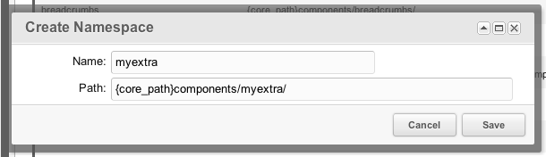
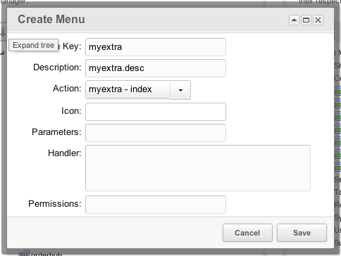

## What is a CMP?

 CMP stands for Custom Manager Page, and it is simply a custom page that loads in the MODX Revolution manager. It may also be called a Component or 3PC (3rd Party Component). Typically CMPs are accessed from the Extras menu in MODX, but as a developer there is a lot of freedom in where they are placed.

 If you are a developer looking to build an extra which includes a component, you should follow the [Developing an Extra for MODX Revolution tutorial](extending-modx/tutorials/developing-an-extra), as it walks you through all the specific steps and terminology based on an example package called doodles. This page only goes into a minimum set up for custom manager pages.

 The equivalent of a CMP or Component in MODX Evolution is a Module, though the technique in which they are created is quite different.

## Namespaces

 CMPs need a namespace in order for MODX to know where to load the files from.

 To create a Namespace, go to System -> Namespaces. Hit the Create New button and give the namespace a name and a core path. In Revolution 2.2 the Assets path is not yet used, but it can't hurt to also specify it. Your namespace name should be lowercase. While you're free to organise your filesystem as you want, it is best practice to place any files in a directory with the same name as your namespace, in the core/components and assets/components directories.

 So for example if your namespace is called "awesomestuff", your core path would be /path/to/core/components/awesomestuff/ and your assets path would be /path/to/assets/components/awesomestuff/.

 The following window is an example of what information makes up a Namespace:

 

 (NOTE: This image is outdated)

 In the paths, you can also use placeholders which will be evaluated when MODX loads files from your namespace:

- {core\_path} - Resolves to the **MODX\_CORE\_PATH** variable, which contains the absolute path to the core directory of your MODX installation, for example _/home/username/public\_html/modx\_location/core/_
- {base\_path} - Resolves to the **MODX\_BASE\_PATH** variable, which contains the absolute path to the root of the MODX installations, typically something _/home/username/public\_html/modx\_location/_
- {assets\_path} - Resolves to the **MODX\_ASSETS\_PATH** variable, which contains the absolute path to the assets directory of your MODX installation.

## Using modAction and modMenu

 To point the end user to your custom manager page, you will typically want to make it available through the top menu. This is done with an Action (modAction) and a Menu item (modMenu).

 An action contains the namespace and the controller name (more on controllers in a minute). A menu item contains the name and description to display in the top menu, and is also linked to your action object.

 To create an Action, go to System -> Actions. Right-click your Namespace from the 'Actions' tree and select "Create Action Here. In the modal window enter your controller name (call it "index" for now), choose the namespace and set the parent controller to "No Action".

 Note: in MODX 2.3, actions are no longer necessary (or possible to set up through the manager interface for that matter) and instead of creating the action, you pass your Menu to the right namespace and give it an action name, which is the name of your controller.

 Now that we have the Action set up, we can create a menu item. This menu item contains the title and description you can see in the top menu and is linked to the Action, which handles loading the controller (we'll get to the controller in a second).

 Again in System > Actions you should see a tree with all the menu items available. Right click on an existing menu item and choose "Place Action Here" to add a menu item. As you would typically place CMPs under the Components menu, right click that one.

 In the modal window, you will be asked to fill in a few details.

- Lexicon Key: this can either be a lexicon key, or just the title you want to show up. When building packages that will be distributed, you should place text in lexicons so they can easily be translated. If it's a lexicon key, it needs to be in the default topic.
- Description: the description that appears under menu items. Can also be a lexicon key.
- Action: choose the action that you created before. It will be listed as "namespace - index" and you may have to page through the dropdown to find it.
- Icon: not used in 2.2
- Parameters: not necessary currently, but you could use this if you want to pass additional URL parameters to the menu item link. Simply specify "&foo=bar" in that case.
- Handler: instead of loading an action, it's also possible for a menu item to execute a piece of javascript when clicked. This javascript would need to be specified in the handler. Leave empty for now.
- Permissions: only show the menu item if the user has these permissions. Note that if someone guesses the link to your action they can still access it, this only affects visibility of the menu item.

 

 (Note: image is outdated)

 Hit save, and refresh the page. Your menu item should be there now! But hold on, it wont work yet, because we're missing the controllers..

## Adding a base Controller

 Now, to make your manager page functional, it's necessary to add the controllers for it. Remember that we created an action with a controller "index"? Let's add our index controller, which will function as entry point to our other controllers.

 Create a new file core/components/namespace/index.class.php, with the following contents:

 ``` php
<?php
/**
 * The abstract Manager Controller.
 * In this class, we define stuff we want on all of our controllers.
 */
abstract class NamespaceManagerController extends modExtraManagerController {
    /**
     * Initializes the main manager controller. You may want to load certain classes,
     * assets that are shared across all controllers or configuration.
     *
     * All your other controllers in this namespace should extend this one.
     *
     * In this case we don't do anything useful, but as you build up more complex
     * extras, it helps to enforce this structure to make it easier to maintain.
     */
    public function initialize() {
        $this->addHtml('<script type="text/javascript">
        Ext.onReady(function() {
            // We could run some javascript here that runs on all of our controllers
            // for example something that loads your config
        });
        </script>');
    }
    /**
     * Defines the lexicon topics to load in our controller.
     * @return array
     */
    public function getLanguageTopics() {
        return array('namespace:default');
    }
    /**
     * We can use this to check if the user has permission to see this controller
     * @return bool
     */
    public function checkPermissions() {
        return true;
    }
}
/**
 * The Index Manager Controller is the default one that gets called when no
 * &action parameter is passed  We use it to define the default controller
 * which will then handle the actual processing.
 *
 * It is important to name this class "IndexManagerController" and making sure
 * it extends the abstract class we defined above
 */
class IndexManagerController extends NamespaceManagerController {
    /**
     * Defines the name or path to the default controller to load.
     * @return string
     */
    public static function getDefaultController() {
        return 'home';
    }
}
```

 So that's our base index controller. The IndexManagerController will be called when the menu item is loaded, which tells MODX to load the "home" controller by default. By passing an "action" url parameter to the page (either by adjusting the menu item "parameters" option, or by manually crafting that link) it will load a different controller instead.

 In this tutorial we only go into the pieces that are actually required to build a real simple manager page, but if you are looking to build a fully fledged manager page with ExtJS and more, follow the [Developing an Extra in MODX Revolution](extending-modx/tutorials/developing-an-extra) tutorial. You'll find there's an overlap between this page and Part 2 of that tutorial, but that we restrict ourselves to a simple manager page here.

## Adding the Home controller

 The Home controller is the one that is actually processed when we open the menu item.

 Create a new file in core/components/namespace/controllers/home.class.php and give it the following contents:

 ``` php
<?php
/**
 * The name of the controller is based on the action (home) and the
 * namespace. This home controller is loaded by default because of
 * our IndexManagerController.
 */
class NamespaceHomeManagerController extends NamespaceManagerController {
    /**
     * Any specific processing we want to do here. Return a string of html.
     * @param array $scriptProperties
     */
    public function process(array $scriptProperties = array()) {
        return '<h2 class="modx-page-header">It\'s alive!</h2><p>This is your first custom manager page. You are awesome!</p>';
    }
    /**
     * The pagetitle to put in the <title> attribute.
     * @return null|string
     */
    public function getPageTitle() {
        return 'My first CMP!';
    }
    /**
     * Register needed assets. Using this method, it will automagically
     * combine and compress them if that is enabled in system settings.
     */
    public function loadCustomCssJs() {
        $this->addCss('url/to/some/css_file.css');
        $this->addJavascript('url/to/some/javascript.js');
        $this->addLastJavascript('url/to/some/javascript_load_last.js');
        $this->addHtml('<script type="text/javascript">
        Ext.onReady(function() {
            // We could run some javascript here
        });
        </script>');
    }
}<br>
```

 We're just returning the HTML we want added to the page in the process function. Easy, right? Load the menu item now and your manager page should show up telling you that you're awesome.

 If you're getting a blank page, there is likely a class name or path wrong somewhere. If you can access the PHP Error logs it will tell you exactly which one, but here are some pointers:

- Is your namespace core path correct?
- Is your index controller called "IndexManagerController"? Don't use the namespace in that name.
- Is your home controller called "NamespaceHomeManagerController"? It's important to start with the namespace with an uppercase character, then the action ("home") with an uppercase controller, and then ManagerController, anything else is not accepted.

### Using a Template file

 It's possible to use a template file for custom manager pages. Simply add a getTemplateFile method and return the absolute path to a file, and it will be loaded and processed as a Smarty template. To add placeholders for the template file, call $this->setPlaceholder($key, $value) in the process function.

 Here's an example of using placeholders in the smarty template file, assuming you called $this->setPlaceholder('foo', 'Bar');

 ``` html
<h2 class="modx-page-header">{$foo}</h2>
```

 This would output a standard MODX Manager page header saying "Bar".

## Going beyond plain HTML

 After this tutorial you built a super simple custom manager page. If you want, you can now continue building a rich interface using [MODExt](extending-modx/custom-manager-pages/modext "MODExt"), the ExtJS integration in Revolution. More about MODExt can be found [here](extending-modx/custom-manager-pages/modext "MODExt").

 It is also recommended to follow the [Developing an Extra in MODX Revolution](extending-modx/tutorials/developing-an-extra) tutorial as it walks you through every step needed to build a rich component.

## See Also

1. [Actions and Menus](extending-modx/menus/actions)
   1. [Action List](extending-modx/menus/action-list)
2. [Custom Manager Pages in 2.3](extending-modx/custom-manager-pages/tutorial)
3. [MODExt](extending-modx/custom-manager-pages/modext)
   1. [MODExt MODx Object](extending-modx/custom-manager-pages/modext/modext-modx-object)
   2. [MODExt Tutorials](extending-modx/custom-manager-pages/modext/modext-tutorials)
      1. [Ext JS Tutorial - Message Boxes](extending-modx/custom-manager-pages/modext/modext-tutorials/1.-ext-js-tutorial-message-boxes)
      2. [Ext JS Tutorial - Ajax Include](extending-modx/custom-manager-pages/modext/modext-tutorials/2.-ext-js-tutorial-ajax-include)
      3. [Ext JS Tutorial - Animation](extending-modx/custom-manager-pages/modext/modext-tutorials/3.-ext-js-tutorial-animation)
      4. [Ext JS Tutorial - Manipulating Nodes](extending-modx/custom-manager-pages/modext/modext-tutorials/4.-ext-js-tutorial-manipulating-nodes)
      5. [Ext JS Tutorial - Panels](extending-modx/custom-manager-pages/modext/modext-tutorials/5.-ext-js-tutorial-panels)
      6. [Ext JS Tutoral - Advanced Grid](extending-modx/custom-manager-pages/modext/modext-tutorials/7.-ext-js-tutoral-advanced-grid)
      7. [Ext JS Tutorial - Inside a CMP](extending-modx/custom-manager-pages/modext/modext-tutorials/8.-ext-js-tutorial-inside-a-cmp)
   3. [MODx.combo.ComboBox](extending-modx/custom-manager-pages/modext/modx.combo.combobox)
   4. [MODx.Console](extending-modx/custom-manager-pages/modext/modx.console)
   5. [MODx.FormPanel](extending-modx/custom-manager-pages/modext/modx.formpanel)
   6. [MODx.grid.Grid](extending-modx/custom-manager-pages/modext/modx.grid.grid)
   7. [MODx.grid.LocalGrid](extending-modx/custom-manager-pages/modext/modx.grid.localgrid)
   8. [MODx.msg](extending-modx/custom-manager-pages/modext/modx.msg)
   9. [MODx.tree.Tree](extending-modx/custom-manager-pages/modext/modx.tree.tree)
   10. [MODx.Window](extending-modx/custom-manager-pages/modext/modx.window)
