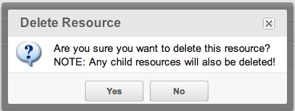

## MODx.msg

**Extends:** Ext.Component
**Key Features:** AJAX connector features.



The MODx.msg class provides the functionality of the Ext.MessageBox class, with the added benefit of using an AJAX callback function (for confirmation dialogs). Simply provide a URL and optional parameters and a connector request will be sent after the user confirms the prompt. It defaults to a minimum width of 200px.

## Methods

### alert

> MODx.msg.alert(title,text,fn,scope)

Used to display an alert dialog box on the page. Example:

``` javascript
MODx.msg.alert('Warning!','You are out of space! We should clear the cache.',function() {
  MODx.clearCache();
},MODx);
```

### confirm

> MODx.msg.confirm(config)

Loads a confirmation dialog that prompts the user for a Yes/No response. If Yes is selected, fires an AJAX request to a specific connector. The properties for the config parameter are:

| Name      | Description                                       |
| --------- | ------------------------------------------------- |
| title     | The title of the confirmation box.                |
| text      | The text in the confirmation box.                 |
| minWidth  | The confirmation popup will automatically choose a size, but to make sure it's at least a certain width provide an integer value representing the width. (Added in 3.0.0-rc2) |
| url       | The URL to send the AJAX request to.              |
| params    | The REQUEST params to send with the AJAX request. |
| listeners | Any listeners to look for on the request.         |

An example:

``` javascript
MODx.msg.confirm({
   title: 'Are you sure?',
   text: 'Do you want to delete the world? This is irreversible.',
   url: 'http://rest.endofdays.com/armageddon/',
   params: {
      deleteWorld: true
   },
   listeners: {
        'success':{fn: function(r) {
             MODx.clearCache(); /* clear cache after world destruction, so we dont have latent data */
        },scope:true}
   }
});
```

#### MODx.msg.confirm Custom Events

MODx.msg.confirm adds a few custom events that fire:

| Name    | Description                                              |
| ------- | -------------------------------------------------------- |
| success | Fires on a successful response from the AJAX submission. |
| failure | Fires on a failed response from the AJAX submission.     |
| cancel  | Fires when the user cancels the confirmation dialog.     |

### status

``` javascript
MODx.msg.status(opt)
```

Loads a temporary status message in the top-right of the screen, that fades away. The properties for the opt parameter are:

| Name     | Description                                                                             | Default |
| -------- | --------------------------------------------------------------------------------------- | ------- |
| title    | Optional. The title of the message.                                                     |         |
| message  | The text of the status message.                                                         |         |
| dontHide | If true, will not automatically hide the status message. Will stay until it is clicked. | false   |
| delay    | The number of seconds to show the message.                                              | 1.5     |

You could use this in custom manager pages to provide confirmation your object was saved. You could add something like this to your FormPanel definition:

``` javascript
        listeners: {
            'success': function (res) {
                MODx.msg.status({
                    title: _('save_successful'),
                    message: res.result['message'],
                    delay: 3
                });
            }
        }
```

The 'success' listener is part of modExt and comes with [MODx.FormPanel](extending-modx/custom-manager-pages/modext/modx.formpanel "MODx.FormPanel").

## See Also

1. [MODExt MODx Object](extending-modx/custom-manager-pages/modext/modext-modx-object)
2. [MODExt Tutorials](extending-modx/custom-manager-pages/modext/modext-tutorials)
   1. [Ext JS Tutorial - Message Boxes](extending-modx/custom-manager-pages/modext/modext-tutorials/1.-ext-js-tutorial-message-boxes)
   2. [Ext JS Tutorial - Ajax Include](extending-modx/custom-manager-pages/modext/modext-tutorials/2.-ext-js-tutorial-ajax-include)
   3. [Ext JS Tutorial - Animation](extending-modx/custom-manager-pages/modext/modext-tutorials/3.-ext-js-tutorial-animation)
   4. [Ext JS Tutorial - Manipulating Nodes](extending-modx/custom-manager-pages/modext/modext-tutorials/4.-ext-js-tutorial-manipulating-nodes)
   5. [Ext JS Tutorial - Panels](extending-modx/custom-manager-pages/modext/modext-tutorials/5.-ext-js-tutorial-panels)
   6. [Ext JS Tutoral - Advanced Grid](extending-modx/custom-manager-pages/modext/modext-tutorials/7.-ext-js-tutoral-advanced-grid)
   7. [Ext JS Tutorial - Inside a CMP](extending-modx/custom-manager-pages/modext/modext-tutorials/8.-ext-js-tutorial-inside-a-cmp)
3. [MODx.combo.ComboBox](extending-modx/custom-manager-pages/modext/modx.combo.combobox)
4. [MODx.Console](extending-modx/custom-manager-pages/modext/modx.console)
5. [MODx.FormPanel](extending-modx/custom-manager-pages/modext/modx.formpanel)
6. [MODx.grid.Grid](extending-modx/custom-manager-pages/modext/modx.grid.grid)
7. [MODx.grid.LocalGrid](extending-modx/custom-manager-pages/modext/modx.grid.localgrid)
8. [MODx.msg](extending-modx/custom-manager-pages/modext/modx.msg)
9. [MODx.tree.Tree](extending-modx/custom-manager-pages/modext/modx.tree.tree)
10. [MODx.Window](extending-modx/custom-manager-pages/modext/modx.window)
