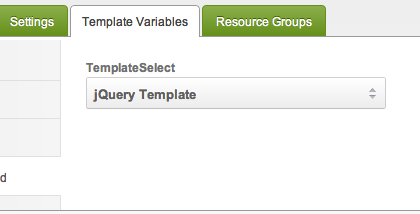

This tutorial is for MODX Revolution 2.2 and 3.x.

## What are Custom TV Input Types?

MODX Revolution lets you add your own TV input types (beside textbox, radio, textarea, richtext, and the rest) for [Template Variables](building-sites/elements/template-variables). This example loads a Template dropdown in the Manager, then on the frontend prints the selected Template ID in a `div`. We call the type `templateselect` and keep the files in an Extra at `core/components/ourtvs/`.

If the custom renderer is missing, MODX draws a **plain text field**. That is the fallback in `modTemplateVar::getRender()`, not a broken combo. The usual cause is skipping the pathing plugin below.

## Create a Namespace

Create a Namespace named `ourtvs` with path `{core_path}components/ourtvs/`.

In 3.x, MODX also scans `{namespace_path}/tv/input/` when it **lists** input types in the TV editor. That list is not the same as **rendering** the TV on a Resource. Rendering still uses the plugin events in the next step.

## Creating the Pathing Plugin

You still need this plugin on 2.3 and on 3.x. The Namespace does not replace it for the Resource form.

Create a plugin named `OurTvsPlugin` and attach **only** these events:

- `OnTVInputRenderList` — Manager input renderer
- `OnTVOutputRenderList` — frontend output renderer
- `OnTVInputPropertiesList` — input properties in the Manager
- `OnTVOutputRenderPropertiesList` — output properties

Plugin code:

``` php
$corePath = $modx->getOption('core_path').'components/ourtvs/';
switch ($modx->event->name) {
    case 'OnTVInputRenderList':
        $modx->event->output($corePath.'tv/input/');
        break;
    case 'OnTVOutputRenderList':
        $modx->event->output($corePath.'tv/output/');
        break;
    case 'OnTVInputPropertiesList':
        $modx->event->output($corePath.'tv/inputoptions/');
        break;
    case 'OnTVOutputRenderPropertiesList':
        $modx->event->output($corePath.'tv/properties/');
        break;
}
```

Those handlers add include paths. Trailing slashes matter. After you save the plugin, clear the Manager cache.

If you skip this plugin, the TV type may still appear in the Input Type dropdown (3.x Namespace scan), but the Resource form falls back to a text field.

## Creating the Input Controller

The input controller loads the markup. Create:

> `core/components/ourtvs/tv/input/templateselect.class.php`

The file name without `.class.php` is the type key: `templateselect`.

``` php
<?php
if (!class_exists('TemplateSelectInputRender')) {
    class TemplateSelectInputRender extends modTemplateVarInputRender {
        public function getTemplate() {
            return $this->modx->getOption('core_path').'components/ourtvs/tv/input/tpl/templateselect.tpl';
        }
        public function process($value, array $params = array()) {
        }
    }
}
return 'TemplateSelectInputRender';
```

On 3.x, `modTemplateVarInputRender` is `MODX\Revolution\modTemplateVarInputRender`. The global name still works while deprecated class aliases are on (default). You can add `use MODX\Revolution\modTemplateVarInputRender;` at the top if you prefer the namespaced class.

`getTemplate()` points at a Smarty file. Put it here:

> `core/components/ourtvs/tv/input/tpl/templateselect.tpl`

``` javascript
<select id="tv{$tv->id}" name="tv{$tv->id}" class="combobox"></select>
<script type="text/javascript">
// <![CDATA[
{literal}
MODx.load({
{/literal}
    xtype: 'modx-combo-template'
    ,name: 'tv{$tv->id}'
    ,hiddenName: 'tv{$tv->id}'
    ,transform: 'tv{$tv->id}'
    ,id: 'tv{$tv->id}'
    ,width: 300
    ,value: '{$tv->value}'
{literal}
    ,listeners: { 'select': { fn:MODx.fireResourceFormChange, scope:this}}
});
{/literal}
// ]]>
</script>
```

You do not have to use ExtJS. A plain HTML control is fine. The control must use the name `tv{$tv->id}`.

Create a Template Variable, set Input Type to `templateselect`, assign it to a Template, then edit a Resource. You should get a Template dropdown:



If you still see a text box: confirm the plugin is enabled on `OnTVInputRenderList`, the class file path matches the output path, and the TV type key is `templateselect`.

## Creating the Output Controller

Create:

> `core/components/ourtvs/tv/output/templateselect.class.php`

``` php
<?php
if (!class_exists('TemplateSelectOutputRender')) {
    class TemplateSelectOutputRender extends modTemplateVarOutputRender {
        public function process($value, array $params = array()) {
            return '<div class="template">'.$value.'</div>';
        }
    }
}
return 'TemplateSelectOutputRender';
```

On the frontend this prints the selected Template ID inside a `div`.

## See Also

1. [Creating a Template Variable](building-sites/elements/template-variables/step-by-step)
2. [Bindings](building-sites/elements/template-variables/bindings)
     1. [CHUNK Binding](building-sites/elements/template-variables/bindings/chunk-binding)
     2. [DIRECTORY Binding](building-sites/elements/template-variables/bindings/directory-binding)
     3. [FILE Binding](building-sites/elements/template-variables/bindings/file-binding)
     4. [INHERIT Binding](building-sites/elements/template-variables/bindings/inherit-binding)
     5. [RESOURCE Binding](building-sites/elements/template-variables/bindings/resource-binding)
     6. [SELECT Binding](building-sites/elements/template-variables/bindings/select-binding)
3. [Template Variable Input Types](building-sites/elements/template-variables/input-types)
4. [Template Variable Output Types](building-sites/elements/template-variables/output-types)
     1. [Date TV Output Type](building-sites/elements/template-variables/output-types/date)
     2. [Delimiter TV Output Type](building-sites/elements/template-variables/output-types/delimiter)
     3. [HTML Tag TV Output Type](building-sites/elements/template-variables/output-types/html)
     4. [Image TV Output Type](building-sites/elements/template-variables/output-types/image)
     5. [URL TV Output Type](building-sites/elements/template-variables/output-types/url)
5. [Adding a Custom TV Type - MODX 2.2](extending-modx/custom-tvs)
6. [Creating a multi-select box for related pages in your template](building-sites/tutorials/multiselect-related-pages)
7. [Accessing Template Variable Values via the API](extending-modx/snippets/accessing-tvs)
