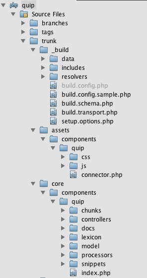
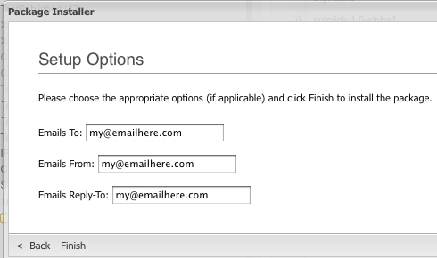

Users using Revolution 2.0.0-beta-4 or earlier should note that the defines are different in beta5 and onward. An example: `xPDOTransport::UNIQUE_KEYS` in beta5+ is `XPDO_TRANSPORT_UNIQUE_KEYS` in beta4 and earlier. MODX recommends to just update to beta5/SVN.

A build script. What is that, you might ask? This is the meat of the packaging process; here is where your component is actually put into the nice, neat .zip transport package that you find on modxcms.com or through Revolution's Package Management section.

This tutorial will guide you through how to create one of those scripts. We'll be using a sample component called Quip, which contains a modAction, a few menus, some chunks and a snippet, lexicons, setup options, a license, a readme, and system settings. It's basically a quick, easy run through of all the basics to creating a fundamental build script.

## Directory Structure

First off, let's take a quick look at our directory structure. This isn't always how you have to do it - this one is specifically built this way for SVN; but it's definitely recommended, especially with the _assets/components/quip/_ and _core/components/quip/_ structures, since that makes creating the transport package much easier.



## Starting the Build Script

Create a new file. Typically, it's build.transport.php in the \_build directory. Let's first start with some phpdoc comments at the top, and then start the timer.

```php
<?php
/**
 * Quip build script
 *
 * @package quip
 * @subpackage build
 */
$mtime = microtime();
$mtime = explode(" ", $mtime);
$mtime = $mtime[1] + $mtime[0];
$tstart = $mtime;
set_time_limit(0); /* makes sure our script doesnt timeout */
```

Now let's define some basic paths. We can define these up top into a "sources" array to make them easier to reach later in the build script. Note how the 'source*core' and `source_assets` directories do \_not* post-fix a foreslash onto their paths. This is required.

```php
$root = dirname(dirname(__FILE__)).'/';
$sources= array (
    'root' => $root,
    'build' => $root .'_build/',
    'resolvers' => $root . '_build/resolvers/',
    'data' => $root . '_build/data/',
    'source_core' => $root.'core/components/quip',
    'lexicon' => $root . 'core/components/quip/lexicon/',
    'source_assets' => $root.'assets/components/quip',
    'docs' => $root.'core/components/quip/docs/',
);
unset($root); /* save memory */
```

Now, we'll need to include some files to get the build libraries we'll need. First, let's include a file we'll create called 'build.config.php' in our build dir.

```php
require_once dirname(__FILE__) . '/build.config.php';
```

In this file, we'll want to define the location of our MODX Revolution installation so that the build script can know where to get the modX class, as well as where to put the package when finished. Our file will look somewhat like this:

```php
<?php
/**
 * Define the MODX path constants necessary for core installation
 *
 * @package quip
 * @subpackage build
 */
define('MODX_CORE_PATH', '/absolute/path/to/modx/core/');
define('MODX_CONFIG_KEY','config');
```

You'll want to make sure to change the value of `MODX_CORE_PATH` to the absolute path of where your MODX Revolution core is installed. `MODX_CONFIG_KEY` can stay the same, unless you're doing a multi-domain install.

Now, you'll want to include the modX class, and instantiate it. We'll also initialize it into the 'mgr' context, and set the log output to HTML to make our errors and info messages nice and formatted - unless we're doing this from the cmd line, where we'll want just standard echo messages.

```php
require_once MODX_CORE_PATH . 'model/modx/modx.class.php';

$modx= new modX();
$modx->initialize('mgr');
$modx->setLogLevel(modX::LOG_LEVEL_INFO);
$modx->setLogTarget(XPDO_CLI_MODE ? 'ECHO' : 'HTML');
```

Okay, it's time for the meat. Let's first off use `$modx->loadClass` to load the `modPackageBuilder` class. Then we'll instantiate an instance of it, and create a package.

```php
$modx->loadClass('transport.modPackageBuilder','',false, true);
$builder = new modPackageBuilder($modx);
$builder->createPackage('quip','0.1','alpha7');
$builder->registerNamespace('quip',false,true,'{core_path}components/quip/');
```

The modPackageBuilder::createPackage function has 3 parameters:
_name_, _version_, and _release_. For us,
we'll be doing quip-0.1-alpha7, so let's go with that.

Next, we'll register a [Namespace](extending-modx/namespaces "Namespaces") to this package. Not all packages need [Namespaces](extending-modx/namespaces "Namespaces"); but all 3rd Party Components do. Basically, a Namespace is an organizing tool for MODX so that MODX can know what objects are tied to what package. This is helpful later on should we want to uninstall our package; we'd want it to remove the objects we'd install.

Plus, should we want to add any [Lexicon Entries](extending-modx/internationalization "Internationalization") to this package (which we will), MODX does so by relating it to it's Namespace. Our package builder will assign our Lexicon Entries to the Namespace, so we can easily manage _just_ our Lexicon Entries; not any others.

## Packaging in Objects

Objects are packaged as _Vehicles_ in MODX Revolution; basically think of a vehicle as a sort of storage system that transports the data and/or files into the zip package. Packages can contain many vehicles; vehicles can contain many objects or files - however, vehicles that contain an object must only have one reference object (or parent object, whichever you prefer) that the vehicle is based off of.

So, let's look at some examples for creating a vehicle before digging into our build script. This first example packages in a simple object, with some parameters:

```php
$snippet = $modx->newObject('modSnippet');
$snippet->set('id',1);
$snippet->set('name','Test');
$vehicle = $builder->createVehicle($snippet,array(
    xPDOTransport::UNIQUE_KEY => 'name',
    xPDOTransport::UPDATE_OBJECT => true,
    xPDOTransport::PRESERVE_KEYS => false,
));
```

So, first off, we created a snippet object. Note that you'll have to specify an arbitrary ID for it, even though we wont keep it later. This is required. Then, we used the 'createVehicle' function in modPackageBuilder to create the vehicle object. Let's look at those attributes options more closely:

-   `xPDOTransport::UNIQUE_KEY` _(string/array)_ - Here you'd place the unique key that identifies the object you're creating. This will tell MODX to search for the modSnippet with the 'name' equal to the packaged in name (here, 'Test') when updating or removing the object. For most objects, this will be 'name'; others require different settings. Some might even require an array of two or more fields.
-   `xPDOTransport::UPDATE_OBJECT` _(boolean)_ - Either true or false, this tells MODX whether or not to update the object if it is found in the DB upon install (or update). Sometimes, if the object is already there, you may not want to update it - the update might erase the user's current settings for that object.
-   `xPDOTransport::PRESERVE_KEYS` _(boolean)_ - Either true or false, this tells MODX whether or not to rewrite the primary keys when the object is found. This can be useful if you're wanting the PKs to stay the same when you update - some PKs are auto_increment, and if you're wanting those to stay the same number, you'd set this to true. Note: If the object already exists, this feature only works if `xPDOTransport::UPDATE_OBJECT` is set to true as well. If the object is not found, it will work regardless.

Simple enough? So our example tells it to look for a Snippet named 'Test', and if it finds it, update its contents. If it doesnt find it, create it. However, if it does find it; we told MODX not to update its PK - there's no need to adjust that in this situation.

Now, what about related objects? What if I want to package in my modMenu, along with its Action associated with the modMenu? Here's a bit more complex scenario:

```php
$action= $modx->newObject('modAction');
$action->fromArray(array(
    'id' => 1,
    'namespace' => 'quip',
    'parent' => '0',
    'controller' => 'index',
    'haslayout' => '1',
    'lang_topics' => 'quip:default,file',
    'assets' => '',
),'',true,true);
$menu= $modx->newObject('modMenu');
$menu->fromArray(array(
    'text' => 'quip',
    'parent' => 'components',
    'description' => 'quip_desc',
    'icon' => 'images/icons/plugin.gif',
    'menuindex' => '0',
    'params' => '',
    'handler' => '',
),'',true,true);
$menu->addOne($action);
$vehicle= $builder->createVehicle($menu,array (
    xPDOTransport::PRESERVE_KEYS => true,
    xPDOTransport::UPDATE_OBJECT => true,
    xPDOTransport::UNIQUE_KEY => 'text',
    xPDOTransport::RELATED_OBJECTS => true,
    xPDOTransport::RELATED_OBJECT_ATTRIBUTES => array (
        'Action' => array (
            xPDOTransport::PRESERVE_KEYS => false,
            xPDOTransport::UPDATE_OBJECT => true,
            xPDOTransport::UNIQUE_KEY => array ('namespace','controller'),
        ),
    ),
));
```

Okay, a bit more meat here. We're introducing 2 new parameters:

-   `xPDOTransport::RELATED_OBJECTS` _(boolean)_ - Either true or false, this will tell MODX we want to search for related objects to this object. This must be set for the next parameter to work.
-   `xPDOTransport::RELATED_OBJECT_ATTRIBUTES` _(array)_ - This defines the types and details of the related objects we want to grab. If you note, the format is simply an associative array of attributes - similar to the parent object's attributes - where the key is the "alias" of the related object we want to grab. The aliases can be found in the Schema, located in _core/model/schema/modx.mysql.schema.xml_.

So our example above tells us on the modAction (found by looking for the modAction with a namespace of 'quip' and a controller of 'index') to include the related modAction object that we package in. We packaged them in manually using xPDO's addOne function on the modAction.

Also, if we wanted to package in related objects to the modAction objects, we would just have had to define that in the 'Action' attributes and addMany (or addOne) on that action. You can go however deep in nesting that you want.

So, back to our script. To recap, so far we have:

```php
<?php
/**
 * Quip build script
 *
 * @package quip
 * @subpackage build
 */
$mtime = microtime();
$mtime = explode(" ", $mtime);
$mtime = $mtime[1] + $mtime[0];
$tstart = $mtime;
set_time_limit(0);

$root = dirname(dirname(__FILE__)).'/';
$sources= array (
    'root' => $root,
    'build' => $root .'_build/',
    'lexicon' => $root . '_build/lexicon/',
    'resolvers' => $root . '_build/resolvers/',
    'data' => $root . '_build/data/',
    'source_core' => $root.'core/components/quip',
    'source_assets' => $root.'assets/components/quip',
    'docs' => $root.'core/components/quip/docs/',
);
unset($root);

/* override with your own defines here (see build.config.sample.php) */
require_once dirname(__FILE__) . '/build.config.php';
require_once MODX_CORE_PATH . 'model/modx/modx.class.php';

$modx= new modX();
$modx->initialize('mgr');
$modx->setLogLevel(modX::LOG_LEVEL_INFO);
$modx->setLogTarget(XPDO_CLI_MODE ? 'ECHO' : 'HTML');

$modx->loadClass('transport.modPackageBuilder','',false, true);
$builder = new modPackageBuilder($modx);
$builder->createPackage('quip','0.1','alpha5');
$builder->registerNamespace('quip',false,true,'{core_path}components/quip/');
```

So, let's first package in our modActions and modMenus for our backend:

```php
/* load action/menu */
$menu = include $sources['data'].'transport.menu.php';

$vehicle= $builder->createVehicle($menu,array (
    xPDOTransport::PRESERVE_KEYS => true,
    xPDOTransport::UPDATE_OBJECT => true,
    xPDOTransport::UNIQUE_KEY => 'text',
    xPDOTransport::RELATED_OBJECTS => true,
    xPDOTransport::RELATED_OBJECT_ATTRIBUTES => array (
        'Action' => array (
            xPDOTransport::PRESERVE_KEYS => false,
            xPDOTransport::UPDATE_OBJECT => true,
            xPDOTransport::UNIQUE_KEY => array ('namespace','controller'),
        ),
    ),
));
$builder->putVehicle($vehicle);
unset($vehicle,$action); /* to keep memory low */
```

Wait! Notice how I put the action data in a different file? You don't have to do this - it's completely personal preference - but it does keep our build script clean, and isolate our actions/menus to a separate file for easy management.

Let's do the same with our system settings:

```php
/* load system settings */
$settings = include $sources['data'].'transport.settings.php';

$attributes= array(
    xPDOTransport::UNIQUE_KEY => 'key',
    xPDOTransport::PRESERVE_KEYS => true,
    xPDOTransport::UPDATE_OBJECT => false,
);
foreach ($settings as $setting) {
    $vehicle = $builder->createVehicle($setting,$attributes);
    $builder->putVehicle($vehicle);
}
unset($settings,$setting,$attributes);
```

Great! We've got our actions, menus and settings packaged in. Now, using our newfound knowledge about related objects, let's create a category called 'Quip' and put our Snippet and Chunks in that category. We'll go through this a bit slower, so we can easily see how this works:

```php
/* create category */
$category= $modx->newObject('modCategory');
$category->set('id',1);
$category->set('category','Quip');
```

Okay, great. Step one done: category created. Now about that Snippet:

```php
/* create the snippet */
$snippet= $modx->newObject('modSnippet');
$snippet->set('id',0);
$snippet->set('name', 'Quip');
$snippet->set('description', 'A simple commenting component.');
$snippet->set('snippet',file_get_contents($sources['source_core'].'/snippet.quip.php');
```

Great! Note how here we're actually using the `file_get_contents()` function to grab the contents of the snippet from our dev environment and place it here. This makes it easy to run the build in future iterations; no need to continually update this call - just update that file.

Now, we had some properties on that snippet...how do we put those in?

```php
$properties = include $sources['data'].'properties.inc.php';
$snippet->setProperties($properties);
$category->addMany($snippet);
```

We're using the addMany method here, and not the addOne method. Wether you need to use one or the other does not so much depend on the amount of objects you are relating (in this case only one snippet), but the cardinality of the relationship. That may sound complex - but the cardinality simply means if it is a one-on-one or one-to-many relationship. In this case, a category has a one-to-many relationship with snippets (there can be many snippets in one category) and that means you will have to use the addMany method. You can pass an array of objects or just one object to that method, but which one you use depends on the cardinality. Read more about [relationships](extending-modx/xpdo/custom-models/defining-a-schema/relationships "Defining Relationships"), [addOne](extending-modx/xpdo/class-reference/xpdoobject/related-object-accessors/addone "addOne") and [addMany](extending-modx/xpdo/class-reference/xpdoobject/related-object-accessors/addmany "addMany").

You'll use modSnippet's setProperties function to pass in an array of property arrays. So, let's take a look at that properties.inc.php file:

```php
<?php
/**
 * Default snippet properties
 *
 * @package quip
 * @subpackage build
 */
$properties = array(
    array(
        'name' => 'closed',
        'desc' => 'If set to true, the thread will not accept new comments.',
        'type' => 'combo-boolean',
        'options' => '',
        'value' => false,
    ),
    array(
        'name' => 'dateFormat',
        'desc' => 'The format of the dates displayed for a comment.',
        'type' => 'textfield',
        'options' => '',
        'value' => '%b %d, %Y at %I:%M %p',
    ),
    /* ...removed others for brevity... */
);
return $properties;
```

Simple enough. And now on to the chunks:

```php
/* add chunks */
$chunks = include $sources['data'].'transport.chunks.php';
if (is_array($chunks)) {
    $category->addMany($chunks);
} else { $modx->log(modX::LOG_LEVEL_FATAL,'Adding chunks failed.'); }
```

Good. We returned an array of chunks, and used modCategory's `addMany()` function to add them in. We also added a sanity check just in case we made a typo or something. Now, let's package all that into a vehicle:

```php
/* create category vehicle */
$attr = array(
    xPDOTransport::UNIQUE_KEY => 'category',
    xPDOTransport::PRESERVE_KEYS => false,
    xPDOTransport::UPDATE_OBJECT => true,
    xPDOTransport::RELATED_OBJECTS => true,
    xPDOTransport::RELATED_OBJECT_ATTRIBUTES => array (
        'Snippets' => array(
            xPDOTransport::PRESERVE_KEYS => false,
            xPDOTransport::UPDATE_OBJECT => true,
            xPDOTransport::UNIQUE_KEY => 'name',
        ),
        'Chunks' => array (
            xPDOTransport::PRESERVE_KEYS => false,
            xPDOTransport::UPDATE_OBJECT => true,
            xPDOTransport::UNIQUE_KEY => 'name',
        ),
    )
);
$vehicle = $builder->createVehicle($category,$attr);
```

Great! We've got our category vehicle, complete with all the related chunks and snippet. They'll be installed in the right category when our users install our package, too - so it'll look nice and sharp!

## Validators and Resolvers

Validators and resolvers are basically scripts that run during the install process. Validators are run pre-install; meaning that they are run before the main package installation happens. If they return false, the installation does not proceed.

Resolvers, on the other hand, execute after the main package has installed. They can either be file or PHP scripts. A file resolver simply copies over files into a specific target location. A PHP resolver executes a script after install.

With that said, we're going to attach 2 file resolvers, and one PHP resolver, to our script:

```php
$vehicle->resolve('file',array(
    'source' => $sources['source_core'],
    'target' => "return MODX_CORE_PATH . 'components/';",
));
$vehicle->resolve('file',array(
    'source' => $sources['source_assets'],
    'target' => "return MODX_ASSETS_PATH . 'components/';",
));
$vehicle->resolve('php',array(
    'source' => $sources['resolvers'] . 'setupoptions.resolver.php',
));
$builder->putVehicle($vehicle);
```

Okay, first things first. File resolvers take two options:

-   **source** - This is the target directory or script. If it's a file resolver, it must not end with a trailing slash and must be a valid directory. If it's a PHP script resolver, it must be a valid and accessible file.
-   **target** - Only applicable to file resolvers, this tells MODX where to install the source files. It is an eval()'ed statement, so must be used as in the example. The standard MODX defines are available to you; use those to grab base paths to target.

So in our examples, we simply move all the files in our source core directory to _modx/core/components/quip/_ (since our directory that we're moving is named "quip"), and all the files in our source assets directory to _modx/assets/components/quip/_.

You might be asking why we're moving these to two directories. Well, in practice, it's best to keep non-web-accessible files - such as PHP scripts, tpl files, docs, etc - in the core (which can be placed outside the webroot) so that they are kept secure from web visitors. This keeps only the files that need to be accessed through the web by your Component in the web-accessible part of your site.

Next, we add a PHP resolver, called 'setupoptions.resolver.php'. We'll get back to this in much more detail, because it actually deals with the setup options process we'll get to later.

And finally, we pack the vehicle into the package using the putVehicle function.

## Lexicons

So now we've got a package with system settings, actions, menus, snippets, chunks, a category, and a few resolvers all set up. Let's talk about our lexicons.

We have our lexicon structured nicely in our _core/components/quip/lexicon_ directory:


As you can see, we have a subdirectory as 'en', the IANA code for English. Then, we have a 'default.inc.php' - this represents the 'default' lexicon topic. Should we want to create separate lexicon topics, we would name them 'topicname.inc.php'.

As of MODX Revolution RC-2, MODX will automatically find the lexicons in your lexicon directory, assuming that you put them in this structure in the following place: '{namespace_path}lexicon/', where the Namespace path is the path you put for your Namespace earlier. You don't have to build in the lexicons directly at all; MODX will parse it for you.

This is because the lexicons are cached first from your files, then any overrides from the DB are merged and cached. This allows people to 'override' your lexicons by using Lexicon Management in the Manager, should they choose to, without breaking their upgrade path for your Component.

## Package Attributes: License, Readme and Setup Options

Each package has what are called 'package attributes', which can be passed to any resolver or validator. You could pass pretty much anything you want into the function `modPackageBuilder::setPackageAttributes()`, in an array format. There are, however, three special keys that we'll deal with.

-   **license** (string) - This represents your license agreement. Should MODX find this not empty during install, it will prompt the user to agree to it before they can proceed to install the package.
-   **readme** (string) - This holds the readme. Before installing, if this is not empty, the user will be able to view the readme. This can be useful to make sure people see any requirements before they install.
-   **setup-options** (string) - And here is the best part - this can be an HTML form (minus the form tags) that will pass any user-inputted options to the resolvers or validators. This means that you can take in user input before install, and process it during install!

So let's use these in our build script:

```php
/* now pack in the license file, readme and setup options */
$builder->setPackageAttributes(array(
    'license' => file_get_contents($sources['docs'] . 'license.txt'),
    'readme' => file_get_contents($sources['docs'] . 'readme.txt'),
    'setup-options' => array(
        'source' => $sources['build'] . 'setup.options.php'
    ),
));
```

Obviously our license and readme values are being passed the contents of our license and readme files. We're doing them via file\*get*contents() so that we can still store the actual files in the \_modx/core/components/quip/docs* directory after install, should the user want to view them later.

But 'setup-options' looks a little different. We could just pass a file_get_contents() call that puts in a string, but then our setup options form wouldn't be dynamic! There might be cases where you wouldn't want that, but we do. We want this options form to upgrade well. Note that you have to pass the file location as the 'source' parameter - remember Resolvers? Looks familiar, eh? Same idea.

Our setup.options.php file looks like this:

```php
<?php
/**
 * Build the setup options form.
 *
 * @package quip
 * @subpackage build
 */
/* set some default values */
$values = array(
    'emailsTo' => 'my@emailhere.com',
    'emailsFrom' => 'my@emailhere.com',
    'emailsReplyTo' => 'my@emailhere.com',
);
switch ($options[xPDOTransport::PACKAGE_ACTION]) {
    case xPDOTransport::ACTION_INSTALL:
    case xPDOTransport::ACTION_UPGRADE:
        $setting = $modx->getObject('modSystemSetting',array('key' => 'quip.emailsTo'));
        if ($setting != null) { $values['emailsTo'] = $setting->get('value'); }
        unset($setting);

        $setting = $modx->getObject('modSystemSetting',array('key' => 'quip.emailsFrom'));
        if ($setting != null) { $values['emailsFrom'] = $setting->get('value'); }
        unset($setting);

        $setting = $modx->getObject('modSystemSetting',array('key' => 'quip.emailsReplyTo'));
        if ($setting != null) { $values['emailsReplyTo'] = $setting->get('value'); }
        unset($setting);
    break;
    case xPDOTransport::ACTION_UNINSTALL: break;
}

$output = '<label for="quip-emailsTo">Emails To:</label>
<input type="text" name="emailsTo" id="quip-emailsTo" width="300" value="'.$values['emailsTo'].'" />
<br /><br />

<label for="quip-emailsFrom">Emails From:</label>
<input type="text" name="emailsFrom" id="quip-emailsFrom" width="300" value="'.$values['emailsFrom'].'" />
<br /><br />

<label for="quip-emailsReplyTo">Emails Reply-To:</label>
<input type="text" name="emailsReplyTo" id="quip-emailsReplyTo" width="300" value="'.$values['emailsReplyTo'].'" />';

return $output;
```

As you can see, some new constants here. These are available to all setup options forms and resolvers:

-   `xPDOTransport::PACKAGE_ACTION` - This tells us what action is being performed on the package; it is one of the following 3 values:
    -   `xPDOTransport::ACTION_INSTALL` - This is set when the package is being executed as an install.
    -   `xPDOTransport::ACTION_UPGRADE` - This is set when the package is being upgraded.
    -   `xPDOTransport::ACTION_UNINSTALL` - This is set when the package is being uninstalled. This doesn't apply to setup-options, obviously, since nothing is being set up. In future Revolution releases, it will allow you to do specific options for uninstall; but not yet.

Basically, we're presenting them with a form before install that looks like this:



So that they can set or update the values of the emailsTo, emailsFrom, and emailsReplyTo system settings before they install the package. Now, the script will first check to see if those settings already exist; and if so, we'll fill them in with those values. This allows for upgrades to go gracefully, persisting the user's custom settings for those values. Pretty cool, huh?

Obviously, there's a lot you could do with this. You could set target directories for photo locations, setup basic email accounts, set login/pass information for 3rd party web service integrations, and more. We'll leave your imagination to do the work from here on out.

Let's go back to our PHP script resolver that processes this information:

```php
<?php
/**
 * Resolves setup-options settings by setting email options.
 *
 * @package quip
 * @subpackage build
 */
$success= false;
switch ($options[xPDOTransport::PACKAGE_ACTION]) {
    case xPDOTransport::ACTION_INSTALL:
    case xPDOTransport::ACTION_UPGRADE:
        /* emailsTo */
        $setting = $object->xpdo->getObject('modSystemSetting',array('key' => 'quip.emailsTo'));
        if ($setting != null) {
            $setting->set('value',$options['emailsTo']);
            $setting->save();
        } else {
            $object->xpdo->log(xPDO::LOG_LEVEL_ERROR,'[Quip] emailsTo setting could not be found, so the setting could not be changed.');
        }

        /* emailsFrom */
        $setting = $object->xpdo->getObject('modSystemSetting',array('key' => 'quip.emailsFrom'));
        if ($setting != null) {
            $setting->set('value',$options['emailsFrom']);
            $setting->save();
        } else {
            $object->xpdo->log(xPDO::LOG_LEVEL_ERROR,'[Quip] emailsFrom setting could not be found, so the setting could not be changed.');
        }

        /* emailsReplyTo */
        $setting = $object->xpdo->getObject('modSystemSetting',array('key' => 'quip.emailsReplyTo'));
        if ($setting != null) {
            $setting->set('value',$options['emailsReplyTo']);
            $setting->save();
        } else {
            $object->xpdo->log(xPDO::LOG_LEVEL_ERROR,'[Quip] emailsReplyTo setting could not be found, so the setting could not be changed.');
        }

        $success= true;
        break;
    case xPDOTransport::ACTION_UNINSTALL:
        $success= true;
        break;
}
return $success;
```

Note that $modx is not available here; you're actually running these scripts from within the transport object. The $modx object is available as a different name, however: $object->xpdo. $object is the object that the resolver is attached to; here, it would be the modCategory.

Our script, then, is setting the values set in the setup-options to the newly installed system settings.

And now that we've got everything packaged and ready to go, let's pack the package into a zip file and give us the time it took to build the package:

```php
$builder->pack();

$mtime= microtime();
$mtime= explode(" ", $mtime);
$mtime= $mtime[1] + $mtime[0];
$tend= $mtime;
$totalTime= ($tend - $tstart);
$totalTime= sprintf("%2.4f s", $totalTime);

$modx->log(modX::LOG_LEVEL_INFO,"\nPackage Built.\nExecution time: {$totalTime}\n");

session_write_close();
exit();
```

Great, we're done! You'll only need to run this script now, and viola! A fully zipped transport package file will appear in your core/packages directory.

## Related Pages

-   [Package Management](extending-modx/transport-packages "Package Management")
-   [Transport Packages](extending-modx/transport-packages "Transport Packages")
-   [Transport Providers](building-sites/extras/providers "Providers")
