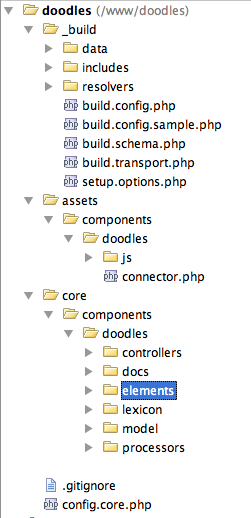

This tutorial is part of a Series:

-   Part I: Getting Started and Creating the Doodles Snippet
-   [Part II: Creating our Custom Manager Page](extending-modx/tutorials/developing-an-extra/part-2 "Developing an Extra in MODX Revolution, Part II")
-   [Part III: Packaging Our Extra](extending-modx/tutorials/developing-an-extra/part-3 "Developing an Extra in MODX Revolution, Part III")

## Overview

This tutorial is written as a comprehensive example on developing Extras for MODX Revolution 2.3 and later - as well as how to setup your Extra to be easily packaged into a Transport Package, as well as able to be developed outside the MODX webroot so that source control (such as Git) can be used.

The overview will be dissecting the "Doodles" Extra, which is a simple Extra that uses a custom table to store objects called "Doodles", which have a name and a description. We'll have a Snippet that pulls them and displays a list of them that is templatable via a Chunk, a Custom Manager Page using ExtJS to have a CRUD grid for editing, and a build script for packaging. And we'll make it all i18n-compatible to allow easy translating. **This is an extremely comprehensive tutorial**, so if you're wanting only specific parts, use the Table of Contents above.

The Doodles Extra in this tutorial can be found on GitHub, here: <https://github.com/splittingred/doodles>

## Setting Up Our Directories

There are many ways that you could start developing your Extra - you could write your Plugins, Snippets, etc. inside MODX and then package it with a packaging tool like [PackMan](extras/packman "PackMan"), or you could develop your project outside the MODX manager and track your files via a source control system such as [Git](http://github.com/). This tutorial uses the latter method for several reasons:

-   Allows immediate development straight from your Git repository
-   Allows easy collaboration between developers, as there is no copying files or changing core files - just developing in your preferred IDE and then doing some initial setup on paths.
-   Allows isolation of your code to be independent of MODX's core - so if you need to move it, you can do it in only one place.

Let's start. I've created a directory at **/www/doodles/** – make sure that this directory is **web-accessible** locally, as you'll need that later on. I have /www/ setup as my webroot on my localhost environment, for example.

You **may** have to add a System Setting in your MODX install called session_cookie_path and give it a value of "/" (no quotations). This will tell MODX to use the same session when you're running stuff at <http://localhost/doodles/>. Also, giving it a unique name via session_name (like "modxlocaldevsession") is a good idea too. That'll prevent conflicts with other MODX installs on your local machine. If you do this, empty the core/cache/ directory and relogin after doing so.

In here, we'll have quite a few directories:



Let's note a few things. The main 3 directories are **core/**, **assets/** and **\_build/**. Typically, MODX Extras are separated into 2 different directories when installed: `core/components/doodles/` and `assets/components/doodles/`. Why? This lets us separate web-specific assets (JavaScript files, CSS, images, connectors etc.) into a location inside of the webroot, whereas all PHP files (connectors have to stay in assets) are put into `core/components/` which can (and should) be outside of the webroot for security reasons.

They're separated into our directory structure here to mimic how they will be in the MODX installation after it's installed by the Transport Package.

The `_build/` directory is not put into the Transport Package zip file. It's there as scaffolding, to assist in the building the Transport Package. More about that at the towards the end of the tutorial.

Let's dive deeper into each subdirectory. In the `assets/` directory, the only not-obvious file is the `assets/components/doodles/connector.php`. This file will allow us to have custom processors for the Custom Manager Page (CMP) we'll be writing. We'll get more into that later.

In the `core/components/doodles/` directory, we have a few directories worth explaining:

-   **controllers** - These are the controllers for our CMP. More on those later.
-   **docs** - Just contains a changelog, readme and license file.
-   **elements** - All our Snippets, Chunks, Plugins, etc.
-   **lexicon** - All our i18n language files. More on those later.
-   **model** - Where all of our classes lie, as well as our XML schema file for our custom database tables.
-   **processors** - All our custom processors for our CMP.

Note that although this directory must be web accessible, it is _completely_ separate from the MODX core. You may wish to go as far as to install MODX in one sub-directory and put your repository in a separate sub-directory. For example, I installed MODX inside `/www/modx/` and I'm developing this Extra inside /www/doodles/. Using separate directories can help isolate you from any Git shenanigans or accidentally putting files into the wrong repository. As long as you have everything properly isolated, you can run "git init" and make yourself a Git repository out of the `/www/doodles/` directory (or whatever you made it). And you can push that up, without having to worry too much about it (we'll mention a few files later when we talk about adding a .gitignore file).

There we have it. An isolated development environment from MODX so that we can do separate development and seamless collaboration. Let's get further in.

## Creating the Doodles Snippet

Go ahead and create a file for our first Snippet:

`/www/doodles/core/components/doodles/elements/snippets/snippet.doodles.php`

You'll have to make a _snippets/_ directory, if you haven't already. Your file should be empty, but let's add a few lines of code:

```php
<?php
$dood = $modx->getService('doodles','Doodles',$modx->getOption('doodles.core_path',null,$modx->getOption('core_path').'components/doodles/').'model/doodles/',$scriptProperties);
if (!($dood instanceof Doodles)) return '';
```

Whoa! What's that? It's where the magic happens. Let's break down each part. First off, we have the getService call. It's shorthand notation right now, so let's split it up a bit to make it easier to read:

```php
$defaultDoodlesCorePath = $modx->getOption('core_path').'components/doodles/';
$doodlesCorePath = $modx->getOption('doodles.core_path',null,$defaultDoodlesCorePath);
$dood = $modx->getService('doodles','Doodles',$doodlesCorePath.'model/doodles/',$scriptProperties);
```

Okay, so first off, what is `$modx->getOption`? That's a method that grabs the System Setting with the key (the first parameter). In the first line, we are grabbing a 'default' path we are assuming our Doodles core path is going to be, by prefixing the MODX core path to it. It'll be: `/www/modx/core/components/doodles/`

Next, we'll pass that as a fallback value for the next `getOption` call. This one passes 3 parameters: a key named "doodles.core_path", null, and our default path var we just assigned. In `getOption`, the 2nd parameter is an array to search for the key (which we aren't doing, so we can set it to null), and the 3rd paramter is a default value if the key isn't found.

All this hubbub is required because we are developing our code in one place, yet when deployed, it will exist in another. We can't simply reference the paths relative to the MODX because we're not developing inside the MODX core. We'll explain this more in the next section.

So, for right now, our 2nd line will return `/www/modx/core/components/doodles/`. But that's not where our Doodles core path is! (hint: it's at `/www/doodles/core/components/doodles`). We want to tell these lines to find it there. So what do we do?

### Making the Magic Path Settings

We set a couple System Settings (that are specific to our development environment) that tell these lines where to get our files! Go ahead and make the following [System Settings](building-sites/settings "System Settings") and set their values:

-   **doodles.core_path** - /www/doodles/core/components/doodles/
-   **doodles.assets_url** - /doodles/assets/components/doodles/

If you need to change either of those to reflect your correct paths, such as the URL one, do so. Now our first line will return: _/www/doodles/core/components/doodles/_ Bingo! Cool, huh?

Why do we do this? Why not just refer to `/www/doodles/core/components/doodles/`? Well, that wouldn't work in someone else's installation. There's is most likely to be at `MODXPATH/core/components/doodles/`. Our Transport Package (later) will handle all of that dynamic path stuff, but we want to add an override to allow us to develop Doodles outside of the MODX path. And we just did. Coding bliss!

Now on to the third line:

```php
$dood = $modx->getService('doodles','Doodles',$doodlesCorePath.'model/doodles/',$scriptProperties);
```

Okay, this gets crazy. `$modx->getService` loads a class and instantiates an object of it, if it exists, and sets it to `$modx->doodles` here in this case (the first parameter passed in). More on getService can be found [here](extending-modx/modx-class/reference/modx.getservice "modX.getService"). But wait! We don't have a Doodles class! Well, it's time to make one.

### Making the Doodles Base Class

First off, you're probably asking me why we're even making this class. Well, it'll help for a few reasons: we can define some basic paths in it that we'll use across our custom Extra, and it can also give us some app-wide methods we can use. Trust me, it's useful. So let's make it in `/www/doodles/core/components/doodles/model/doodles/doodles.class.php`:

```php
<?php
class Doodles {
    public $modx;
    public $config = array();
    public function __construct(modX &$modx,array $config = array()) {
        $this->modx =& $modx;
        $basePath = $this->modx->getOption('doodles.core_path',$config,$this->modx->getOption('core_path').'components/doodles/');
        $assetsUrl = $this->modx->getOption('doodles.assets_url',$config,$this->modx->getOption('assets_url').'components/doodles/');
        $this->config = array_merge(array(
            'basePath' => $basePath,
            'corePath' => $basePath,
            'modelPath' => $basePath.'model/',
            'processorsPath' => $basePath.'processors/',
            'templatesPath' => $basePath.'templates/',
            'chunksPath' => $basePath.'elements/chunks/',
            'jsUrl' => $assetsUrl.'js/',
            'cssUrl' => $assetsUrl.'css/',
            'assetsUrl' => $assetsUrl,
            'connectorUrl' => $assetsUrl.'connector.php',
        ),$config);
    }
}
```

Great! It's pretty simple for now - just creates a class object that has a constructor that sets a reference to the modX object at `$doodles->modx`. This is useful later. Also, it populates some basic paths we may use later on into the `$doodles->config` array, and it does it with our fancy System Settings trick so we can point it to our `/www/doodles/` path!

Now, back to our Snippet. Let's go ahead and add some default properties to our Snippet, after the lines above, so it looks like this:

```php
$dood = $modx->getService('doodles','Doodles',$modx->getOption('doodles.core_path',null,$modx->getOption('core_path').'components/doodles/').'model/doodles/',$scriptProperties);
if (!($dood instanceof Doodles)) return '';
/* setup default properties */
$tpl = $modx->getOption('tpl',$scriptProperties,'rowTpl');
$sort = $modx->getOption('sort',$scriptProperties,'name');
$dir = $modx->getOption('dir',$scriptProperties,'ASC');
$output = '';
return $output;
```

Cool. Now we want to use [xPDO](extending-modx/xpdo "xPDO") to query the database to grab our records...oops. We haven't made an xPDO model for them yet. We should do that.

### Making the Model

xPDO OOP query methods to access the database. It currently is beginning to support multiple databases, and it does that by the abstraction of DB queries. Also, it allows you to keep your DB rows in nice, clean classes and do all kinds of neat things in very short lines of code. But to do that, we have to add an xPDO model to our Snippet (via the `$modx->addPackage` method`). But first we have to build that model, using an xPDO Schema. There's a [nice long tutorial here](extending-modx/xpdo/custom-models) on how to do that, but we'll go over it fast for now.

Go ahead and make a xml file in _/www/doodles/core/components/doodles/model/schema/doodles.mysql.schema.xml_. Put this in it:

```xml
<?xml version="1.0" encoding="UTF-8"?>
<model package="doodles" baseClass="xPDOObject" platform="mysql" defaultEngine="MyISAM" version="1.0">
    <object class="Doodle" table="doodles" extends="xPDOSimpleObject">
        <field key="name" dbtype="varchar" precision="255" phptype="string" null="false" default=""/>
        <field key="description" dbtype="text" phptype="string" null="false" default=""/>
        <field key="createdon" dbtype="datetime" phptype="datetime" null="true"/>
        <field key="createdby" dbtype="int" precision="10" attributes="unsigned" phptype="integer" null="false" default="0" />
        <field key="editedon" dbtype="datetime" phptype="datetime" null="true"/>
        <field key="editedby" dbtype="int" precision="10" attributes="unsigned" phptype="integer" null="false" default="0" />
        <aggregate alias="CreatedBy" class="modUser" local="createdby" foreign="id" cardinality="one" owner="foreign"/>
        <aggregate alias="EditedBy" class="modUser" local="editedby" foreign="id" cardinality="one" owner="foreign"/>
    </object>
</model>
```

Ooookay. Lots of stuff here. If this is your first time learning about xPDO or if you are all unfamiliar with the how's and why's of its XML schema files, you may want to review [More Examples of xPDO XML Schema Files](extending-modx/xpdo/custom-models/defining-a-schema/more-examples "More Examples of xPDO XML Schema Files"). First off, the first line:

```xml
<model package="doodles" baseClass="xPDOObject" platform="mysql" defaultEngine="MyISAM">
```

This tells the schema that our xPDO package is called 'doodles'. This is what we'll refer to in our `addPackage()` call. Great. It also says the base class for all the objects defined here is "`xPDOObject`", and that this schema is made for MySQL. Finally, it gives a default MySQL engine of MyISAM. Next!

```xml
<object class="Doodle" table="doodles" extends="xPDOSimpleObject">
```

An "object" in a xPDO schema is basically a database table. This line says, give xPDO a name for the table called '{table*prefix} \_doodles'. Assuming your table prefix you did in your MODX install is 'modx*', it would translate to 'modx_doodles'. Then it says that it extends "`xPDOSimpleObject`". What's that? Well, `xPDOObject` is the base object for any xPDO table class. `xPDOSimpleObject` extends it, but adds a nice little "id" auto-increment field to that table. So, since we're gonna want a "id" field on our table, we use `xPDOSimpleObject`.

```xml
<field key="name" dbtype="varchar" precision="255" phptype="string" null="false" default=""/>
<field key="description" dbtype="text" phptype="string" null="false" default=""/>
<field key="createdon" dbtype="datetime" phptype="datetime" null="true"/>
<field key="createdby" dbtype="int" precision="10" attributes="unsigned" phptype="integer" null="false" default="0" />
<field key="editedon" dbtype="datetime" phptype="datetime" null="true"/>
<field key="editedby" dbtype="int" precision="10" attributes="unsigned" phptype="integer" null="false" default="0" />
```

The rest of these fields are pretty self-explanatory - they are fields on the DB table. Let's move on to the last two parts:

```xml
<aggregate alias="CreatedBy" class="modUser" local="createdby" foreign="id" cardinality="one" owner="foreign"/>
<aggregate alias="EditedBy" class="modUser" local="editedby" foreign="id" cardinality="one" owner="foreign"/>
```

Okay, this is where related objects come in with xPDO. For the purposes of this tutorial, just know that this tells xPDO that the createdby field maps to a modUser, and the editedby field maps to another modUser. Cool? Now let's get into parsing that xml file and creating our classes and maps.

### The Schema Parsing Script

Now it's time to look at our elusive `_build` directory. Go ahead and create a file in there: `/www/doodles/_build/build.schema.php` and put this in:

```php
<?php
require_once dirname(__FILE__).'/build.config.php';
include_once MODX_CORE_PATH . 'model/modx/modx.class.php';
$modx= new modX();
$modx->initialize('mgr');
$modx->loadClass('transport.modPackageBuilder','',false, true);
$modx->setLogLevel(modX::LOG_LEVEL_INFO);
$modx->setLogTarget(XPDO_CLI_MODE ? 'ECHO' : 'HTML');
$sources = array(
    'model' => $modx->getOption('doodles.core_path').'model/',
    'schema_file' => $modx->getOption('doodles.core_path').'model/schema/doodles.mysql.schema.xml'
);
$manager= $modx->getManager();
$generator= $manager->getGenerator();
if (!is_dir($sources['model'])) { $modx->log(modX::LOG_LEVEL_ERROR,'Model directory not found!'); die(); }
if (!file_exists($sources['schema_file'])) { $modx->log(modX::LOG_LEVEL_ERROR,'Schema file not found!'); die(); }
$generator->parseSchema($sources['schema_file'],$sources['model']);
$modx->addPackage('doodles', $sources['model']); // add package to make all models available
$manager->createObjectContainer('Doodle'); // created the database table
$modx->log(modX::LOG_LEVEL_INFO, 'Done!');
```

Basically this file parses your XML schema file and makes xPDO classes and maps (PHP representations of that XML file) for your component. We'll come back to this, but first off, it's not gonna run. It's gonna die on looking for a `/www/doodles/_build/build.config.php` file. Time to make one of those!

```php
<?php
define('MODX_BASE_PATH', '/www/modx/');
define('MODX_CORE_PATH', MODX_BASE_PATH . 'core/');
define('MODX_MANAGER_PATH', MODX_BASE_PATH . 'manager/');
define('MODX_CONNECTORS_PATH', MODX_BASE_PATH . 'connectors/');
define('MODX_ASSETS_PATH', MODX_BASE_PATH . 'assets/');
define('MODX_BASE_URL','/modx/');
/* define('MODX_CORE_URL', MODX_BASE_URL . 'core/'); */ /* There isn't a core URL!! */
define('MODX_MANAGER_URL', MODX_BASE_URL . 'manager/');
define('MODX_CONNECTORS_URL', MODX_BASE_URL . 'connectors/');
define('MODX_ASSETS_URL', MODX_BASE_URL . 'assets/');
```

Obviously, you may need to change those paths to wherever your MODX installation is at.

Now, you can go to your `_build/build.schema.php` file, and run it. I do it by loading up in a web browser: [http://localhost/doodles/\_build/build.schema.php](http://localhost/doodles/_build/build.schema.php). You may need to change that URL to wherever you made the doodles directory web-accessible (you did like I said to earlier, didn't you? If not, now's a good time!).

That should run and generate you some nice pretty class files and maps:


Bravo! You've just made your maps and classes. Let's go make an adjustment to our Doodles base class, so it automatically adds in the Doodles xPDO package whenever we load the class. Add this line after the `$this->config = array_merge` part, at the end of the constructor:

```php
<?php
class Doodles {
    public $modx;
    public $config = array();
    public function __construct(modX &$modx,array $config = array()) {
        $this->modx =& $modx;
        $basePath = $this->modx->getOption('doodles.core_path',$config,$this->modx->getOption('core_path').'components/doodles/');
        $assetsUrl = $this->modx->getOption('doodles.assets_url',$config,$this->modx->getOption('assets_url').'components/doodles/');
        $this->config = array_merge(array(
            'basePath' => $basePath,
            'corePath' => $basePath,
            'modelPath' => $basePath.'model/',
            'processorsPath' => $basePath.'processors/',
            'templatesPath' => $basePath.'templates/',
            'chunksPath' => $basePath.'elements/chunks/',
            'jsUrl' => $assetsUrl.'js/',
            'cssUrl' => $assetsUrl.'css/',
            'assetsUrl' => $assetsUrl,
            'connectorUrl' => $assetsUrl.'connector.php',
        ),$config);
        // add this below
        $this->modx->addPackage('doodles',$this->config['modelPath']);
    }
}
```

This tells xPDO that we want to add the 'doodles' xPDO package in, allowing us to query that custom table. Bravo!

Okay, our Snippet so far looks like this:

```php
<?php
$dood = $modx->getService('doodles','Doodles',$modx->getOption('doodles.core_path',null,$modx->getOption('core_path').'components/doodles/').'model/doodles/',$scriptProperties);
if (!($dood instanceof Doodles)) return '';
/* setup default properties */
$tpl = $modx->getOption('tpl',$scriptProperties,'rowTpl');
$sort = $modx->getOption('sort',$scriptProperties,'name');
$dir = $modx->getOption('dir',$scriptProperties,'ASC');
$output = '';
return $output;
```

Pretty lame snippet, eh? Well, all we're doing right now is setting up the Doodles class object into a variable called $dood, and setting up some defaults for properties we'll use later. $scriptProperties is an array, by the way, of all the properties passed into the Snippet. The getOption calls here parse it to find the properties in them, and if not set, gives them default values.

### The Static Snippet

You're probably also thinking, "It's not even in the MODX manager yet! Who is this guy and who does he think he's kidding?" Good question. Well, let's do that then!

Now, to preserve our custom System Setting-based paths we did earlier, we're not going to want to actually create a Doodles snippet in our manager, and paste its code in there. That'd make it pretty annoying to develop - lots of copy+paste, etc. So, we're going to make a static snippet .

Create a new snippet, and check the Is Static checkbox. This will display two new fields. First, the Media Source for Static File field. This will offer a list of media sources to use as the base. Since our Doodles is not in the MODX webspace, we'll need to set this to "None". Now, we need to put in the path to the actual snippet file. We'll use that magic path setting we added to the System Settings for the base of the path, and add the rest of the path to the actual snippet file.

```php
[[++doodles.core_path]]elements/snippets/snippet.doodles.php
```

The path will now resolve to:

/www/doodles/core/components/doodles/elements/snippets/snippet.doodles.php

Which works perfect for us! Then we can edit our Snippet in our favorite IDE and go about our business. It'll also pass any properties we pass into the include snippet call into our Doodles snippet as well. Cool! Back to the Snippet.

### Building the Query

**Note:** The previous object creation which was located here, is moved to the `_build/build.schema.php` file, as you can see in the above section. Because creating your storage table should be done inside a snippet but belongs to the build process of your package.

Okay, let's add this to our Snippet before the return statement:

```php
$doodles = $modx->getCollection('Doodle');
$output = count($doodles);
```

**Know Your Objects!**
In this example, we are retrieving a collection of "Doodle" objects. Most of the time when using [xPDO.getCollection](extending-modx/xpdo/class-reference/xpdo/xpdo.getcollection "xPDO.getCollection"), you will be retrieving the built-in MODX objects (e.g. pages are "modResource", templates are "modTemplate"), so you may find it quite handy to keep open your `core/model/schema/modx.mysql.schema.xml` file so you can review your object names.

That's going to grab an array of Doodle objects, or in non-xPDO terms, a bunch of rows from the database. Go ahead and save your snippet, then run it in the browser at <http://localhost/modx/doodles.html> (or wherever the Resource was). You should get this:

> 0

Ha, tricked you! In reality, the first time it runs it wont grab anything, since we don't have any data in the table. Let's go put some data in the table.

Use whatever DB editing software (such as phpMyAdmin) you want, and find the 'modx_doodles' table in your database. Add a few rows to it (just add name/description values for now). That should give you some data. Let's assume you added 2 rows. Go ahead and run your snippet, and you should get:

> 2

Great! Your custom database query works! Let's make it more complex. We can use xPDO's [xPDOQuery](extending-modx/xpdo/class-reference/xpdoquery "xPDOQuery") to create some pretty complex queries. For now, let's just add a sort command to it:

```php
$c = $modx->newQuery('Doodle');
$c->sortby($sort,$dir);
$doodles = $modx->getCollection('Doodle',$c);
```

Great. That will sort it by the field in `$sort` (which we defined above) and the direction in `$dir`. Now we need to actually create some output for it. Let's do it!

### The Doodles class getChunk Method

In a lot of my Extras, I add a couple of helper methods to my base class called getChunk. What they allow me to do is use file-based chunks to develop in. So, let's do that. Go ahead and open up your Doodles class and add these two methods in:

```php
    public function getChunk($name,$properties = array()) {
        $chunk = null;
        if (!isset($this->chunks[$name])) {
            $chunk = $this->modx->getObject('modChunk',array('name' => $name));
            if (empty($chunk) || !is_object($chunk)) {
                $chunk = $this->_getTplChunk($name);
                if ($chunk == false) return false;
            }
            $this->chunks[$name] = $chunk->getContent();
        } else {
            $o = $this->chunks[$name];
            $chunk = $this->modx->newObject('modChunk');
            $chunk->setContent($o);
        }
        $chunk->setCacheable(false);
        return $chunk->process($properties);
    }
    private function _getTplChunk($name,$postfix = '.chunk.tpl') {
        $chunk = false;
        $f = $this->config['chunksPath'].strtolower($name).$postfix;
        if (file_exists($f)) {
            $o = file_get_contents($f);
            $chunk = $this->modx->newObject('modChunk');
            $chunk->set('name',$name);
            $chunk->setContent($o);
        }
        return $chunk;
    }
```

For now, all you need to know is that these methods will look for Chunks in your `/www/doodles/core/components/doodles/elements/chunks/` directory, postfixed with '.chunk.tpl' and all in lowercase. If it doesn't find them on the filesystem, it looks for them in MODX. So, if we called:

```php
$o = $dood->getChunk('hello',array('name' => 'Joe'));
```

It would set to `$o` the contents of `/www/doodles/core/components/doodles/elements/chunks/hello.chunk.tpl`, with the property `[[+name]]` parsed as Joe. This will allow you to edit your Chunks in your IDE, rather than in MODX. It will also allow you to package your Extra without installing default chunks into the user's MODX install (which they would be tempted to overwrite, which would get erased in upgrades of your Extra).

So, back to our snippet. Create a Chunk file in `/www/doodles/core/components/doodles/elements/chunks/rowtpl.chunk.tpl`, and put this inside:

```html
<li><strong>[[+name]]</strong> - [[+description]]</li>
```

Now add this below your query but above the return line in your Snippet:

```php
foreach ($doodles as $doodle) {
    $doodleArray = $doodle->toArray();
    $output .= $dood->getChunk($tpl,$doodleArray);
}
```

So, what this does is iterates over all the Doodle objects we got with the getCollection call, and creates a PHP array from their values with the toArray method. Then, it uses getChunk and that array to set values to the Chunk for each row, and append that to the `$output` variable. So we get a bunch of

1. tags (as many as you added rows in the DB for). It should look something like this:
    

Cool, huh? You can obviously change that Chunk to whatever you want - and people can pass in a name of a Chunk to &tpl in their Snippet call to use whatever Chunk they want. Templatability in your Snippet! Hooray!

So let's recap. Our snippet looks like this:

```php
<?php
$dood = $modx->getService('doodles','Doodles',$modx->getOption('doodles.core_path',null,$modx->getOption('core_path').'components/doodles/').'model/doodles/',$scriptProperties);
if (!($dood instanceof Doodles)) return '';
/* setup default properties */
$tpl = $modx->getOption('tpl',$scriptProperties,'rowTpl');
$sort = $modx->getOption('sort',$scriptProperties,'name');
$dir = $modx->getOption('dir',$scriptProperties,'ASC');
/* build query */
$c = $modx->newQuery('Doodle');
$c->sortby($sort,$dir);
$doodles = $modx->getCollection('Doodle',$c);
/* iterate */
$output = '';
foreach ($doodles as $doodle) {
    $doodleArray = $doodle->toArray();
    $output .= $dood->getChunk($tpl,$doodleArray);
}
return $output;
```

And we've got it loading our custom base class from our System Setting-defined paths, adding our custom xPDO db package, pulling from our custom database table, and outputting it via a Chunk. Cool, huh?

## Summary

We've got ourselves a nice custom database model, which our Doodles Snippet using to grab Doodles records from our database. We also have looked at the basic structure for a comprehensive MODX Extra.

But we're gonna want some way of editing that data in the MODX manager, right? Well, that's where Custom Manager Pages (CMPs) come in. Go on and proceed to the [next part of this tutorial](extending-modx/tutorials/developing-an-extra/part-2 "Developing an Extra in MODX Revolution, Part II").

This tutorial is part of a Series:

-   Part I: Getting Started and Creating the Doodles Snippet
-   [Part II: Creating our Custom Manager Page](extending-modx/tutorials/developing-an-extra/part-2 "Developing an Extra in MODX Revolution, Part II")
-   [Part III: Packaging Our Extra](extending-modx/tutorials/developing-an-extra/part-3 "Developing an Extra in MODX Revolution, Part III")
