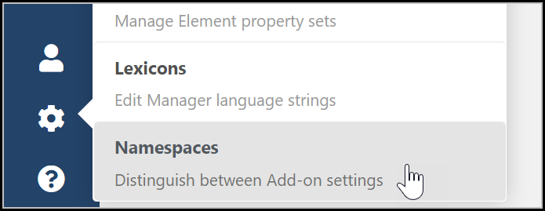
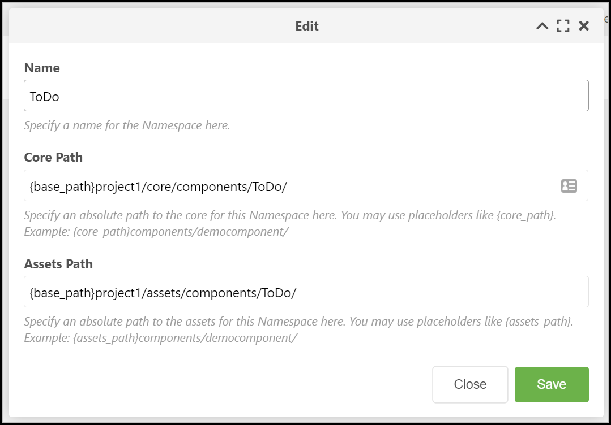
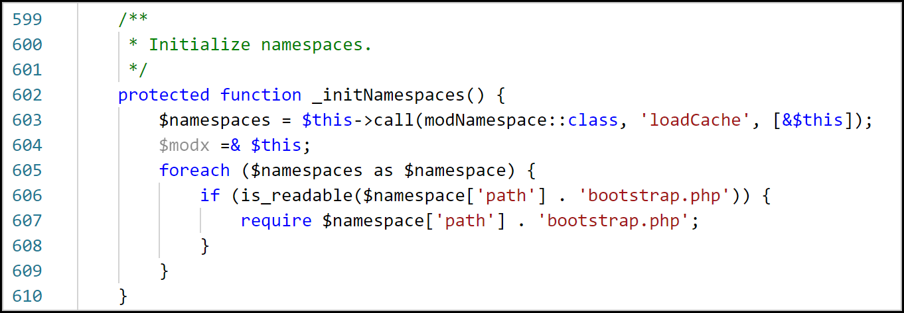
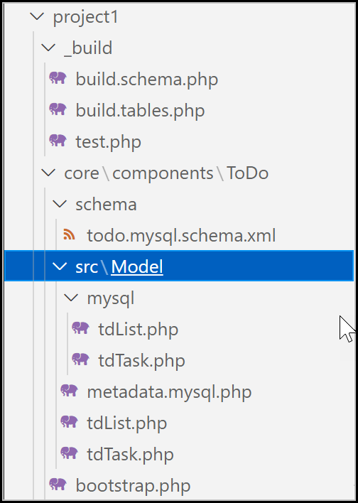
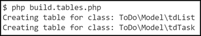
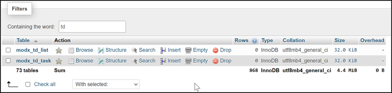
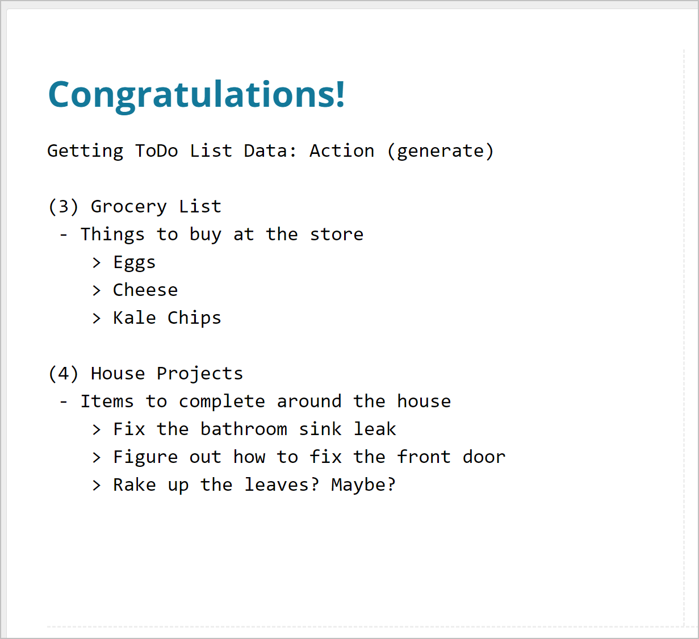

This tutorial covers how to use MODX to build a custom database table and link it to xPDO's object model. At the end of this tutorial you should have learned how to write a simple XML Schema for your table, create the PHP Class files, and read and write data through MODX.

## What's Changed in MODX 3?

MODX 3 brings PHP Namespaces to your XML Schema, generated class files, and a new bootstrap functionality to custom packages and Extras. It also changes the MySQL map file structure in the model that it generates. Let's walk through a simple example as a starting point. From here, you can make things more complex, such as using configuration files or helper functions. But to start, let's look at the minimum needed to create a custom table, and show we can write and read from the table.

**NOTE**: This was converted from the previous "StoreFinder" example.

**ALSO NOTE**: This methodology is not backwards compatible to MODX 2.x. This tutorial is intended to be run and used in MODX 3. You can see the equivalent guide for 2.x here: [Using Custom Database Tables](/2.x/en/extending-modx/tutorials/using-custom-database-tables.md "Using Custom Database Tables")

## Key Terminology and Standards

Based on recent discussions, we should clarify at the start, the terminology used and what it refers to. These are also standard practices that should be followed for consistency.

1. PHP Namespace
   1. With MODX 3, our Models and Processors use PHP Namespaces and are auto-loadable.
   2. Example, at the top of your Model class files, MODX generates a php namespace declaration
      ```php
	  <?php

	  namespace MyComponent\Model\MyClass
2. Component Namespace
   1. MODX has a namespace record that you create within the manager. This is separate from the PHP namespace and should be lowercase. This value is used to determine the paths to a particular custom component. The Core Path and the Assets Path.
   2. Menu entries specify this lowercase namespace. MODX uses that to route the manager request to the proper manager page.
3. XML Schema Package attribute
   1. The package attribute in MODX 3 is your PHP Namespace. This value is generated to the top of your PHP Model class files and should be CamelCase/ProperCase.
4. Directory structure and capitalization
   1. All directories should be lowercase except those located in your `src/` directory. Within `src/` the files should mirror the capitalization (camelCase or PascalCase of your namespaced classes)
      1. Example file path: `{core_path}/components/mycomponent/src/Model/MyClass.php`
      2. Corresponding PHP Namespace: `MyComponent\Model\MyClass`
      3. The prefix `MyComponent` corresponds to the `mycomponent/src/` directory. Everything following that is mirrored in both directory structure and case used.

## Directory Structure Changes

MODX 3 introduces Composer, PHP Namespace and source directories.  The change to a `src/` directory is a structure that MODX 3 uses in it's own file structure and sets you up to use Composer and other fancy features if your Component becomes more complex.

The structure I've selected for this tutorial tries to keep the naming convention functional and more concise. It is slightly different than previous examples and will hopefully be less confusing. Previous examples would frequently have the same package name repeated in the directory structure like `doodles/core/components/doodles/model/doodles`. To me, that seemed like a lot of doodling for one path.

If you've built on MODX before you'll know that the `/core/components/` structure is where custom components (Extras) are installed to. If you don't plan on publishing this as an Extra, you could simplify your directory structure by not utilizing that part. But, if you did want to publish it, you may have to refactor your code later.

In this example, we'll use the methodology where we create a project folder in the web root, and utilize the `/core/components/` structure so that we can build it to a package later on. The `project1` directory is located in our web root directory:

 *   project1
     *   _build
     *   core
         *   components 
             *   todo
                 *   src
                     *   Model
                 *   schema
     *   bootstrap.php

Go ahead and create these directories except for the `Model/` directory.

---

If we were building a Custom Manager Page (CMP), then we would also have a folder for assets. But since we're focused on the data aspect for Part 1, we'll leave the CMP and assets directory out for now.

Also, you'll notice an extra PHP file listed called `bootstrap.php`. You can take a look at the documentation for further details on how that works, but we'll also cover it here in the scope of our example.

This file allows us a different method to load our classes calling `addPackage` here to load our Model classes. It also allows us to access the MODX Autoloader and register additional PSR-4 Namespaces with corresponding `src/` directory. 

From here, we can also initialize a Service Class and add it to the new MODX Dependency Injection Container. We can then access that Service throughout the system (Plugins/Events, Snippets, etc).

> More details on [Namespaces and Bootstrapping Services](extending-modx/namespaces.md#bootstrapping-services "Namespaces | Bootstrapping Services")

## Data and Tables

For this tutorial, lets use the classic To-Do list example. You can never have too many To-Dos. And as the first To-Do, let's add, "Build a To-Do list in MODX 3!". Let's lay out the tables and structure. 

We will use a parent ***To-Do List*** table and child ***To-Do Tasks*** table. There will be a one-to-many relationship from the List to the Tasks.
 
*   Table Name: `modx_td_list`
    *   Fields:
        *   `name`
        *   `description`
*   Table Name: `modx_td_task`
    *   Fields:
        *   `short_description`
        *   `due_date`
        *   `completed` (boolean)

Now that we've defined our starting table structure, let's make the schema file that defines the model. This schema file is an XML representation of our database table(s). It is then parsed by xPDO into PHP-format "maps", which are array representations of the schema and its relationships.

## Define the Schema XML

The schema structure has not been significantly changed for MODX 3. The key changes are in how the "package" attribute value is used and how it relates to the build process. The other key change is that the classes which you extend are now namespaced. As an example `xPDOSimpleObject`, now becomes `xPDO\Om\xPDOSimpleObject`. The rule of thumb is for xPDO objects, add the Namespace `xPDO\Om\` and for any MODX objects like `modElement` use the Namespace `MODX\Revolution\`.

### MODX and xPDO File Locations

The `MODX` prefix corresponds to `core/src/` and from there mirrors the file structure. So, the modElement file path would be `core/src/Revolution/modElement.php`. If you're unsure of the class to use, look at the docs, but also leverage the directory structure to explore the available classes.

xPDO is a little different and is located in `core/vendor/xpdo/src/xPDO/` then follows class to directory structure. So the `xPDOSimpleObject` filepath would be `core/vendor/xpdo/src/xPDO/Om/xPDOSimpleObject.php`.

### Schema File Contents

In the schema below we'll define the two tables, and add a parent/child relationship defined by a composite/aggregate attribute. These two entries define the owner and the type of relationship. In our case if we delete a ToDo List with 20 ToDo Tasks, both the List and the Tasks will be deleted.

> For more details on when to use `xPDOObject` vs. `xPDOSimpleObject`, See this blog post from Bob Ray: [Comparing xPDOObject and xPDOSimpleObject](https://modx.com/blog/comparing-xpdoobject-and-xpdosimpleobject?utm_source=MODX+News&utm_campaign=df07d658fe-weekly_recap_21_12_10_&utm_medium=email&utm_term=0_27b5d94031-df07d658fe-34671909&goal=0_27b5d94031-df07d658fe-34671909&mc_cid=df07d658fe&mc_eid=21ae2973a7 "Comparing xPDOObject and xPDOSimpleObject"). In our case, we'll use `xPDOSimpleObject` so that we have an "`id`" auto-incrementing primary key generated for us.

Go ahead and create a file in your schema directory with the name `todo.mysql.schema.xml`. The full path starting from project1 should be `project1/core/components/todo/schema/todo.mysql.schema.xml`. Copy and paste the XML below into your file and save it.

```xml
<?xml version="1.0" encoding="UTF-8"?>
<model package="ToDo\Model" baseClass="xPDO\Om\xPDOObject" platform="mysql"  defaultEngine="InnoDB" version="3.0">
	
	<object class="tdList" table="td_list" extends="xPDO\Om\xPDOSimpleObject">
		<field key="name" dbtype="varchar" precision="128" phptype="string" default="" />
		<field key="short_description" dbtype="varchar" precision="255" phptype="string" default="" />

		<index alias="name" name="name" primary="false" unique="false" type="BTREE">
			<column key="name" length="" collation="A" null="false" />
		</index>

		<composite alias="Task" class="ToDo\Model\tdTask" local="id" foreign="list" cardinality="many" owner="local" />
	</object>

	<object class="tdTask" table="td_task" extends="xPDO\Om\xPDOSimpleObject">
		<field key="list" dbtype="int" precision="10" phptype="integer" null="false" default="" />
		<field key="task_description" dbtype="varchar" precision="255" phptype="string" default="" />
		<field key="due_date" dbtype="datetime" phptype="datetime" null="true" default="NULL" />

		<index alias="task_description" name="task_description" primary="false" unique="false" type="BTREE">
			<column key="task_description" length="" collation="A" null="false" />
		</index>

		<aggregate alias="List" class="ToDo\Model\tdList" local="list" foreign="id" cardinality="one" owner="foreign" />
	</object>

</model>
```

**Note**: In MODX 3, any aggregate or composite, the "class" ***must be the full namespaced class***.

The model tag and its attributes define a few different things about your Component/Extra:

*   **package** - The PHP Namespace of the xPDO package. This is a significant change in MODX 3. As mentioned earlier, *this value is generated to your PHP class files as your **namespace**.*
*   **baseClass** - This is the base class from which all your class definitions will extend. Unless you're planning on creating a custom `xPDOObject` extension, it's best to leave it at the default.
*   **platform** - MySQL (mysql).
*   **defaultEngine** - The default engine of the database tables, usually either InnoDB or MyISAM. MODX recommends using InnoDB.
*   **phpdoc-package** - This value is not directly used by MODX, but can be leveraged in Documentation Blocks. The expected value is your PHP Namespace in MODX 3, and if you don't populate it, MODX matches it automatically. You'll see this in your class files documentation blocks as `@package MyComponent\Model`.
*   **phpdoc-subpackage** - According to [phpDocumentor](https://docs.phpdoc.org/guide/references/phpdoc/tags/subpackage.html), this is considered deprecated. It should not be needed since the namespace represents both package and subpackage in one value.

---

> For more details on MODX schemas, see [Defining a Schema | Database and Tables](custom-models/defining-a-schema/database-and-tables#defining-tables). This gives additional details on the Class, Table, and Extends attributes, as well as additional examples.
> 
> For more details on how the paths are defined and used, see [Namespaces | Usage](extending-modx/namespaces.md#usage).

## Create a Component Namespace Entry in the Manager

The data defined in your Component Namespace entry remains the same as MODX 2 and should not be confused with your PHP Namespace. Both the "Name" and paths should be lowercase. MODX 3 adds one additional usage for the Component Namespace, but that's descrubed in the next section.

Go ahead and navigate to the Namespaces and create a new one.



Fill in the fields as displayed and save the record. *(Make sure that your paths end with a trailing "slash")*.

> **Name**: todo<br/>
> **Core Path**: {base_path}project1/core/components/todo/<br/>
> **Assets Path**: {base_path}project1/assets/components/todo/

**What is the base_path?**: The `{base_path}` is a parameter that MODX replaces with the base install path for your current MODX installation. This could be your web root, or a subdirectory if MODX was installed to a subdirectory.



## How does MODX use the Component Namespace Record?

As of MODX 3, the core path in your Namespace entry is where MODX looks for your `bootstrap.php` file. The bootstrap file will allow us to add our class files, hook into the Autoloader, register a service, or any other startup tasks that are needed.

### Additional Details for Overachievers :)

If you look at the index file, you can see that it calls the initialize function and passes in the "web" context: `$modx->initialize('web')`. If you then take a look at the initialize function within the main `modX.php` file, you'll see that it calls `_initNamespaces()`. This function loads the namespace data from the cache, loops through the entries, then checks for and requires the `bootstrap.php` file if it's present and readable.



## Writing Our Build Schema Script

Go ahead and create a `build.schema.php` file in your `_build/` directory. It should contain the below PHP. In other documentation, you may see references to "*MODX_API_MODE*" being deprecated. That doesn't seem to be the case. It's still present in the current version 3.0.0-rc1 build. Setting this constant to true prevents the final function, `$modx->handleRequest()`, from executing. 

```php
<?php

// Set API Mode to true
define('MODX_API_MODE', true);

// Include the main index.php file to load MODX in API Mode
@include(dirname(__FILE__, 3) . DIRECTORY_SEPARATOR . 'index.php');

/**
 * @var \MODX\Revolution\modX $modx
 * 
 */

// Get the manager and generator
$manager = $modx->getManager();
$generator = $manager->getGenerator();

// Define the paths needed
//{base_path}/project1/
$projectRootDir = MODX_BASE_PATH . 'project1/';

//{base_path}/project1/core/components/todo/
$corePath = $projectRootDir . 'core/components/todo/';

//{base_path}/project1/core/components/todo/schema/todo.mysql.schema.xml
$schemaFile = $corePath . "schema/todo.mysql.schema.xml";

if (is_file($schemaFile)) {
	echo("Parsing schema: $schemaFile".PHP_EOL);
	// Parse the schema to generate the class files
	$generator->parseSchema(
		$schemaFile, 
		$corePath . 'src/',
		[
			"compile" => 0,
			"update" => 0,
			"regenerate" => 1,
			"namespacePrefix" => "ToDo\\"
		]
	);
}
else {
	echo("Schema file path invalid: $schemaFile".PHP_EOL);
}
```

In other examples from 2.x you'll see a main class file, or configuration blocks with getProperty calls. To keep this first step as simple as possible, I've kept the paths self explanitory and hard coded. If you don't have your project folder in the web root, you'll need to adjust this based on your folder location.

I've also removed any timing in the script. I've never seen much need to include millisecond start and stop times. Most projects have 5 or less custom tables and the build process runs very quickly.

The steps in our build are commented in the script itself. I have gone the route of just including the index file rather than calling the MODX class directly. There is a check within the index for API Mode which we set to true here.

Now let's go ahead and build our schema to generate the class files. To do this, simply run the file at the command line using `php build.schema.php` from within your `_build` directory. You should now see a new `src/Model/` directory and few more files:



## Configure our Bootstrap.php File

Now that we have our class files, we could go ahead and create objects using the `xPDO::newObject` function as documented, but we have no database table to save it to. Before we can build the tables, let's create our Bootstrap file so that our classes are loaded every time MODX initializes.

MODX 3 still uses the `addPackage` call but with a slightly different format. Within `addPackage` it also adds our Model namespace to the PSR-4 autoloader. Simply use the below script for now. And since we don't have any services to register, all we really need is a single line of code that calls the `addPackage` function to load the model files for our package/custom table.

Adding the comment block defining your available variables will allow your text editor of choice to show you details about the functions and recognize that `$modx` exists.

Go ahead and create `bootstrap.php` in the `components/todo/` directory and copy the below contents into the PHP file.

```php
<?php

/**
 * @var \MODX\Revolution\modX $modx
 * @var array $namespace
 */

// Load the classes
$modx->addPackage('ToDo\Model', $namespace['path'] . 'src/', null, 'ToDo\\');
```

**Warning**: The `bootstrap.php` file seems to be very sensitive to "breaking" the manager. If for instance, if you have a typo in your PHP or the wrong class name, or tried to echo anything out here, it would cause the MODX Manager to break and not load properly. Removing the log or echo will restore it to working order.

## Writing our Build Tables Script

This is very similar to the schema script and has all the same shared paths. You could consolidate the files and have a single build file that creates the schema, then creates the database tables. I've found it can be helpful to run them independently and make sure your schema files generate successfully.

> Beyond the scope of this tutorial, you can also use the new xPDO CLI to write your files and build. This can also be included into your composer.json settings.

Go ahead and create `build.tables.php` in your `_build/` directory and copy the below contents into that file.

```php
<?php

// Set API Mode
define('MODX_API_MODE', true);

// Shortcut for directory separator
$ds = DIRECTORY_SEPARATOR;

// Include the index to load MODX in API Mode
@include(dirname(__FILE__, 3) . $ds . 'index.php');

/**
 * @var \MODX\Revolution\modX $modx
 * 
 */

// Classes to loop through
$classes = [
	'ToDo\Model\tdList',
	'ToDo\Model\tdTask'
];

// Get the manager
$manager = $modx->getManager();

// Loop through our classes
foreach ($classes as $class) {
	// Check if the class exists
	if (class_exists($class)  ) {
		// Create the table
		echo("Creating table for class: $class".PHP_EOL);
		$manager->createObjectContainer($class);
	}
	else {
		echo("Unable to load model class: $class".PHP_EOL);
	}
}
```
Now execute that file on the command line with `php build.tables.php`;

If you saw something like this as your output, congratulations! 



Check phpMyAdmin or your MySQL editor of choice and search for table name containing "td". You should have two new tables.



## Using our New Model

In this section we'll take a look at two examples. In our first we'll show how to use our models in a snippet and store new records. We'll also look at how we can read from those tables and display the data. The scope of this section will be from Snippets for usage in the web front end.

Hopefully, in following tutorials, we can expand this into a full Extra with a Custom Manager page.

To test out our tables, we'll create, or modify a resource to include the below HTML. We're avoiding some of the complexity in passing in a template to our Snippet, or iterating. Instead we'll wrap the output in "pre" tags and use it as a "log" type functionality. It will output all the ToDo Lists and Tasks.

I modified the default home page that ships with MODX and replaced the content field with this value. This tells to MODX to output the result from running the snippet with the name `ToDo`. The `!` tells it to run uncached.

```html
<pre>[[!ToDo]]</pre>
```

Go ahead and create a new Snippet. Give it the same name, "ToDo", to match our HTML content. Then paste in the script below. This may seem confusing, but I've added comments throughout the script to help. This could have been created as two separate snippets or a command line script to generate the data, then a snippet to list the data.

For this example I consolidated it so it's all in one place. If you load the page with your snippet and add a parameter of `&action=generate`, it will create the ToDo Lists and Tasks specified in the data array.

**NOTE**: If you load the page more than once with the "action" parameter set, it will generate additional duplicate entries in the tables but with new unique "ids".

The second half of the script simply reads the data, and outputs it to a string. For further details on getting and writing data, see the resources below:

* [Creating Objects](https://docs.modx.com/3.x/en/extending-modx/xpdo/creating-objects "Creating Objects")
* [Retrieving Objects](https://docs.modx.com/3.x/en/extending-modx/xpdo/retrieving-objects "Retrieving Objects")
* [Add Many | Adding multiple child records with one "save"](https://docs.modx.com/3.x/en/extending-modx/xpdo/class-reference/xpdoobject/related-object-accessors/addmany "Adding multiple child records with one save")

```php
<?php
// Output
$output = "";

// Namespace
$namespace = "ToDo\\Model\\";

// Handle task generation
$action = $_GET['action'] ?: "Get Lists";
$output .= "Getting ToDo List Data: Action ($action)";

if ($action === 'generate') {
    // Define our todo list data as an array
    $data = [
        [   
            "name" => "Grocery List",
            "short_description" => "Things to buy at the store",
            "tasks" => [
                ["task_description" => "Eggs"],
                ["task_description" => "Cheese"],
                ["task_description" => "Kale Chips"]
            ]
        ],
        [
            "name" => "House Projects",
            "short_description" => "Items to complete around the house",
            "tasks" => [
                ["task_description" => "Fix the bathroom sink leak"],
                ["task_description" => "Figure out how to fix the front door"],
                ["task_description" => "Rake up the leaves? Maybe?"]
            ]
        ]
    ];
    
    // Now let's loop through and create our lists and tasks
    foreach ($data as $createList) {
        // Get a list object and set the values
        $newList = $modx->newObject($namespace.'tdList');
        $newList->set('name', $createList['name']);
        $newList->set('short_description', $createList['short_description']);
        
        // Now before we save the list, let's create an array of task objects
        $newTaskArr = [];
        foreach ($createList['tasks'] as $createTask) {
            // Get a task object and set the values
            $newTask = $modx->newObject($namespace.'tdTask');
            $newTask->set('task_description', $createTask['task_description']);
            
            // Add the task object to the array
            $newTaskArr[] = $newTask;
        }
        
        // Use the addMany function to associate all the tasks to the parent list
        $newList->addMany($newTaskArr);
        
        // And finally call the save function to persist the data to our tables
        $newList->save();
    }
}

// Query for any lists
$lists = $modx->getCollection($namespace.'tdList', []);
$listCount = 0;

// If our query returned results
if ($lists) {
    // Loop through them
    foreach ($lists as $list) {
        // Add the list to the output
        $output .= PHP_EOL.PHP_EOL.'(' . $list->get('id') . ') '.$list->get('name');
        
        // Add the description if we have one
        if ($list->get('short_description'))
            $output .= PHP_EOL.' - '.$list->get('short_description');
            
        // Now get any tasks
        $tasks = $modx->getCollection($namespace.'tdTask', ['list' => $list->get('id')]);
        $taskCount = 0;
        
        // If we have tasks
        if ($tasks) {
            // Loop through the tasks
            foreach ($tasks as $task) {
                // Add the task to the output
                $output .= PHP_EOL."    > " . $task->get('task_description');
            }
        }
    }
}

// Return output
return $output;
```
When you navigate to the root page of the site, or to the page you used as your test page, you should see similar output to below:



## See Also

* [Generating the xPDO Model Code](extending-modx/xpdo/custom-models/generating-the-model "Generating the Model Code")
* [More Examples of xPDO XML Schema Files](extending-modx/xpdo/custom-models/defining-a-schema/more-examples "More Examples of xPDO XML Schema Files")
*[Reverse Engineer xPDO Classes from Existing Database Table](extending-modx/xpdo/custom-models/generating-the-model/reverse-engineer "Reverse Engineer xPDO Classes from Existing Database Table")
* [Creating Objects](https://docs.modx.com/3.x/en/extending-modx/xpdo/creating-objects "Creating Objects")
* [Retrieving Objects](https://docs.modx.com/3.x/en/extending-modx/xpdo/retrieving-objects "Retrieving Objects")
* [Add Many | Adding multiple child records with one "save"](https://docs.modx.com/3.x/en/extending-modx/xpdo/class-reference/xpdoobject/related-object-accessors/addmany "Adding multiple child records with one save")