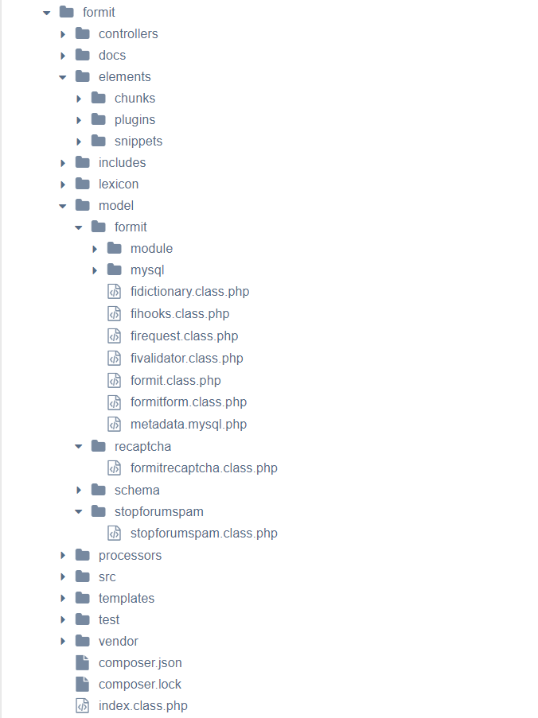

## xPDO::addPackage

Loads the xPDO ORM mapping classes that define your package's objects. By MODX convention those classes live under your package's `model/` directory. After you call `addPackage`, xPDO can work with your custom objects and the database tables they map to.

xPDO keys off `metadata.{dbtype}.php` inside the package directory (`$path` + `$pkg`), for example `metadata.mysql.php`. That file lists active class names and which classes extend core classes. The effect is similar to an autoloader for the package models.

## Syntax

API Docs: <https://api.modx.com/revolution/2.2/db_core_xpdo_xpdo.class.html#\xPDO:addPackage()>

``` php
boolean addPackage (
    [string $pkg = ''],
    [string $path = ''],
    [string|null $prefix = null],
    [string|null $namespacePrefix = null]
)
```

- `$pkg` — name of a subfolder under `$path`. That folder holds your `*.class.php` files and usually a platform folder such as `mysql/` with map files (`*.map.inc.php`) and `metadata.{dbtype}.php`.
- `$path` — absolute path to the directory that **contains** the `$pkg` subfolder. End it with a trailing slash.
- `$prefix` — optional table prefix for this package only. Leave it out (`null`) in almost all MODX code so xPDO uses the connection default (`xPDO::OPT_TABLE_PREFIX`), which is the site’s table prefix from `config.inc.php`. A non-null string **overrides** that MODX prefix for every table in the package.
- `$namespacePrefix` — optional PSR-4 namespace prefix for model classes (xPDO 3 / MODX 3).

The function returns `true` on success and `false` on error. Check the logs when it fails.

### When to pass `$prefix`

**Prefer omitting `$prefix`.** Packages that live in the same database as MODX should follow the site prefix. If you hard-code `mypkg_` (or any other string) while the install uses `modx_` or a custom hardened prefix, queries miss the real tables. Sites that [change the default database prefix](getting-started/maintenance/securing-modx#changing-default-database-prefixes) break first.

Pass an explicit `$prefix` only when the package tables intentionally use a **different** prefix than the MODX connection (legacy import, shared third-party schema, or a second xPDO connection with its own prefix). In that case document the choice and keep the schema, maps, and call in sync.

If the package was generated against the same prefix as MODX, call `addPackage` with two arguments (or pass `null`) and let the connection supply the prefix.

## Example

Most Snippets and plugins load a package from `MODX_CORE_PATH` and point at the component's `model/` directory. Omit the third argument so the package uses the MODX table prefix:

``` php
$modx->addPackage('mypkg', MODX_CORE_PATH . 'components/mypkg/model/');
```

## Another Example

The screenshot shows a FormIt component tree. Sibling folders under `model/` are the packages you can pass as `$pkg` when `$path` points at `model/`:



That `model/` layout still looks like this in FormIt:

``` text
core/components/formit/model/
├── formit/
├── recaptcha/
├── schema/
└── stopforumspam/
```

Load one of those packages:

``` php
$modx->addPackage('formit', MODX_CORE_PATH . 'components/formit/model/');
```

Or another package from the same path:

``` php
$modx->addPackage('recaptcha', MODX_CORE_PATH . 'components/formit/model/');
```

`addPackage` expects package metadata (`metadata.{dbtype}.php`) under `$path/$pkg/`. Folders without that file can still hold classes for [`loadClass`](extending-modx/xpdo/class-reference/xpdo/xpdo.loadclass); missing metadata produces a log warning.

Current FormIt also ships a namespaced xPDO model under `core/components/formit/src/FormIt/Model/` (with `metadata.mysql.php`). For that layout, set `$path` to that Model directory and use `$namespacePrefix` when the package uses PSR-4 namespaces.

## Testing

``` php
$xpdo->setLogLevel(xPDO::LOG_LEVEL_INFO);
$xpdo->setLogTarget('ECHO');
if (!$xpdo->addPackage('my_package', '/path/to/docroot/core/components/my_package/model/')) {
    print 'There was a problem adding your package.';
}
```

The `$path` (2nd argument) must exist, or xPDO logs an error. If `$pkg` is not a subfolder of `$path`, you do not always get a hard failure; check the log for missing metadata warnings.

On failure, `addPackage` writes verbose messages to the log.

## Adding Packages from other Databases

`addPackage()` works on any xPDO instance that can reach valid class and map files. To use another database, create a new xPDO instance with that connection, as described in [Database Connections and xPDO](extending-modx/xpdo/create-xpdo-instance/connections).

## Creating Tables

Loading the package only registers the PHP classes. If the package defines tables, you still need to create them. Package installers usually do that for you. For manual setup, use [xPDOManager.createObjectContainer](extending-modx/xpdo/class-reference/xpdomanager/xpdomanager.createobjectcontainer).

## See Also

- [xPDO](extending-modx/xpdo)
- [Loading Packages](extending-modx/xpdo/custom-models/loading-package)
