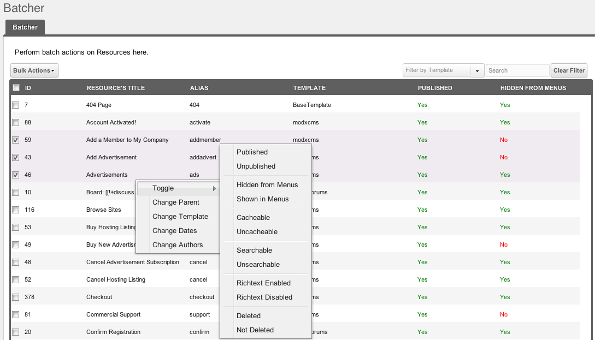

## What is Batcher?

Batcher is a batch-editing component for MODX Revolution. It allows you to perform basic actions on multiple Resources.

## Requirements

- MODX Revolution 2.0.0-RC-2 or later
- PHP5 or later

## History

Batcher was written by [Shaun McCormick](https://github.com/splittingred) as a simple search component, and first released on June 2nd, 2010.

It is now developed and maintained by Sterc at <https://github.com/Sterc/Batcher>

### Download

It can be downloaded from within the MODX Revolution manager via [Package Management](developing-in-modx/advanced-development/package-management "Package Management"), or from the MODX Extras Repository, here: <https://rtfm.modx.com/extras/revo/batcher>

### Development and Bug Reporting

Batcher is stored and developed in GitHub, and can be found here: <https://github.com/Sterc/Batcher>

Bugs can be filed here: <https://github.com/Sterc/Batcher/issues>

## Usage

After installing, simply reload the page, and the 'Batcher' menu option should be available through the top Components menu.

## See Also

1. [Batcher.Roadmap](extras/batcher/roadmap)
