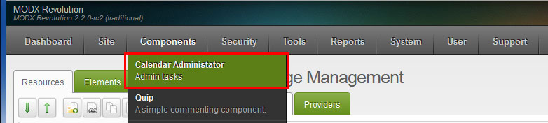
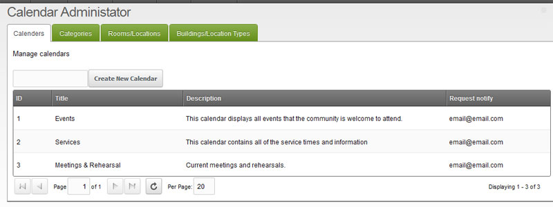
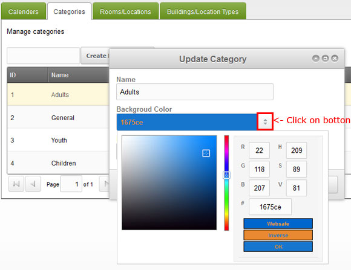
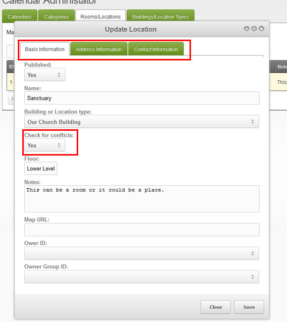

## Church Events Calendar Manager functions

Once you have installed Church Event Calendar via the package manager and your refresh the page you should see in the MODX Manager Menu: Components -> Calendar Administrator. This is where you can manage the Calendars, Categories and Locations. 

### Calendars

Calendars are really just a filter that you can apply to all views (day/week/month/year/RSS/List/iCal). You must have at least one Calendar for the program to work. The default Calendars that are loaded are Events, Services and Meetings & Rehearsal. 

### Categories

Categories are an additional way to apply filters that you can apply to all views (day/week/month/year/RSS/List/iCal). You must have at least one Category for the program to work. The default Categories that are loaded are Adults, Children, Youth and General. Select a background and font color click on the button to the right of the fields in the popup view. These options are only used in the ChurchEvents\_CategoryHeadTpl Chunk.

### Buildings/Location Types

This option is only used if you have the Use Locations System Setting set to Yes. You must have at least one Building. These can be anything like a building, parking lot, park, city or what ever you would like. Just remember that Rooms/Locations are there children.

### Rooms/Locations

This option is only used if you have the Use Locations System Setting set to Yes. You must have at least one Location. These can also be whatever you would like but they should make sense as they must fit with in a parent Building/Location Type. When you create or edit a location make sure you click on all the tabs as outlined in red below. You will also see a check for conflicts option that is in red. If this option is set to Yes then any event that is requested or added, must first verify that the event does not conflict with another event for this specific location before it will save. If set to No then events can overlap. 

?
