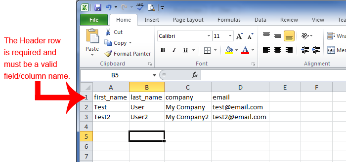
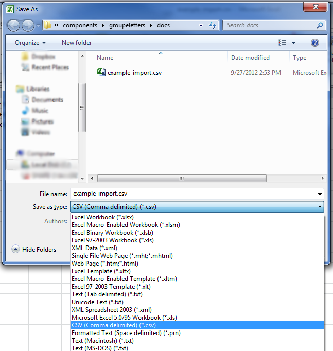
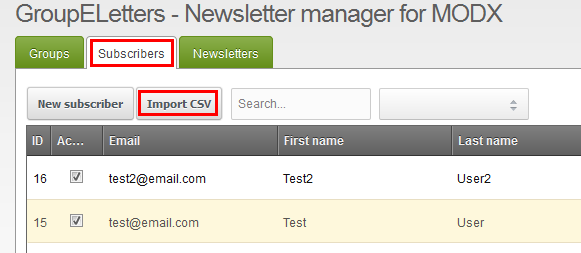
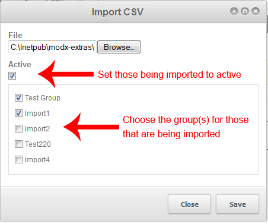

Added in 1.0 beta3

You can now create a CSV of name and import them directly and choose if they are active and what groups they are assigned to.

## Preparing a CSV File for Import

Preparing a CSV for import is fairly easy if you know how to use excel or similar product. There is an example CSV file located in your MODX install at core/components/eletters/docs/example-import.csv

1. To practice open up Excel and for the first row you can put in each column the available field names to create a header row. They are as follows: crm\_id, first\_name, m\_name,last\_name, company, address, city, state, zip, country, email, phone and cell. The order does not matter but you probably will not need all of them so you can leave ones out that you don't want to use. It is required to have at least email to import.
  
2. Now fill in the columns with your subscribers information
3. When you are ready save the file as CSV format.
  

## Import a CSV File

1. First hover over Components and then click on Eletters
2. Now you should see the management portion click on the Subscribers tab
3. Now you should see a few buttons, click on the Import CSV button
  
4. Once the window pops up choose your CSV file and then select Active and the groups that you want.
  

## See Also

1. [Eletters.API](extras/eletters/eletters.api)
2. [Eletters.FormIt](extras/eletters/eletters.formit)
3. [Eletters.Import CSV](extras/eletters/eletters.import-csv)
4. [Eletters.Templates](extras/eletters/eletters.templates)
