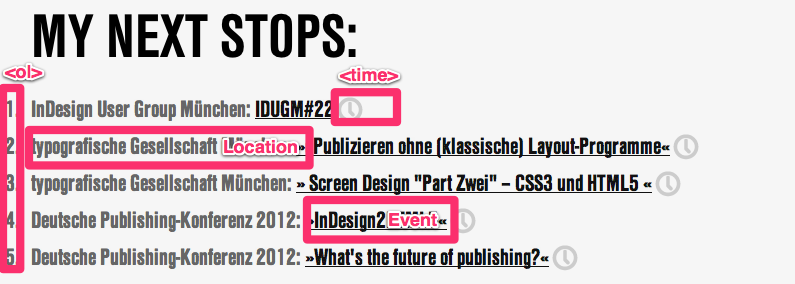

## Examples for EventsX

### Display a list of upcoming events

Go to components -> EventsX and create some events

(make sure they are active)

### create your chunk "upcomingEvents"

``` php
        <li>[[+location:htmlentities]]: <a href="[[+url]]" title="[[+name:htmlentities]]">[[+name:htmlentities]]</a> <time datetime="[[+startdate:strtotime:date=`%Y-%m-%d`]]" title="event is scheduled on [[+startdate:strtotime:date=`%d.%m.%Y`]]">[[+startdate:strtotime:date=%d.%m.%Y`]]</time></li>
```

### create snippet call

Add this snippet call on your template or resource where you would like to display the list of events.

``` php
        <h2>next events:</h2>
        <ol id="eventcal">
                [[!EventsX? &tpl=`upcomingEvents` &limit=`10`]]
        </ol>
```

### screenshot

A screenshot could look like this. Note that I've styled the time element individually.



## See Also

1. [EventsX.Examples](extras/eventsx/eventsx.examples)
