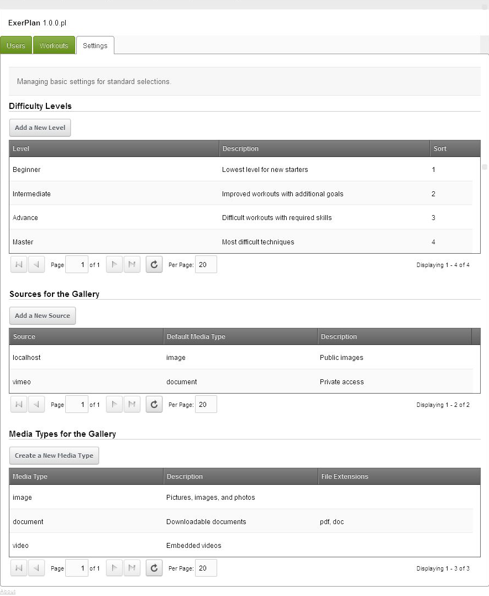
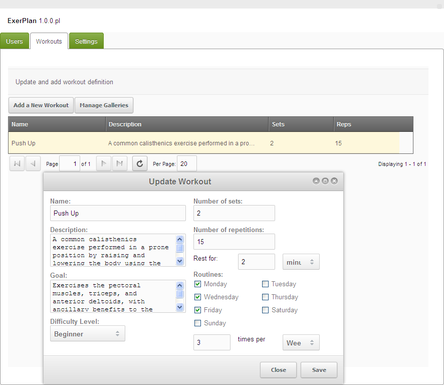
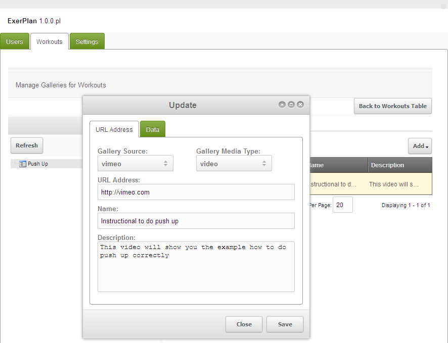
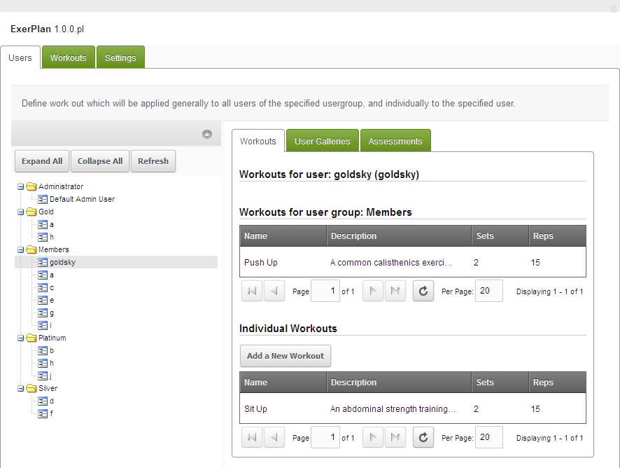
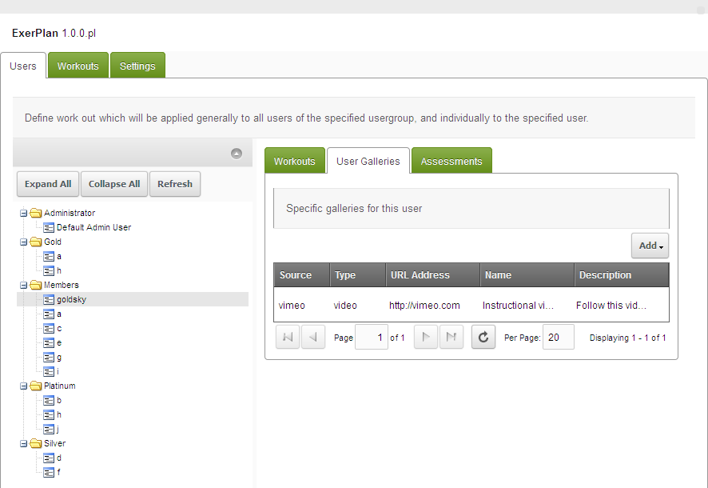
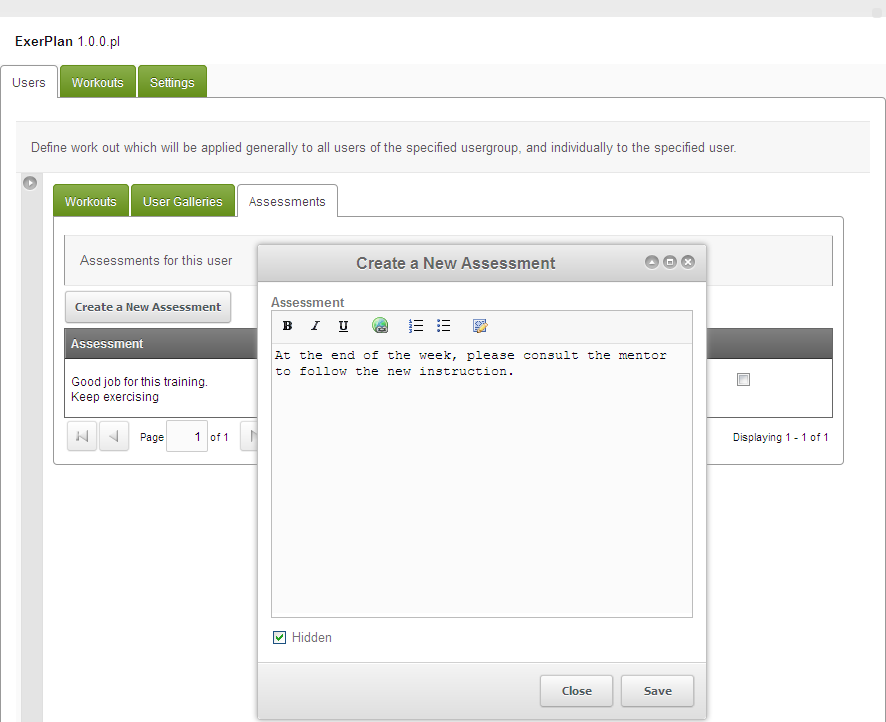

ExerPlan is en exercise planner for a health care or sport training type websites.
Each of the workouts can have galleries (such as pictures, downloadable files, or video sources) as additional information to the members, eg: about the instructional material.

ExerPlan was written by goldsky and first released on May 25th, 2013.

## Download

It can be downloaded from within the MODX Revolution manager via [Package Management](developing-in-modx/advanced-development/package-management "Package Management"), or from the MODx Extras Repository, available here: <http://modx.com/extras/package/exerplan>

## Development and Bug Reporting

ExerPlan is stored and developed in GitHub, and can be found here: <https://github.com/goldsky/ExerPlan>

## Custom Manager Page (CMP)

The admin/manager users get a very easy UI for them to manage the workouts.

To understand how it works, I'll explain it backward, start from the setting.

## Settings



In here uses are able to set some of the basic settings for drop downs:

1. Media Types
  This option makes categorization of which file types you want to select. This is related with the **&mediaTypes** property on the snippet call.
2. Sources
  This option is set to apply some Data/API/Embed code for some of the sources. If it's localhost, then you can ignore that requirements.
3. Difficulty Levels
  The level of the workout

## Workouts



This is where the list of the workouts that will be provided for the members/usergroups of the website.
On the same tab, admin/manager users can set the galleries, by clicking the "Manage Galleries" button.



By selecting the left tree of workouts list, admin/manager users can see the grid/table of galleries that have been set before.
To add new gallery, they can simply click the "Add > Add URL Address" button.

This is where the admin/manager users give the URL address of the galleries, and set the Gallery Sources and Types to apply the additional Data/API/Embed code if there is any.

## Users



At last, at the first dashboard, there is the Users tree under the Usergroups tree.
By selecting the Usergroup name, admin/manager users can see the workouts for the Usergroups.
By selecting the User name, they can see the workouts for the user, based on the (multiple) usergroups they are within, and of course the additional Individual workouts for the specific user only.

And how about the additional Galleries for this specific user?



Admin/manager users can show the members some videos/pictures/documents from any website sources, eg: the members' own captured video for evaluation.

And the last but not least,



the admin/manager users/mentors can give some assessments about the members.
FYI, at this moment, this is one way comments, so no respond will be available at the front-end.

## Snippets

There are 3 snippets available:

1. exerplan.Exercises
2. exerplan.Galleries
3. exerplan.Assessments

All of these snippets have (as the default) **&requireAuth=`1`** property is set, which then output the list that has been set for the logged in user only.
For all snippets, to get a brief of the placeholders, use **&toArray=`1`** property.
On the chunk properties, **@BINDINGs** means you can use **@FILE:** to refer the template to the physical file, or **@CODE:** or **@INLINE:** for the inline the code.

## exerplan.Exercises

This snippet show the workouts that have been set for the members.

### Properties

| property             | description                                                                         | options                                | default                    |
| -------------------- | ----------------------------------------------------------------------------------- | -------------------------------------- | -------------------------- |
| **requireAuth**      | is authorization required to see the output?                                        | bool                                   | 1                          |
| userId               | get the workouts that apply to this user                                            | int                                    |                            |
| sortby               | sort the list by this selection                                                     | the field's name of the workouts table | id                         |
| sortdir              | sort the list by this direction                                                     | enum(asc,desc)                         | asc                        |
| phsPrefix            | placeholder's prefix of the output                                                  | string                                 | exerplan.                  |
| groupByUsergroups    | _not yet implemented_                                                               |                                        |                            |
| getGalleries         | include the galleries of each workout                                               | bool                                   |                            |
| gallerySource        | if this is used, then filter the output by this media source                        | string                                 |                            |
| galleryMediatype     | if this is used, then filter the output by this media type                          | string                                 |                            |
| galleryPrefix        | add more placeholder's prefix for the gallery                                       | string                                 | gallery.                   |
| getUsergroupWorkouts | Is getting workouts for user groups?                                                | bool                                   | 1                          |
| getUserWorkouts      | Is getting workouts for user?                                                       | bool                                   | 1                          |
| tplItem              | chunk name, or use any of @BINDINGs for workout rows                                | string                                 | exerplan.exercises.item    |
| itemSeparator        | separator of each of item templates output                                          | string                                 | "\\n"                      |
| tplWrapper           | chunk name, or use any of @BINDINGs for wrapper                                     | string                                 | exerplan.exercises.wrapper |
| tplGalleryItem       | chunk name, or use any of @BINDINGs for gallery's rows inside the gallery's wrapper | string                                 | exerplan.gallery.item      |
| gallerySeparator     | separator of each of gallery's item templates output                                | string                                 | "\\n"                      |
| tplGalleryWrapper    | chunk name, or use any of @BINDINGs for gallery's wrapper                           | string                                 | exerplan.gallery.wrapper   |
| **toArray**          | dump the placeholders output, rather parse them in the chunk                        | bool                                   |                            |
| toPlaceholder        | place the output into the given name of the placeholder                             | string                                 |                            |

## exerplan.Galleries

This snippet show the **individual Galleries** that have been given for the members, or the Galleries for the specified workout.

### Properties

| property             | description                                                  | options                                | default                  |
| -------------------- | ------------------------------------------------------------ | -------------------------------------- | ------------------------ |
| **requireAuth**      | is authorization required to see the output?                 | bool                                   | 1                        |
| userId               | get the workouts that apply to this user                     | int                                    |                          |
| sortby               | sort the list by this selection                              | the field's name of the workouts table | id                       |
| sortdir              | sort the list by this direction                              | enum(asc,desc)                         | asc                      |
| phsPrefix            | placeholder's prefix of the output                           | string                                 | exerplan.                |
| workoutId            | the ID of the workout                                        | int                                    |                          |
| gallerySource        | if this is used, then filter the output by this media source | string                                 |                          |
| galleryMediatype     | if this is used, then filter the output by this media type   | string                                 |                          |
| galleryPrefix        | add more placeholder's prefix for the gallery                | string                                 | gallery.                 |
| getUsergroupWorkouts | Is getting workouts for user groups?                         | bool                                   | 1                        |
| getUserWorkouts      | Is getting workouts for user?                                | bool                                   | 1                        |
| tplItem              | chunk name, or use any of @BINDINGs for gallery's rows       | string                                 | exerplan.gallery.item    |
| itemSeparator        | separator of each of item templates output                   | string                                 | "\\n"                    |
| tplWrapper           | chunk name, or use any of @BINDINGs for gallery's wrapper    | string                                 | exerplan.gallery.wrapper |
| **toArray**          | dump the placeholders output, rather parse them in the chunk | bool                                   |                          |
| toPlaceholder        | place the output into the given name of the placeholder      | string                                 |                          |

## exerplan.Assessments

This snippet show the assessments that have been set for the members, or from the specified assessor.

### Properties

| property         | description                                                  | options                                | default                     |
| ---------------- | ------------------------------------------------------------ | -------------------------------------- | --------------------------- |
| **requireAuth**  | is authorization required to see the output?                 | bool                                   | 1                           |
| assesseeId       | get the assessments for this user                            | int                                    |                             |
| assessorId       | get the assessments from this user                           | int                                    |                             |
| **showHidden**   | Show hidden assessments?                                     | bool                                   |                             |
| sortby           | sort the list by this selection                              | the field's name of the workouts table | id                          |
| sortdir          | sort the list by this direction                              | enum(asc,desc)                         | asc                         |
| phsPrefix        | placeholder's prefix of the output                           | string                                 | exerplan.                   |
| assessmentPrefix | add more placeholder's prefix for the assessment's output    | string                                 | assessment.                 |
| tplItem          | chunk name, or use any of @BINDINGs for assessment's rows    | string                                 | exerplan.assessment.item    |
| itemSeparator    | separator of each of item templates output                   | string                                 | "\\n"                       |
| tplWrapper       | chunk name, or use any of @BINDINGs for assessment's wrapper | string                                 | exerplan.assessment.wrapper |
| **toArray**      | dump the placeholders output, rather parse them in the chunk | bool                                   |                             |
| toPlaceholder    | place the output into the given name of the placeholder      | string                                 |                             |

## Examples

``` php
[[!Login]]<br>

<!-- &toArray is commented out, remove _ to run -->
[[!exerplan.Galleries?
&requireAuth=`1`
&userId=`[[+modx.user.id]]`
&galleryMediatype=`video`
&_toArray=`1`
]]

[[!exerplan.Assessments?
&requireAuth=`1`
&assesseeId=`[[+modx.user.id]]`
&_toArray=`1`
]]
```

## Default Chunks

> exerplan.exercises.item

``` html
<div id="exerplan-exercise-[[+exerplan.id]]">
    <div>Exercise: [[+exerplan.name]]</div>
    <div>Description: [[+exerplan.description]]</div>
    <div>Goal: [[+exerplan.goal]]</div>
    <div>Level: [[+exerplan.level_name]]</div>
    <div>Sets: [[+exerplan.set]]</div>
    <div>Reps: [[+exerplan.repetition]]</div>
    [[+exerplan.usergroup:notempty=`
    <div>Usergroup: [[+exerplan.usergroup]]</div>
    `]]
    [[+exerplan.galleries:notempty=`
    [[+exerplan.galleries]]
    `]]
</div>
```

> exerplan.exercises.wrapper

``` html
<div>
    [[+exerplan.items]]
</div>
```

> exerplan.gallery.item

``` html
<div id="exerplan-gallery-item-[[+exerplan.gallery.id]]">
    [[+exerplan.gallery.url:notempty=`
    <div>
        <a href="[[+exerplan.gallery.url]]"
           title="[[+exerplan.gallery.description]]"
           class="lightbox">
            [[+exerplan.gallery.name]]
        </a>
    </div>
    `:default=`
    <div>[[+exerplan.gallery.name]]</div>
    `]]
    <div>[[+exerplan.gallery.description]]</div>
</div>
```

> exerplan.gallery.wrapper

``` html
<div id="exerplan-exercise-gallery-wrapper">
    [[+exerplan.gallery.items]]
</div>
```

> exerplan.assessment.item

``` html
<div
    id="exerplan-assessment-item-[[+exerplan.assessment.id]]"
    [[+exerplan.assessment.row_index:mod:is=`0`:then=`
    style="border-top: 1px dotted #ddd; border-bottom: 1px dotted #ddd; background-color: #ddd; padding: 10px;"
    `:else=`
    style="border-top: 1px dotted #ddd; border-bottom: 1px dotted #ddd; background-color: #efefef;padding: 10px;"
    `]]
    >
    <div
        style="font-style: italic; font-size: smaller; color: grey;"
        >By: [[+exerplan.assessment.assessor.fullname:notempty=`
        [[+exerplan.assessment.assessor.fullname]]
        `:default=`
        [[+exerplan.assessment.assessor.username]]
        `]], [[+exerplan.assessment.created_on:date=`%d-%m-%Y`]]
    </div>
    <div>[[+exerplan.assessment.assessment]]</div>
</div>
```

> exerplan.assessment.wrapper

``` html
<div id="exerplan-exercise-assessment-wrapper">
    [[+exerplan.assessment.items]]
</div>
```
