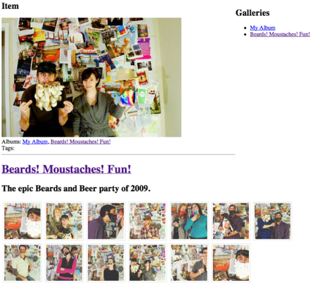

## Setting Up Your Gallery

This quick reference shows you how to setup a barebones gallery on your site that displays a list of Albums, then once an album is selected, displays the images from that album. Once a thumbnail is clicked, it shows a bigger version of that album:



## Uploading Your Photos

You need some photos to show so you'll have to upload some before setting up the display.

- Go to Components -> Gallery in the Manager Top Menu.
- Click on the "Create Album" button.
- Give your Album a name and description
- Check the "Active" checkbox
- Click on the "Save" button

Now, right-click on the new album and select "Update Album"
Then, click on either the "Upload Item" or "Batch Upload" button and upload some photos

## Displaying Your Photos

First, off, paste this code in your Resource:

``` html
<div style="float: right">
<h2>Galleries</h2>
<ul>
[[!GalleryAlbums]]
</ul>
</div>

<h2>Item</h2>

[[!GalleryItem]]
[[!+galitem.image:notempty=`
<div class="image">
  <a href="[[+galitem.image]]"></a>
  <br />Albums: [[+galitem.albums]]
  <br />Tags: [[+galitem.tags]]
</div>
`]]

<hr />

[[!Gallery? &album=`1` &toPlaceholder=`gallery`]]
<h1><a href="[[~[[*id]] &galAlbum=`[[+gallery.id]]`]]">[[+gallery.name]]</a></h1>
<p>[[+gallery.description]]</p>

[[+gallery]]
```

That's it! It will work now. Let's go through each part.

## Listing Gallery Albums

So the code we're using to display our Gallery Albums is this:

``` html
<div style="float: right">
<h2>Galleries</h2>
<ul>
[[!GalleryAlbums]]
</ul>
</div>
```

We're first off running the GalleryAlbums snippet. Then in our HTML we've floated it to the right - you don't have to do this, but we did to preserve screen real estate. That's it - GalleryAlbums will then display a list of the albums, and make them clickable.

## Displaying The Selected Album

Okay, now once you've clicked them, we want Gallery to display all the images from that album. Luckily, the Gallery snippet works in tandem with the GalleryAlbums snippet to do just this - without any customizing:

``` html
[[!Gallery? &album=`1` &toPlaceholder=`gallery`]]
<h1><a href="[[~[[*id]] &galAlbum=`[[+gallery.id]]`]]">[[+gallery.name]]</a></h1>
<p>[[+gallery.description]]</p>

[[+gallery]]
```

So, we've set the Gallery album to by default display the Album with ID 1. If we clicked a link from our GalleryAlbums snippet call above, it will override this; but for now we want it to start with Album #1. We've also set it to a placeholder called 'gallery' so we can output some information about that album, such as its name and description.

## Showing a Larger Image

Now we've got our thumbnails, but we want when they're clicked to show a big image. Simple: the GalleryItem snippet will automatically handle this:

``` html
[[!GalleryItem]]
[[!+galitem.image:notempty=`
<div class="image">
  <a href="[[+galitem.image]]"></a>
  <br />Albums: [[+galitem.albums]]
  <br />Tags: [[+galitem.tags]]
</div>
`]]
```

The GalleryItem snippet calls and looks for a "galItem" parameter in the URL. Once found, it will load that image from the album. The Gallery snippet uses those in its URLs for its thumbnails. Next, we output some metadata for the image, such as its name, albums, tags, and a direct link to it.

And we're done! An immediately functioning Gallery.

## Conclusion

There is much, much more you can do with Gallery, but hopefully this short reference gets you up to speed on how all the parts behave together.
