 GridClassKey is a custom class key for MODX Revolution's Manager to hide child resources inside container's grid.

 You can switch the current resource to be this class key, AND it can be reverted back to the usual modResource by changing the Resource Type inside the Settings tab.

 It only hides the child resources, and display them in the grid. Everything else is just as same as the usual modResource's form.

 Any bugs or feature requests can be reported to here: <https://github.com/goldsky/GridClassKey/issues>

 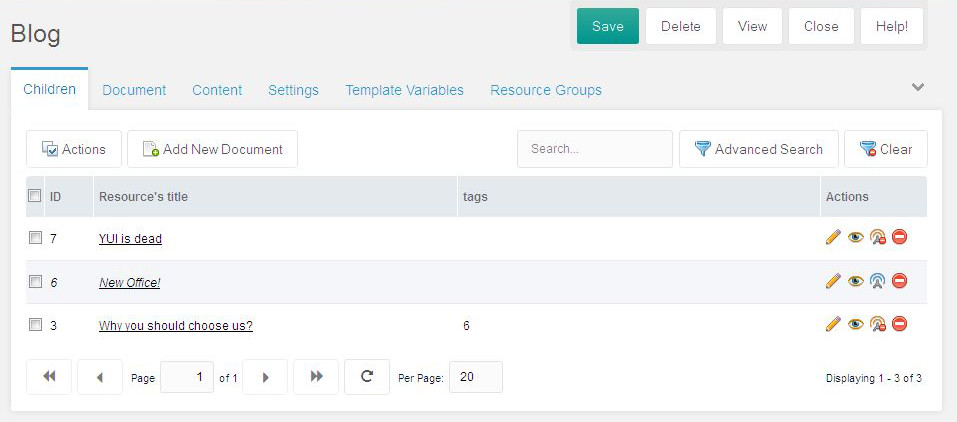

## Settings

 "Settings" are the place to configure the table/grid how it looks, and some of mouse-clicking behaviors.

### Fields

 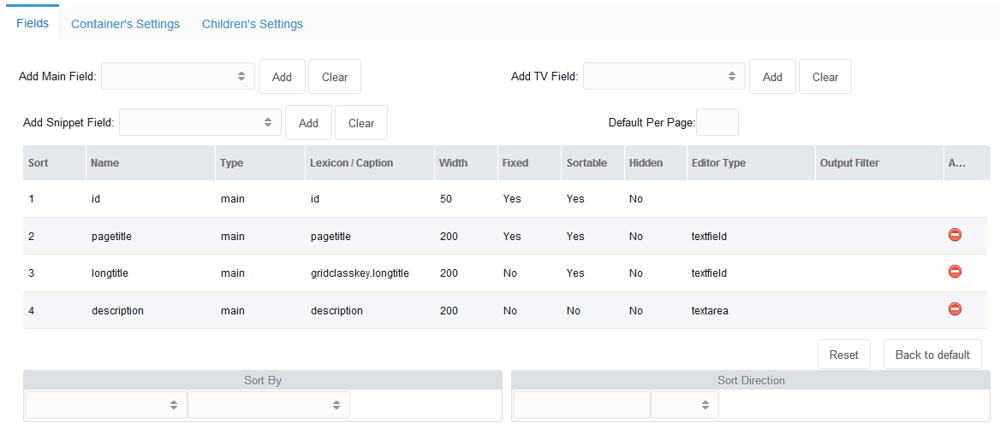

 In here, user can define what data they want to have on their grid.

- As default, GCK sets _id, pagetitle, longtitle,_ and _description_ fields into the grid.
- To delete the field, just click the red "delete" button on the right side.
- To add new field, just select "**Add Main Field**", or "**Add TV** (Template Variable) **Field**", or "**Add Snippet Field**", then click the "_Add_" button to add the selected field into the _fields grid_.

 Main field is the MODX's original fields of modx\_site\_content table.

 To have TV or Snippet field, [you must make sure that there is no dots on its name](https://github.com/goldsky/GridClassKey/issues/9)!

 User can re-align the sorting by dragging-dropping the row of the field.

 Each of the columns presents the variables/parameters attached to the fields of the resource grid.

 User can define different values for the parameters, by double-clicking the cell:

- Lexicon: user can set a MODX's lexicon string for a multilingual manager, or they can just set a plain text, eg: "Page Title"
- Width: the width of the column
- Fixed: to set whether the column can be dragged left-right to adjust its width
- Sortable: to set whether the column is sortable or not
- Hidden: a field can be hidden from the view, but it can be shown manually by an icon tool in the grid's header
- Editor Type: all cells are editable, except the ID.
   On here, user can define what kind of editor they want to use to edit the content.
   The options are:
    - the name of any of ExtJs and MODX's xtype editors, or
    - (since 1.0.1-rc1) a json-parameter object of a complex set of an editor, eg:
      `{xtype:"modx-combo",url:"path/to/connector",baseParams:{action:"something/getlist",combo:true}}`
- Output Filter: user can modify the output value of the grid when its rendered. It's just a [MODX's Output Filter](making-sites-with-modx/customizing-content/input-and-output-filters-(output-modifiers)).

#### Sorting

 User can define by which field the grid is sorted, and to which direction, ascending or descending.

### Container's Settings

 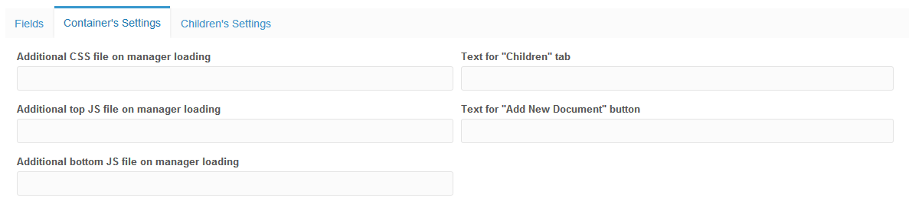

 User can change page's style, javascript's behavior, or change some buttons of the grid's manager.

 The CSS file will be loaded for all Manager's pages, eg: the user wants to [change the icons of resource tree](https://github.com/goldsky/GridClassKey/issues/72).

 The JS file(s) will _only_ be loaded when the particular grid page is loaded. Developer can add their JS file to manipulate how the grid will perform.

### Exampleof Custom Javascript

#### [Adding a dropdown filter field that can be used by clients](http://forums.modx.com/thread/92669/grid-class-key-add-a-dropdown-filter-field-that-can-be-used-by-clients)

 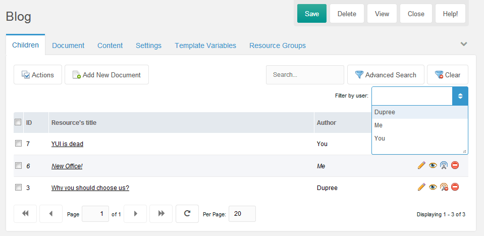

 The requirements:

1. Each of resource contains a TV of the users from the "Author" usergroup
2. Add a combo of users from "Author" usergroup into top of the grid
3. Reload the grid after the combobox is selected
4. Clear the filter when the "Clear" button is selected

##### 1. Set Up the "Author" usergroup

 You can choose different name, this is an example.

 Make sure to sync the name with other files that refer to this name.

 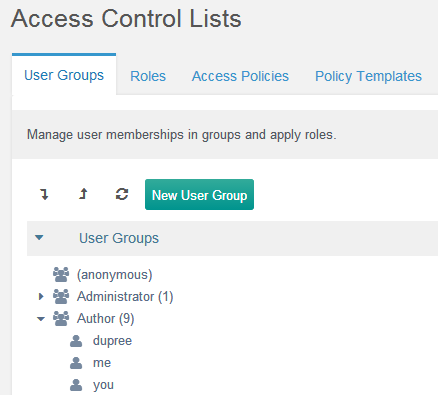

##### 2. Create the "author" Template Variable

 We need to create a TV that lists users from the "Author" usergroup.

 On this example, let's named it "author".

 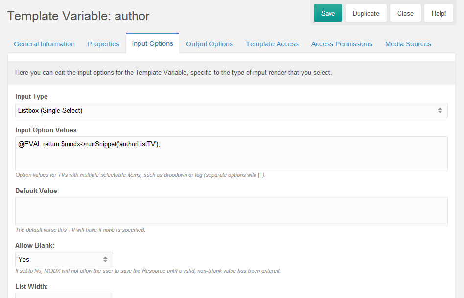

 We need a snippet that will list the users from this particular user group, we use [@EVAL binding](making-sites-with-modx/customizing-content/template-variables/bindings/eval-binding) feature for this.

##### 3. Create snippet to list the authors on Template Variable's values

 On this example, let's name it "authorListTV".

``` php
<?php
$c = $modx->newQuery('modUser');
$c->leftJoin('modUserProfile', 'Profile', 'Profile.internalKey = modUser.id');
$c->leftJoin('modUserGroupMember', 'UserGroupMembers', 'UserGroupMembers.member = modUser.id');
$c->leftJoin('modUserGroup', 'UserGroup', 'UserGroup.id = UserGroupMembers.user_group');
$c->select(array(
    'modUser.id',
    'modUser.username',
    'Profile.fullname',
));
$c->where(array(
    'UserGroup.name' => 'Author'
));
$users = $modx->getCollection('modUser', $c);
if (!$users) {
    return;
}
$output = array();
foreach ($users as $user) {
    $userArray = $user->toArray();
    $output[] = (!empty($userArray['fullname']) ? $userArray['fullname'] : $userArray['username']) . '==' . $userArray['id'];
}
$output = implode('||', $output);
return $output;
```

 This will list the users from this specific user group on resource.

 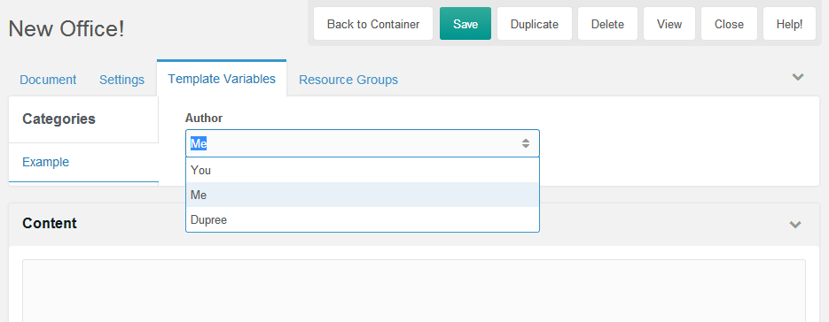

##### 4. Prepare files for the Feature

 We will create some files for this additional feature.

 On this example, let's say it as "customize-gck".

 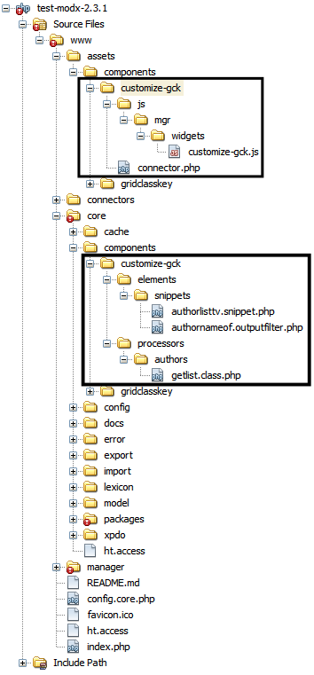

 1. Add a combo of users from "Author" usergroup into top of the grid

 We need to adjust the settings.

 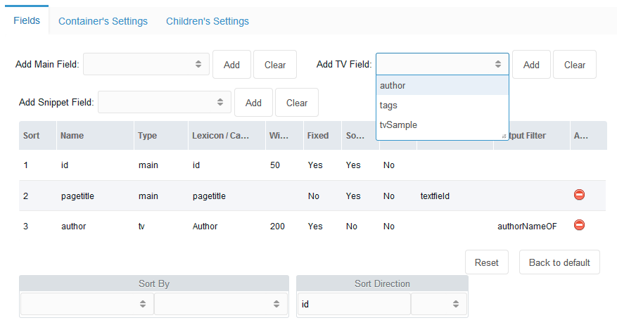

 From the "Add TV Field", select "author" to add it to the grid.

 On the Output Filter of the "author" field, double click the cell, and define a snippet name that will convert the value of the TV, which is actually an ID, to be _some name_ to make it convenient for users to see the output.

 On this example, let's name it "authorNameOF".

``` php
<?php
$output = $input;
if (is_numeric($input)) {
    $user = $modx->getObject('modUser', $input);
    if ($user) {
        $profile = $user->getOne('Profile');
        $fullname = $profile->get('fullname');
        $output = !empty($fullname) ? $fullname : $user->get('username');
    }
}
return $output;
```

 Then go to the "Container's Settings" tab to define our custom Javascript file.

 

 On this example, it's "../assets/components/customize-gck/js/mgr/widgets/customize-gck.js".

``` javascript
// Define the combo
GridClassKey.combo.Users = function(config) {
    config = config || {};
    Ext.applyIf(config, {
        // this goes to a custom connector, to refer the custom path of the processor
        url: MODx.config.base_url + 'assets/components/customize-gck/connector.php'
        , baseParams: {
            action: 'authors/getlist'
        }
        , fields: ['id', 'name']
        , width: config.comboWidth || 190
        /**
         * Don't give name, exclude this combo out of the saving
         */
//        , name: 'mainfield'
//        , hiddenName: 'mainfield'
        , displayField: 'name'
        , valueField: 'id'
        , listeners: {
            select: {
                fn: function(combo, record, index) {
                    this.filter(record);
                },
                scope: this
            }
        }
    });
    GridClassKey.combo.Users.superclass.constructor.call(this, config);
};
Ext.extend(GridClassKey.combo.Users, MODx.combo.ComboBox, {
    filter: function(record) {
        var grid = Ext.getCmp('gridclasskey-grid-children');
        if (typeof (grid) === 'undefined') {
            return false;
        }
        var s = grid.getStore();
        s.baseParams.advancedSearch = true;
        s.baseParams.fields = JSON.stringify([{
                'name': 'author', // name of the TV
                'value': record['id']
        }]);
        grid.getBottomToolbar().changePage(1);
        grid.refresh();
    }
});
Ext.reg('gridclasskey-combo-users', GridClassKey.combo.Users);
// Manipulate the grid to add above combo to its top toolbar
Ext.onReady(function() {
    var grid = Ext.getCmp('gridclasskey-grid-children');
    if (typeof (grid) === 'undefined') {
        return false;
    }
    // get top toolbar, add more stuffs
    var tbar = grid.getTopToolbar();
    var newTbar = new Ext.Toolbar({
        renderTo: tbar.id,
        anchor: '100%',
        items: [
            '->', {
                xtype: 'panel',
                html: 'Filter by user:'
            }, {
                xtype: 'gridclasskey-combo-users',
                id: 'gridclasskey-combo-users'
            }
        ]
    });
    newTbar.show();
    // reset users combo when "Clear" button is clicked
    var btns = tbar.findByType('button');
    var clearBtn;
    Ext.each(btns, function(item){
        if (item.iconCls === "icon-gridclasskey-filter-delete") {
            clearBtn = item;
        }
    });
    clearBtn.on('click', function(e){
        var usersCombo = Ext.getCmp('gridclasskey-combo-users');
        usersCombo.reset();
    });
});
```

 Now we need to create a connector for the combo, "assets/components/customize-gck/connector.php"

``` php
<?php
// beware of the location of this file!
require_once dirname(dirname(dirname(dirname(__FILE__)))) . '/config.core.php';
require_once MODX_CORE_PATH . 'config/' . MODX_CONFIG_KEY . '.inc.php';
require_once MODX_CONNECTORS_PATH . 'index.php';
$corePath = $modx->getOption('gridclasskey.core_path', null, $modx->getOption('core_path') . 'components/gridclasskey/');
require_once $corePath . 'model/gridclasskey.class.php';
$modx->gridclasskey = new GridClassKey($modx);
$modx->lexicon->load('gridclasskey:default');
/* handle request */
$modx->request->handleRequest(array(
    'processors_path' => $modx->getOption('core_path') . 'components/customize-gck/processors/',
    'location' => '',
));
```

 Now let's add the combo's processor, "core/components/customize-gck/processors/authors/getlist.class.php"

``` php
<?php
class AuthorUsersGetListProcessor extends modObjectGetListProcessor {
    /** @var string $objectType The object "type", this will be used in various lexicon error strings */
    public $objectType = 'gridclasskey.AuthorUsersGetList';
    /** @var string $classKey The class key of the Object to iterate */
    public $classKey = 'modTemplateVarResource';
    /** @var string $defaultSortField The default field to sort by */
    public $defaultSortField = 'id';
    /**
     * Can be used to adjust the query prior to the COUNT statement
     *
     * @param xPDOQuery $c
     * @return xPDOQuery
     */
    public function prepareQueryBeforeCount(xPDOQuery $c) {
        $c->distinct();
        $c->leftJoin('modTemplateVar', 'TemplateVar', 'TemplateVar.id = ' . $this->classKey . '.tmplvarid');
        $c->leftJoin('modUser', 'User', 'User.id = ' . $this->classKey . '.value');
        $c->leftJoin('modUserProfile', 'UserProfile', 'UserProfile.internalKey = User.id');
        $c->select(array(
            $this->classKey . '.*',
            'User.username',
            'UserProfile.fullname',
        ));
        $c->where(array(
            'TemplateVar.name' => 'author' // XXX: Adjust this!
        ));
        return $c;
    }
    /**
     * Prepare the row for iteration
     * @param xPDOObject $object
     * @return array
     */
    public function prepareRow(xPDOObject $object) {
        $objectArray = $object->toArray();
        $outputArray = array(
            'id' => $objectArray['value'],
            'name' => (!empty($objectArray['fullname']) ? $objectArray['fullname'] : $objectArray['username']),
        );
        return $outputArray;
    }
}
return 'AuthorUsersGetListProcessor';
```

 And now ALL are set.

 If you change the drop down, because it's listening to "select" event, the grid will be filtered out to the selected user.

 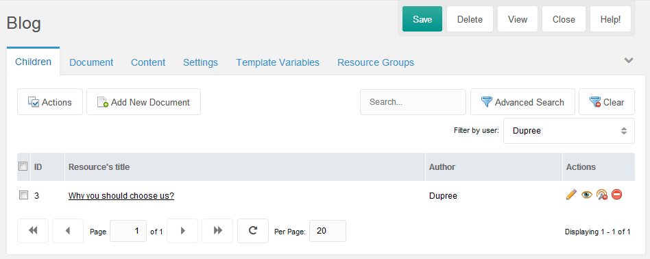

 Click the "Clear" button to clear the filter(s).

#### [Custom Inline Editor](https://github.com/goldsky/GridClassKey/issues/110)

 If you want to create a custom inline editor, you can also do similar thing like above.

 This example is a simple one, you can adjust more in your Javascript's class file.

 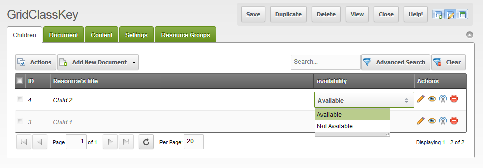

 What it needs is the definition of the editor.

1. Create the component
2. Load the file
3. Edit the GridClassKey's setting

##### 1. Component

``` javascript
GridClassKey.combo.Availability = function (config) {
    config = config || {};
    Ext.applyIf(config, {
        store: new Ext.data.SimpleStore({
            fields: ['d', 'v']
            , data: [['Available', 'Available'], ['Not Available', 'Not Available']]
        })
        , displayField: 'd'
        , valueField: 'v'
        , listWidth: 150
    });
    GridClassKey.combo.Availability.superclass.constructor.call(this, config);
};
Ext.extend(GridClassKey.combo.Availability, MODx.combo.Boolean);
Ext.reg('gridclasskey-combo-availability', GridClassKey.combo.Availability);
```

On here, this component extends "MODx.combo.Boolean" with obvious values, just for the sake of simplicity.

You can extends any available MODx's JS components.

##### 2. Load the file

 Let's say we save the above code as "**../assets/components/customize-gck/js/mgr/widgets/combo.availability.js**"

 

##### 3. Edit the GridClassKey's setting

 Then change the Field's setting.

 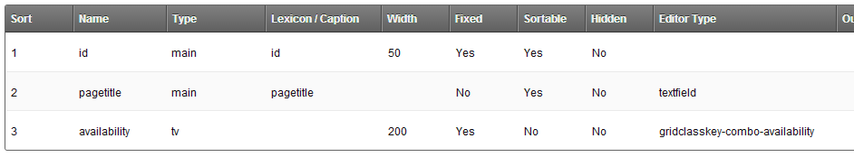

 And it's done.

### Children's Settings

 This settings try to override the specified settings of the child resource **when it is being created** under this grid container.

 Again, only applies when it is being created, not being updated.

 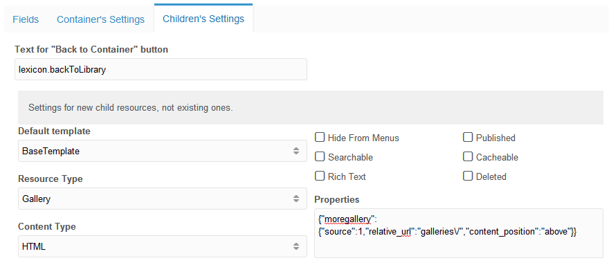

 For "Text for "Back to Container" button" field, you can define a lexicon string, or just plain text on it.

 The "Properties" are a modx\_site\_content field to store some properties for particular plugins/extras.
 It's a json format comma delimited properties.
 Please refer to their documentation of the parameters.

## Permissions

 GridClassKey has some set of permissions.

 On the grid, if the user does not have permission to delete, edit, or publish, then the Action Icon regarding to the permission will be disappeared.

 There is also permission to limit user to access "Batch Actions" and the "Advanced Search" buttons.

 On Access Control page, you will see that it added a Policy named "GridClassKey".

 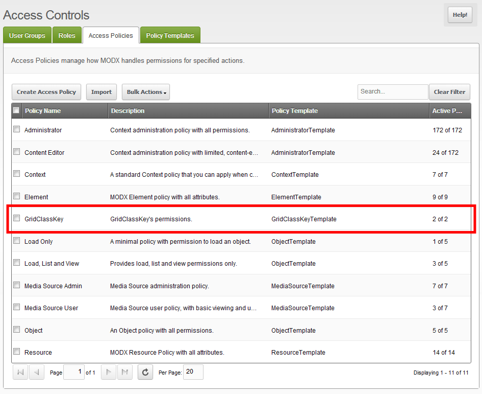

 If you **Right Click > Update Policy**, you will see that actually it only manages 2 permissions: accesses to Batch Actions and Advanced Search buttons.

 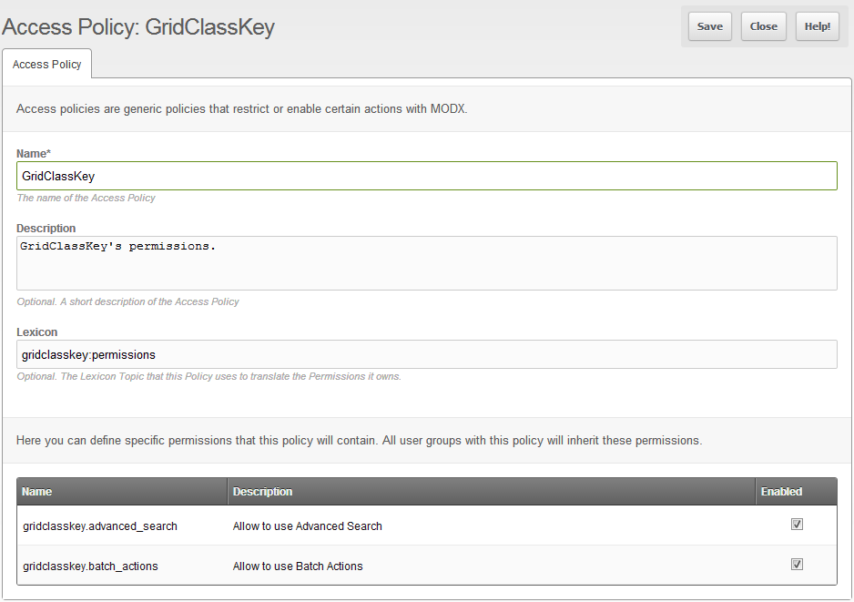

 So if you are setting up some usergroups, make sure you add this permission for the usergroup that is allowed to access those buttons.

 From the top menu " **Security**", select "**Access Controls**".

 Then on the specified usergroup, **Right Click > Update User Group**

 On the **Context Access** tab, click the "**Add Context**" button.

 Set up the the window form like this:

 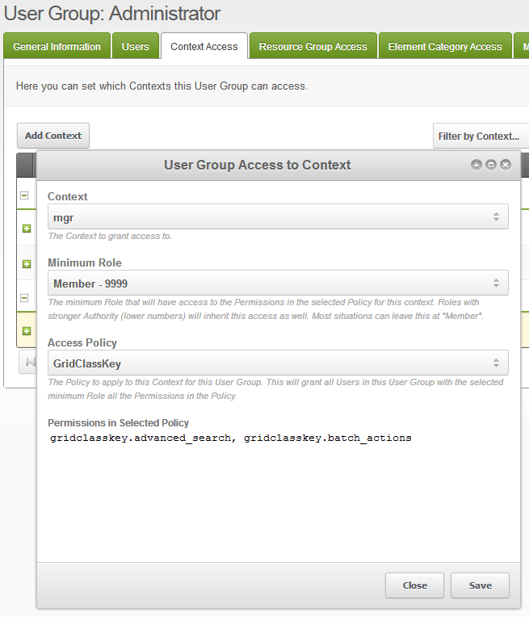

 Then after you save it, you will see a new permission appears to the specified usergroup on manager context.

 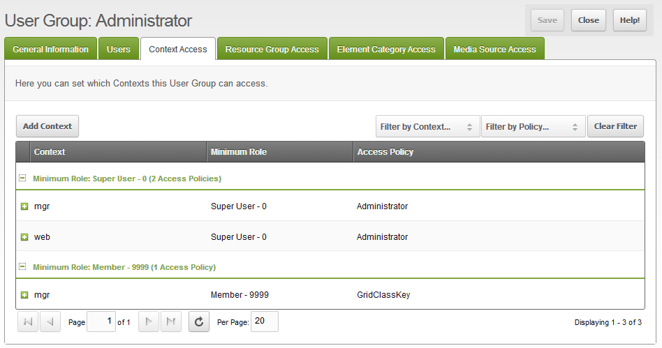
