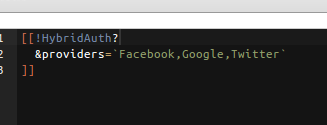
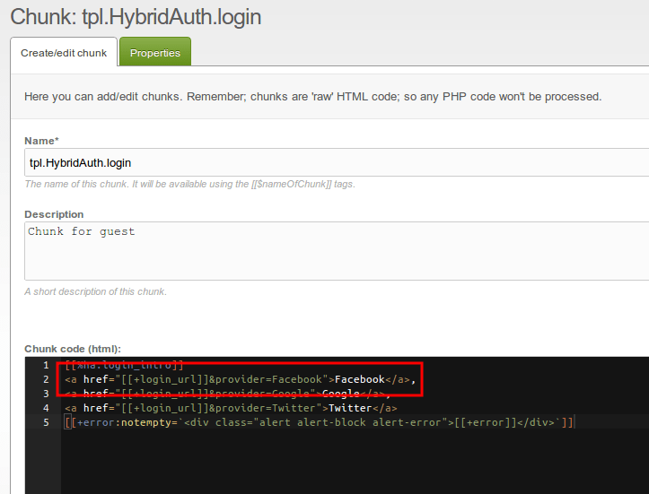
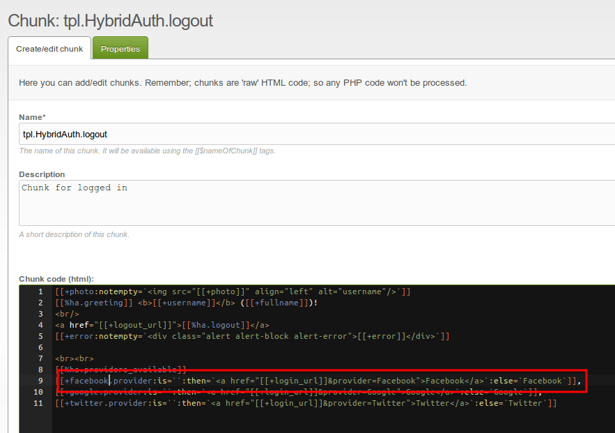
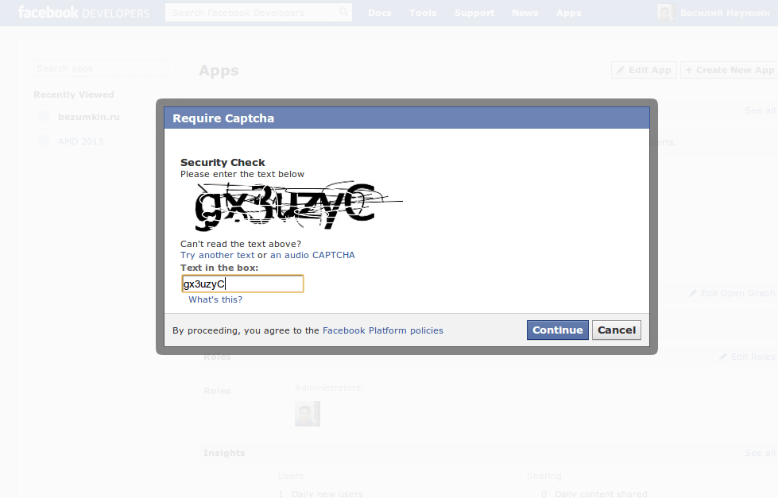
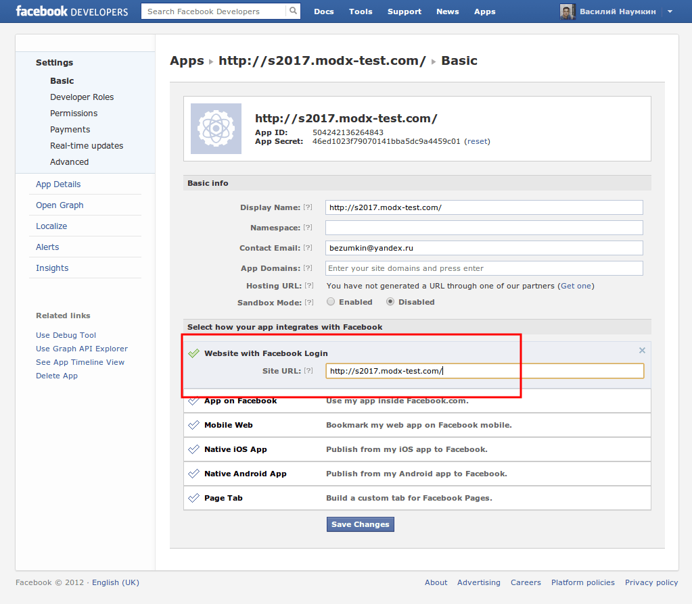
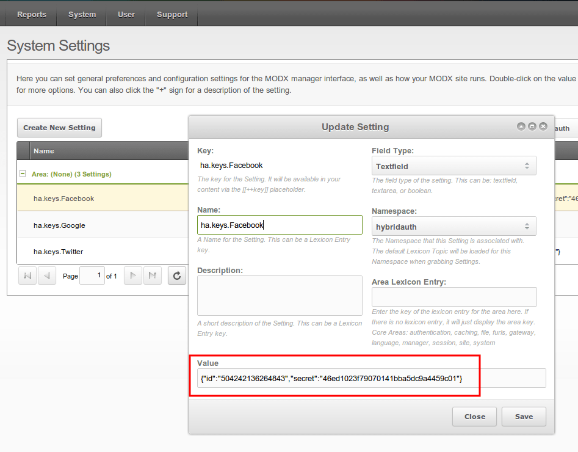
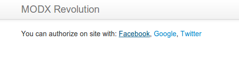
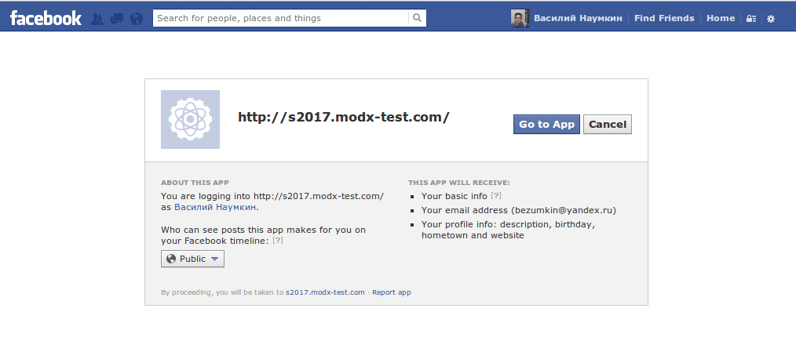
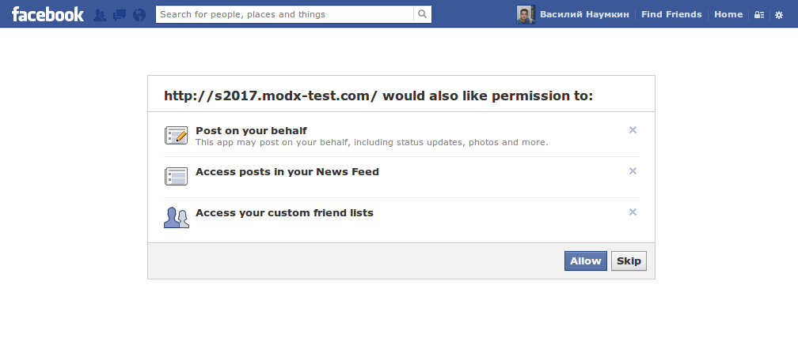
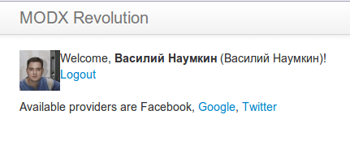

All services are integrated very simple. You need to add auth link in chunk, and setup service keys in system settings.

Now, let`s go together, step-by-step!

First of all, you need to specify alailable providers for your site. For example: \*Facebook, Google, Twitter\*.



Then You need to edit chunks, and add links to Facebook authorization.

 

And now we need to register our application on Facebook and receive **id** and **secret**

[  

Important - **specifying url of our site**


Finaly adding credentials to system settings



And now we can login

  

Thats all!



As you see, after first authorization you can add more services to your profile, and already added will be inactive.

#### Registering application

**1**. Go to <https://developers.facebook.com/apps> and **create a new application** by clicking "Create New App". You may need to Register as a developer first.

**2**. Fill out any required fields such as the application name and description.

**3**. Choose **Website with Facebook Login** and put your website domain in the **Site Url** field.

**4**. Once you have registered, copy and past the created application credentials (**App ID** and **Secret**) into System Setting **ha.keys.Facebook** like

``` php
{"id":"1234567890","secret":"f384hf3894hf8394hf843hf"}
```

## See Also
