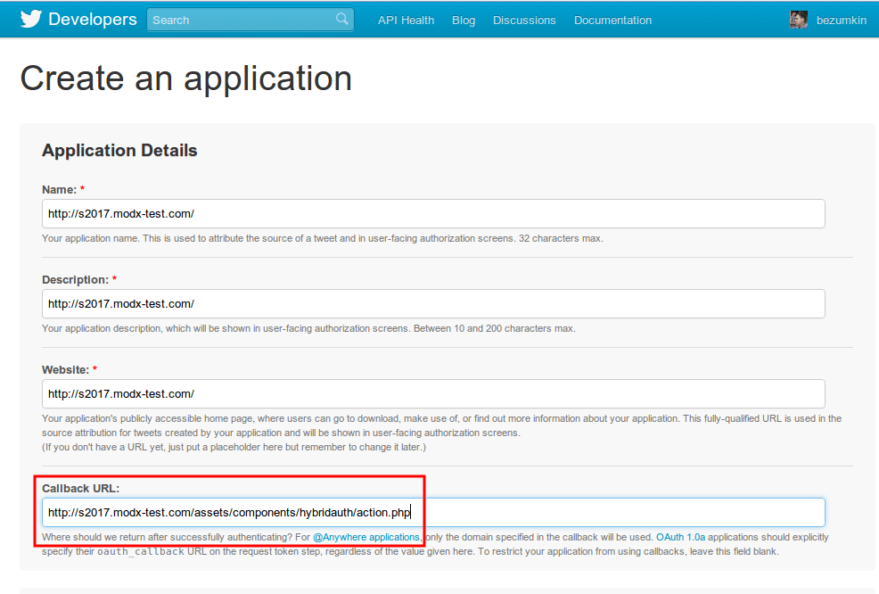
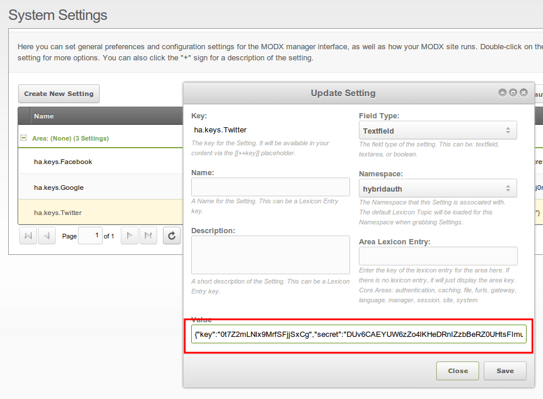

Integrating Twitter

Integration of any service is very simple. So, you can read about [Facebook](extras/hybridauth/hybridauth.integrating-facebook), first, then look to screenshots and everything must be clear.

  

  
