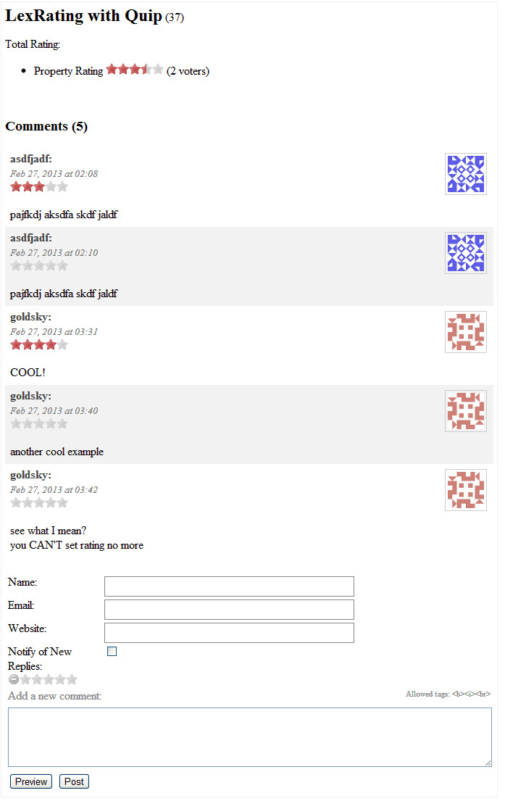

LexRating (by [goldsky](http://twitter.com/_goldsky)) is a jQuery's star rating plugin, based on [rateit.codeplex.com](http://rateit.codeplex.com) (by [gidon](http://twitter.com/gjunge)).

For MODX implementation, this extra uses AJAX to store the rating.

All issues can be notified in its [github's page](https://github.com/goldsky/LexRating/issues).

You can get it by downloading it via Package Manager.

There are 2 snippets for this package:

1. **LexRating**,
2. **LexRatingList**, to list the rating results.

There is a Quip's hook: **LexRatingQuipPostHook**, to create a star rating on each comment.
Think about a comment based star rating.



## LexRating

This snippet offers web visitor to give a rating into an object/item, based on the given name.
This snippet checks the visitor's IP address, and if visitor logged in, the visitor's ID

## Properties

| Name                                                           | Description                                                                                      | Example                                                | Default Value                                         | Options                     |
| -------------------------------------------------------------- | ------------------------------------------------------------------------------------------------ | ------------------------------------------------------ | ----------------------------------------------------- | --------------------------- |
| name                                                           | Defines the name of the rating's item                                                            | &name=``[[*pagetitle]]``                               | `[[*id]]`                                             | string                      |
| group                                                          | Defines the rating's group name.                                                                 |
| This will be useful to compare the results using LexRatingList | &group=`articles`                                                                                | modResource                                            | string                                                |
| userGroups                                                     | Defines who is able to vote.                                                                     | &userGroups=`Members`                                  | empty                                                 | comma separated group names |
| extended                                                       | (@since 1.0.0-beta.2) To set and get an additional extended parameter of individual vote account | &extended=`{"quipReplyId":"`[[+idprefix]]``[[+id]]`"}` | empty                                                 | practically any string      |
| initialAjax                                                    | Load the initial values using Ajax                                                               | &initialAjax=`1`                                       | 1                                                     | 1                           | 0                 |
| readOnly                                                       | (@since 1.0.0-beta.2) read only mode                                                             | &readOnly=`1`                                          | 1                                                     | 1                           | 0                 |
| tpl                                                            | Template chunk for the output, can be chunk or file based chunk.                                 | &tpl=``[[++core_path]]`templates/blabla.tpl`           | lexrating                                             | chunk name or file path     |
| css                                                            | CSS filename                                                                                     | &css=`assets/templates/css/blabla.css`                 | assets/components/lexrating/default/css/lexrating.css | string                      | empty - disabling |
| js                                                             | Javascript filename                                                                              | &css=`assets/templates/js/blabla.js`                   | assets/components/lexrating/default/js/lexrating.js   | string                      | empty - disabling |
| loadjQuery                                                     | Auto load/disable jQuery                                                                         | &loadjQuery=`0`                                        | 1                                                     | 1                           | 0                 |
| phsPrefix                                                      | Prefix for placeholders                                                                          | &phsPrefix=`blabla.`                                   | lexrating.                                            | string                      |
| toArray                                                        | Return an array of placeholders                                                                  | &toArray=`1`                                           | null                                                  | 1                           | 0                 | null |
| toPlaceholder                                                  | Save the output into the given name placeholder                                                  | &toPlaceholder=`my_rating`                             | null                                                  | string                      |

## Placeholders

To get the complete placeholders, just use **&toArray=`1`** to spit out the keys.

| Name                          | Description                               |
| ----------------------------- | ----------------------------------------- |
| `[[+lexrating.name]]`         | The name you specify in the snippet       |
| `[[+lexrating.group]]`        | The group name you specify in the snippet |
| `[[+lexrating.total.voters]]` | Total number of the voters                |
| `[[+lexrating.initialAjax]]`  | The property you set in the snippet call  |

## Example

 ``` php
[[LexRating?
&name=`[[*pagetitle]]`
&group=`articles`
&userGroups=`Members`
]]
```

If you just want to display a rating of an item, use this

 ``` php
[[LexRating?
&name=`[[*pagetitle]]`
&group=`articles`
&initialAjax=`0`
&readOnly=`1`
]]
```

## LexRatingList

This snippet retrieves the items of the LexRating's results based on the given group name.

## Properties

| Name           | Description                                                    | Example                                 | Default Value                                         | Options                 |
| -------------- | -------------------------------------------------------------- | --------------------------------------- | ----------------------------------------------------- | ----------------------- |
| group          | The group name to be retrieved                                 | &group=`articles`                       | modResource                                           | string                  |
| limit          | Limit the number of ouput                                      | &limit=`10`                             | 10                                                    | int                     |
| offset         | Query's limit offset                                           | &offset=`10`                            | 0                                                     | int                     |
| sort           | Sorting direction                                              | &sort=`asc`                             | desc                                                  | asc (lo-hi)             | desc (hi-lo)      |
| tplListWrapper | Template chunk for wrapper, can be chunk or file based chunk   | &tplListWrapper=`lexratinglist.wrapper` | lexratinglist.wrapper                                 | chunk name or file path |
| tplListItem    | Template chunk for each item, can be chunk or file based chunk | &tplListItem=`lexratinglist.item`       | lexratinglist.item                                    | chunk name or file path |
| css            | CSS filename                                                   | &css=`assets/templates/css/blabla.css`  | assets/components/lexrating/default/css/lexrating.css | string                  | empty - disabling |
| js             | Javascript filename                                            | &css=`assets/templates/js/blabla.js`    | assets/components/lexrating/default/js/lexrating.js   | string                  | empty - disabling |
| loadjQuery     | Auto load/disable jQuery                                       | &loadjQuery=`0`                         | 1                                                     | 1                       | 0                 |
| phsPrefix      | Prefix for placeholders                                        | &phsPrefix=`blabla.`                    | lexrating.                                            | string                  |
| toArray        | Return an array of placeholders                                | &toArray=`1`                            | null                                                  | 1                       | 0                 | null |
| toPlaceholder  | Save the output into the given name placeholder                | &toPlaceholder=`my\_rating`             | null                                                  | string                  |

## Placeholders

To get the complete placeholders, just use **&toArray=`1`** to spit out the keys.

**WRAPPER**:

| Name                        | Description                         |
| --------------------------- | ----------------------------------- |
| `[[+lexrating.list.items]]` | The holder of the list of the items |

**LIST**:

| Name                          | Description                               |
| ----------------------------- | ----------------------------------------- |
| `[[+lexrating.name]]`         | The name you specify in the snippet       |
| `[[+lexrating.group]]`        | The group name you specify in the snippet |
| `[[+lexrating.total.voters]]` | Total number of the voters                |
| `[[+lexrating.initialAjax]]`  | The property you set in the snippet call  |

## Example

`[[LexRatingList? &group=`articles`]]`

## LexRatingQuipPostHook

This hook requires quip's thread name.
This only works once for each IP Address + userID.
So any logged in user can not vote twice.

On the quip's call, try to use this as an example:

 ``` php
[[LexRatingList? &group=`articles`]]
```

## LexRatingQuipPostHook

This hook requires quip's thread name.
This only works once for each IP Address + userID.
So any logged in user can not vote twice.

On the quip's call, try to use this as an example:

 ``` php
<p>Total Rating:</p>
[[!LexRatingList?
&name=`threadNameHere`
&group=`Overall Rating`
]]
<br />
[[!Quip?
&thread=`threadNameHere`
&tplComment=`lexrating.quipComment`
]]
<br />
[[!QuipReply?
&thread=`threadNameHere`
&postHooks=`LexRatingQuipPostHook`
&tplAddComment=`lexrating.quipAddComment`
&redirectTo=`[[*id]]`
]]
```

You can sync the connection between the thread's name (eg:**threadNameHere**) with the **LexRating** inside the other chunk, **lexrating.quipComment**
Basically, it only adds up the **LexRating** call but with the proper properties to make this works:

 ``` php
[[!LexRating?
&group=`Overall Rating`
&name=`[[+thread]]`
&extended=`{"quipReplyId":"[[+idprefix]][[+id]]"}`
&readOnly=`1`
&tpl=`lexrating.quip`
&js=``
&loadjQuery=`0`
&initialAjax=`0`
&_toArray=`1`
]]
```

&group is for the title,
&name must be as same as the quip's thread name

What **&extended** does is only to identify each of the vote. You can change it anything, as long as it's the same with what the **lexrating.quip** needs for its placeholder.

 ``` php
data-rateit-extended="[[+lexrating.extended]]"
```

You must specify different names for the quip's thread names, remember to change/duplicate part of the chunks:

the duplicate of **lexrating.quipAddComment**

``` html
<!-- replace lexrating_groupName's value with what you have as the &group -->
<input type="hidden" name="lexrating_groupName" value="Overall Rating" />

<!-- but leave this one untouched because the &name is using the same placeholder [[+thread]] anyway -->
<input type="hidden" name="lexrating_objectName" value="[[+thread]]" />
```

the duplicate of **lexrating.quipComment**

 ``` php
&group=`Overall Rating` // <== replace this
```

You need to empty out the database when testing, because LexRating fills up the data automatically, while the access is limited to once per IP/user ID
