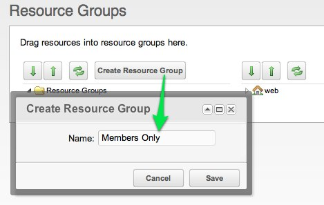
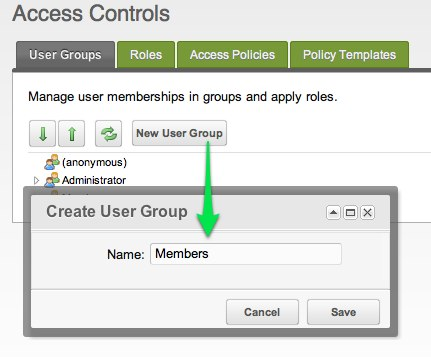
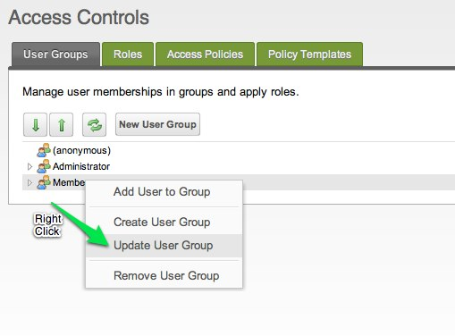
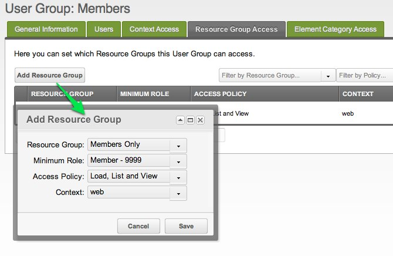
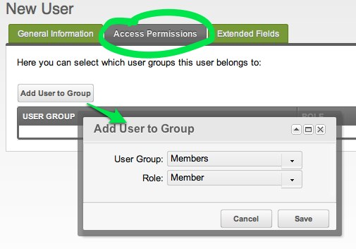
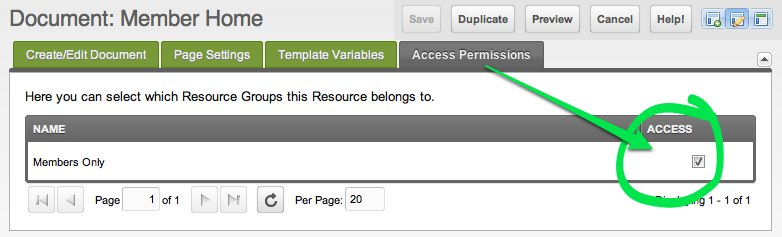

 This tutorial catalogs which pages you need to set up and the Snippets that belong on each page. At the end of this tutorial, you will have a setup which will allow users to log in via the front-end of your website, but the users must be manually created by an admin in the manager. There is a [separate tutorial](extras/login/login.tutorials/request-membership "Login.Request Membership") for establishing a process where users can request membership themselves.

 Even a basic setup of a login portal involves a lot of inter-related parts, and the setup demonstrated here puts pretty much everything on its own page. A cleaner implementation might involve putting some of the functions listed below inside chunks or templates instead of on their own dedicated pages, but this page should give enough information to get a login portal established.

 All the pages here use a sample **page\_id** for reference.

## Create the Required Pages

 Before we add all the Snippets that do all the dirty work, let's first add the following **5** pages to your MODX Revo site:

- **Login Page (1)** : the page containing your login form
- **Forgot Password (2)** : the page where users can go when they forgot their password
- **Reset Password Handler (3)** : the hidden page that will actually do the resetting of the password
- **Members Home Page (4)** : the secret clubhouse, available only to valid members
- **Come Again Soon (5)** : the page displayed upon successful logout

 Next, you'll want to prepare the necessary rights and permissions for users and resources on your site.

## Create the Necessary User Groups and Resource Groups

 MODX Revolution includes some pretty head-splitting granularity when it comes to [Permissions](administering-your-site/security/policies/permissions "Permissions"), but here is a basic schema to get you started. (Have a look at [Making Member-Only Pages](administering-your-site/security/security-tutorials/making-member-only-pages "Making Member-Only Pages") for more detailed explanation.)

 As of MODX 2.2.3, you can skip most of this step by using the **Access Wizard**, which appears when you create a new Resource Group under **Security -> Resource Groups**. Just use the following settings:

- Name: Members
- Context: web
- Automatically Give Adminstrator Group Access: **checked**
- Create Parallel User Group: **checked**
- Automatically Give Anonymous Access: _UNCHECKED_
- Automatically Give Other User Groups Access: _blank_

 If you are using an older version of MODX or you just want to enhance your understanding of the process, you can follow the manual steps below:

1\. **Security -> Resource Groups** : Create a new Resource Group for all the pages that will be available only to members.

 

2\. **Security -> Access Controls** : Create User Group named "Members". Users in the "Members" group will have access to the "Members Only" resources. Make sense?

 

3\. On that same page (**Security -> Access Controls**), **Right Click** the newly created "Members" User Group and select "Update User Group".

 

 

 Then Add a Resource Group to this User Group. At a minimum, the Resource Group should have the following settings:

- **Resource Group:** Members Only (the one we just created)
- **Mimimum Role:** Member-9999
- **Access Policy:** Load, List and View
- **Context:** web

 Then save.

4\. **Security -> Manage Users** : Create a new "member" user so we can test whether or not our login portal works.

 Use a simple Username and password that you can remember; the important thing here is to make sure your new user is a member of the "Members" User Group. Head to the "Access Permissions" tab and click "Add User to Group"

 

- **User Group:** Members
- **Role:** Member

 This should ensure that your new user can log in with basic permissions to look around the "Members Only" pages.

 Now circle back to add the various Snippet (adjust the Snippet calls so they point to the corresponding pages on your system).

## Add Snippets to the Pages

### Login Page (1)

 Put the following Snippet call on your login page:

``` php
[[!Login?
&loginTpl=`lgnLoginTpl`
&logoutTpl=`lgnLogoutTpl`
&errTpl=`lgnErrTpl`
&loginResourceId=`4`
&logoutResourceId=`5`
]]
```

 Then save the page. You'll notice that the Snippet call has a lot of arguments – many of those arguments reference the names of Chunks. When you installed the Login Add-on, many of these Chunks were already created for you (look under the Elements tab), but sometimes you may want to create your own Chunks and update the Snippet parameters to reference their names. In this example, we are customizing the **lgnLoginTpl** Chunk.

 The Chunk that displays the login form should also include a link to the "Forgot Password" page; this is so we only display that link to users who have not logged in yet. Here is an example of the **lgnLoginTpl** Chunk, so either create a Chunk of that name or edit the existing Chunk so it matches the following:

``` html
<div class="loginForm">
    <div class="loginMessage">[[+errors]]</div>
    <div class="loginLogin">
        <form class="loginLoginForm" action="[[~[[*id]]]]" method="post">
            <fieldset class="loginLoginFieldset">
                <legend class="loginLegend">[[+actionMsg]]</legend>
                <label class="loginUsernameLabel">[[%login.username]]
                    <input class="loginUsername" type="text" name="username" />
                </label>
                <label class="loginPasswordLabel">[[%login.password]]
                    <input class="loginPassword" type="password" name="password" />
                </label>
                <input class="returnUrl" type="hidden" name="returnUrl" value="[[+request_uri]]" />
                [[+login.recaptcha_html]]
                <input class="loginLoginValue" type="hidden" name="service" value="login" />
                <span class="loginLoginButton"><input type="submit" name="Login" value="[[+actionMsg]]" /></span>
            </fieldset>
        </form>
    </div>
</div>
<a href="[[~2]]">Forgot your Password?</a>
```

 You may choose to put the link to "Forgot your Password" inside your template and keep it out of the Chunk, it's really up to you. As long as your site is clean and organized and you're not putting chunks within chunks within chunks, then you should be Ok.

### Forgot Password (2)

- _Probably hidden from most menus_

 This page houses the form where users can request that their password be reset. Remember: it displays the form that allows users to say that they've forgotten their password, and the "ResetPassword" Snippet is what actually resets the password.

``` php
[[!ForgotPassword? &resetResourceId=`3` &tpl=`lgnForgotPassTpl`]]
```

 Here's what the flow looks like, just so you can follow what we're doing here:

 

### Reset Password Handler (3)

- _Hidden from menus_

 When a user requests that his/her password be reset, they are emailed a link to this page. When a valid incoming link to this page is detected, the password is reset and the user is redirected to the login page.

``` php
[[!ResetPassword? &loginResourceId=`1`]]
```

 Remember to ensure the **Forgot Password (2)** and **Reset Password Handler (3)** pages are published.

### Members Home Page (4)

 This is the page that displays to users who have successfully logged in. This page must have restricted permissions, and the users who log in must have the corresponding permissions to access this page. You can put whatever "private" content you want on it, just make sure you update the permissions on it so that it belongs to the "Members Only" resource group – just click on the page's "Access Permissions" or "Resource Groups" tab (depending on your version of MODX):

 

 and check the box for "Members Only".

### Come Again Soon (5)

 This is the page that people see after a successful logout. It needs only to contain a basic message, or perhaps a link back to the Login page:

``` html
<p>Thank you for visiting! Come again soon!</p>
```

## Optional

### Logout Page

- _WebLink_

 This isn't strictly necessary per-se, but for testing it can be helpful to have a dedicated WebLink that will logout your user.

 Weblink:

``` php
[[~1? &service=`logout`]]
```

 This is effectively the same as adding a Logout link like this to your pages:

``` html
<a href="[[~1? &service=`logout`]]" title="Logout">Logout</a>
```

## Possible Errors

 Now that you've put together all these parts, it's time to test them. If everything works perfectly, then you can login on the Login page and be redirected to the "Members Home Page". Logging out can be accomplished by visiting the Login page and clicking the "Logout" link (or optionally if you created it, by clicking the "Logout Page" WebLink). Upon successful logout, you should be redirected to the "Come Again Soon" page.

### I can't log in!

 Usually the errors here revolve around incorrect page IDs, misspellings of Chunk names, or omissions of square brackets in your template tags. Double-check these very carfully.

 Also make sure that your Snippets are called uncached! Some of them will function cached, but some will not. They should use the exclamation point in front of them:

``` php
[[!Login]]
```

 and **not**

``` php
[[Login]]
```

### I can't log out!

 Another subtle error that you might encounter is an inability to log out. One cause of that is pointing your logout link to a page other than your _Login_ page. Remember, your logout link must point to the same page containing the **Login** snippet!

 It's also possible that your server does not send out the Password Reset emails correctly; in that case you need to debug your email setup on your server.

### Login errors are not displayed

 If you fingermash the keyboard with a non-existent username and try to login, sometimes you don't see any errors displayed.

### Error HTTP 500 (Internal Server Error)

 If you see this error when you try to view some of your "Members Only" pages and you see something like `does not have permission to load object of class modContext with primary key` in the MODX error log, then the problem might be with your Context Access: especially when dealing with multiple contexts, make sure you grant Contexts Access access to all contexts.
