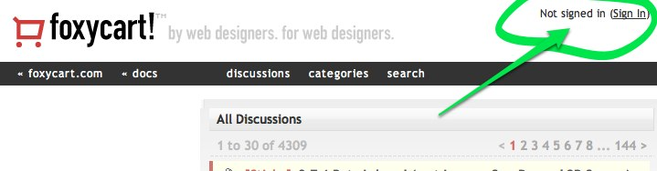
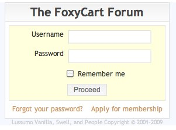
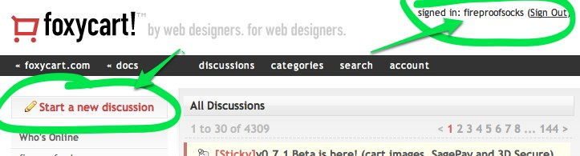
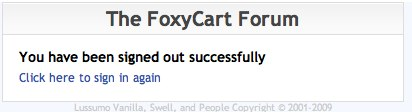
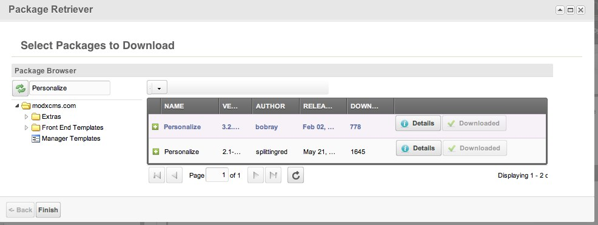
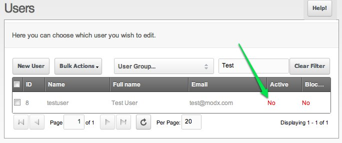

## Outline

If you've followed the tutorial for the [Basic Setup](extras/login/login.tutorials/basic-setup "Login.Basic Setup"), then it's time to try for a more thorough implementation of the Login Snippet where _users can apply for site membership themselves_. Once you've completed this tutorial, visitors to your site will be able to request membership by themselves and you will not have to add users manually.

Do not try to use extended user fields yet. First get the registration process working using the standard user fields. See the next tutorial for setting up user profiles and using extended user fields.

A good example for what we're trying to accomplish in this tutorial is visible on the [FoxyCart Forum](http://forum.foxycart.com/): when you're viewing the forums as a guest, the header displays a login link, but after you've signed in, additional functionality is unlocked. You've seen this type of thing on many sites.

The FoxyCart forum is not running MODX: we're just using a simplified version of their login flow as an example.

The steps go something like this:

1\. **Visit the homepage as a guest:** the header displays a link to the login page.



2\. **Login:** The Login page contains links to the "Forgot Password" and to a "Apply for Membership" page.



3\. **Redirect to the Homepage:** after a successful login, you are returned to the homepage, but this time, additional functionality is unlocked.



4\. **Logout:** When you're done visiting the site, you can click the "Logout" link and land on the "Come Again" page.



Make sense? It's pretty similar to what we did before in the [Basic Setup](extras/login/login.tutorials/basic-setup "Login.Basic Setup"), but there are a few extra things going on, so we need a few extra pages. Most importantly, we'll need to integrate both the [Register](extras/login/login.register "Login.Register") and the [Personalize](http://modx.com/extras/package/personalize) Snippets, and we'll need to shuffle around a couple other components from the [Basic Setup](extras/login/login.tutorials/basic-setup "Login.Basic Setup") tutorial.

This tutorial makes use of related and complimentary Snippets!

Let's get started!

## Download the Necessary Snippets

We're augmenting the functionality offered by the default Login snippet, so make sure that you also download the [Personalize](http://modx.com/extras/package/personalize) Snippet. It is available via package management.



Be sure to download the latest version (the one by BobRay). Bob says he may have goofed when submitting his upgrade, so it shows up as a separate package.

## Create the Required Pages

As with the basic setup, we want to make sure we have the required pages in place before we add in all the Snippets. Make sure the following **9** pages exist on your MODX Revo site (1 - 5 are the same as the basic setup, additional pages highlighted in green):

- **Login Page (1)** : the page containing your login form
- **Forgot Password (2)** : the page where users can go when they forgot their password
- **Reset Password Handler (3)** : the hidden page that will actually do the resetting of the password
- **Members Home Page (4)** : the secret clubhouse, available only to valid members
- **Come Again Soon (5)** : the page displayed upon successful logout
- **Request Membership (6)** : the page where users can request membership, i.e. the "Become a Member" page.
- **Request Pending (7)** : notifies the user that the user's request has been received
- **Membership Confirmation Handler (8)** : the hidden page that will actually register the user

And lest we forget...

- **Home Page (9)** : we're just being thorough – you probably already some page designated as your home page.

## Ensure Basic Permissions are in Place

In case you haven't already, you'll want to prepare the necessary rights and permissions for users and resources on your site as described in the [Basic Setup](http://rtfm.modx.com/display/ADDON/Login.Basic+Setup#Login.BasicSetup-CreatetheNecessaryUserGroupsandResourceGroups). This must be in place before continuing!

## Add Snippets

### Login Page (1)

You don't have to spruce up your login page, so if you're at all unsure here, skip these bits with the **Personalize** Snippet and skip ahead a bit.

As before, we can use the same Login Snippet:

 ``` php
[[!Login?
&loginTpl=`lgnLoginTpl`
&logoutTpl=`lgnLogoutTpl`
&errTpl=`lgnErrTpl`
&logoutResourceId=`5`
]]
```

### The Homepage Template

That nifty banner link on your homepage that displays "Logout" when you are signed in and "Login" when you're not can be accomplished via the [Personalize](http://modx.com/extras/package/personalize) Snippet.

To make use of it, put something like the following in your homepage template (add HTML to taste):

 ``` php
<div id="your_header">
[[!Personalize? &yesChunk=`header_for_members` &noChunk=`header_for_guests` &ph=`name`]]
</div>
```

It's important that the **Personalize** snippet is not cached!

#### Add Chunk: header\_for\_guests

Create a chunk that contains something like the following:

 ``` php
<span id="logged_in_status">Not signed in (<a href="[[~1]]">Sign in</a>)</span>
```

The important thing there is that it links back to the login form.

#### Add Chunk: header\_for\_members

Next create a chunk that will be displayed to members when they are logged in:

 ``` php
<span id="logged_in_status">Signed in: [[+name]] (<a href="[[~1? &service=`logout`]]">Sign out</a>)</span>
```

Note the special format of the logout link: you trigger the logout action by passing a parameter to the _Login_ page.

The syntax for passing parameters to a MODX URL tag is similar the way parameters are passed to Snippets; this ensures that the parameter gets correctly appended to the URL. The `[[~1? &service=`logout`]]` tag would render two different ways depending on whether friendly URLs were enabled:

- <http://yoursite.com/index.php?id=1&service=logout>
- <http://yoursite.com/login?service=logout>

Note that MODX automatically handled the placement of the "?"

We could do the same thing for any parts of our page that need to change how they look based on whether a user is logged-in or not. In the example of FoxyCart, their site also added some menu options that appeared when when a user had successfully logged in. All you would need to do is create another instance of the [Personalize](http://modx.com/extras/package/personalize) Snippet with its corresponding **yesChunk** and **noChunk**. We're going to assume you get the idea and you can repeat as needed.

### Login Page (1)

We can basically use the same Snippet call as the Basic setup, but we're going to add one more parameter: **redirectToPrior**. This will enable users to login from any page, then return to that same page after completing the login.

 ``` php
[[!Login?
&loginTpl=`lgnLoginTpl`
&logoutTpl=`lgnLogoutTpl`
&errTpl=`lgnErrTpl`
&logoutResourceId=`5`
&redirectToPrior=`1`]]
```

We can use the same **loginTpl** Chunk to display the login form, but we want to add a link to where the user can "Request Membership" :

``` html
<div class="loginForm">
    <div class="loginMessage">[[+errors]]</div>
    <div class="loginLogin">
        <form class="loginLoginForm" action="[[~[[*id]]]]" method="post">
            <fieldset class="loginLoginFieldset">
                <legend class="loginLegend">[[+actionMsg]]</legend>
                <label class="loginUsernameLabel">[[%login.username]]
                    <input class="loginUsername" type="text" name="username" />
                </label>

                <label class="loginPasswordLabel">[[%login.password]]
                    <input class="loginPassword" type="password" name="password" />
                </label>
                <input class="returnUrl" type="hidden" name="returnUrl" value="[[+request_uri]]" />

                [[+login.recaptcha_html]]

                <input class="loginLoginValue" type="hidden" name="service" value="login" />
                <span class="loginLoginButton"><input type="submit" name="Login" value="[[+actionMsg]]" /></span>
            </fieldset>
        </form>
    </div>
</div>

<a href="[[~2]]">Forgot your Password?</a>  <a href="[[~6]]">Apply for Membership</a>
```

Again, you may choose to put the "Forgot Password" and "Apply for Membership" links outside of your Chunk and put them in the template alongside the Snippet call.

### Forgot Password (2)

This page functions identically as it did in the Basic Setup: it provides a form where forgetful users can request that their password be reset. The form submission triggers an email to be sent. The email contains a link to the "Reset Passsword Handler (3)" page.

### Reset Password Handler (3)

This page functions in exactly the way it did in the Basic Setup: it handles incoming links from emails and resets passwords as appropriate.

### Members Home Page (4)

You'll notice that in this scenario, we have effectively bypassed this page entirely. It's still good to have it there: by its membership in a "Members Only" resource group, it represents content that is only visible to validated members. In the FoxyCart example, the menu that was displayed only to the members represented "Members Only" pages like this one. Just create the necessary pages you need, and adjust their access permissions so they belong to the "Members Only" resource group.

### Come Again Soon (5)

This page doesn't have to change any from the basic setup. Its purpose is simply to message the user; you can throw a link back to the login page if you want.

### Request Membership (6)

Next, let's handle the form that allows users to apply for membership on your site. The [Register](extras/login/login.register "Login.Register") Snippet acts on a form that is included in-line on the page (as opposed to a form inside of a chunk).

``` html
<h2>Register</h2>

[[!Register?
    &submitVar=`registerbtn`
    &activationResourceId=`8`
    &activationEmailTpl=`lgnActivateEmailTpl`
    &activationEmailSubject=`Thanks for Registering!`
    &submittedResourceId=`7`
    &usergroups=`Members`
]]

<div class="register">
    <div class="registerMessage">[[+error.message]]</div>

    <form class="form" action="[[~[[*id]]]]" method="post">
        <input type="hidden" name="nospam:blank" value="" />

        <label for="username">[[%register.username? &namespace=`login` &topic=`register`]]
            <span class="error">[[+error.username]]</span>
        </label>
        <input type="text" name="username:required:minLength=6" id="username" value="[[+username]]" />

        <label for="password">[[%register.password]]
            <span class="error">[[+error.password]]</span>
        </label>
        <input type="password" name="password:required:minLength=6" id="password" value="[[+password]]" />

        <label for="password_confirm">[[%register.password_confirm]]
            <span class="error">[[+error.password_confirm]]</span>
        </label>
        <input type="password" name="password_confirm:password_confirm=`password`" id="password_confirm" value="[[+password_confirm]]" />

        <label for="fullname">[[%register.fullname]]
            <span class="error">[[+error.fullname]]</span>
        </label>
        <input type="text" name="fullname:required" id="fullname" value="[[+fullname]]" />

        <label for="email">[[%register.email]]
            <span class="error">[[+error.email]]</span>
        </label>
        <input type="text" name="email:email" id="email" value="[[+email]]" />

        <br class="clear" />

        <div class="form-buttons">
            <input type="submit" name="registerbtn" value="Register" />
        </div>
    </form>
</div>
```

It needs to reference two other pages: the **Request Pending (7)** page, and the **Membership Confirmation Handler (8)** page.

### Request Pending (7)

This page's job is to inform the user that their request is being processed and that they should check their email for an activation link. Here's a sample message:

``` html
<p>Thank you for your interest in our site! Check your email for an activation link.  
You will need to click this link before you can log into our site.</p>

```

### Membership Confirmation Handler (8)

This page handles the incoming links from the emails sent by the **Register** Snippet. The **ConfirmRegister** Snippet handles this processing; in our example, we want it to redirect users to the home page (page 9 in our example):

 ``` php
[[ConfirmRegister? &redirectTo=`9`]]
```

## Testing: Making it all Work

Now that we have the pieces laid out, let's try to make this work.

### Request Membership

Go to your **Request Membership (6)** page. Verify that the form shows up and go ahead and try creating a new user – use a different email address for this than the one you have assigned to your MODX manager user.

If the page doesn't redirect correctly, verify that you have a valid page ID for the **&submittedResourceId** parameter.

1. **CHECK:** After submitting the form, you should be redirected to the **Request Pending (7)** page.
2. **CHECK:** After submitting the form, you should see the new user created under **Security --> Manage Users**. It will be grayed out because the user is not yet active until they confirm their email address by clicking the link that was emailed to them.



### Check for Verification Email

Check your email for email message containing the confirmation link. There is a section below for troubleshooting email functionality on your server.

Also check your spam filters on your your email account, and keep in mind it may take a minute or two for the email to arrive.

1. **CHECK:** Did you get the confirmation email? You can customize the text of the email by changing the content of the **ActivationEmailTpl** Chunk.
2. **CHECK:** Is the confirmation link in the email correct? When you click it, does it take you to the **Membership Confirmation Handler (8)** page? If the link is not correct, double-check the **&activationResourceId** parameter and make sure it's pointing to your **Membership Confirmation Handler (8)** page.
3. **CHECK:** Make sure that the **ConfirmRegister** Snippet on the **Membership Confirmation Handler (8)** page works: if your template isn't displaying `[[**content]]` correctly, then the \*ConfirmRegister** Snippet may never execute. The expected behavior is that clicking the activation link in your email message should take to to the **Membership Confirmation Handler (8)** page, which should _immediately_ redirect to the home page (check the **&redirectTo** parameter in the **ConfirmRegister** Snippet.
4. **CHECK:** Verify that your new user is not set to **Active** under **Security -> Manage Users**. This confirms that the user was activated!

### Login

Using a different browser other than the one you're logged into the MODX manager, navigate to your **Login Page (1)** (as was set up in the [basic tutorial](extras/login/login.tutorials/basic-setup "Login.Basic Setup"). Try to log in using the newly created user.

1. **CHECK:** is the login successful? Does the page redirect to your **Members Home Page (4)**? If not, double-check the **&loginResourceId** parameter in your **Login** Snippet call.
2. **CHECK:** is the **Members Home Page (4)** publicly accessible? You might need a 3rd browser for this, but try visiting the Members Home Page in a browser where you are not logged in to any part of the site. You should see a 404 page.
3. **CHECK:** Can you log out? It's best to put a logout link on your Members Home Page somewhere. See the basic tutorial for how to set up a logout link. In a pinch, visit your login page and append **?service=logout** to the URL.

## Errors

### When I submit the request membership form, the page does not redirect!

Sometimes the form submits, the user _IS_ created, but the page does not redirect: the user sees the same form they filled out. What's going on?

Triple-check the page ID you have set the **&submittedResourceId** parameter. If the page ID does not exist on your site, the user will be created, but the redirect will fail.

### When I get the Activation email, the message is blank!

The cause is almost certainly that you do not have a Chunk by the name listed for the **&activationEmailTpl** parameter. The default install of the Login package uses a Chunk named **lgnActivateEmailTpl**, whereas the tutorial here used one named **ActivateEmailTpl**.

### I never get the Emails that MODX sends!

Email configuration is unfortunately complex and differs from server to server. A good place to start is checking whether PHP can send emails. Try placing the following script on your site, then navigate to it in your browser:

 ``` php
<?php
 $to = "recipient@example.com";
 $subject = "Hi!";
 $body = "Hi,\n\nHow are you?";
 if (mail($to, $subject, $body)) {
   echo("<p>Message successfully sent!</p>");
  } else {
   echo("<p>Message delivery failed...</p>");
  }
 ?>
```

_\* Script from [About.com](http://email.about.com/od/emailprogrammingtips/qt/How_to_Send_Email_from_a_PHP_Script.htm)_

You can also try configuring your site to use SMTP to send emails; this is often preferable because it relies on a dedicated email server (e.g. yahoo.com or google.com) to send your messages. Under System->Settings, search for SMTP, and you'll find a handful of settings that can help you set that up.

### After submitting the registration form, I get a white page.

This issue shouldn't come up on recent versions of MODX, but to verify this behavior, try visiting your "Request Membership" sign-up page and submit the form without any data in it. If you get nothing but a completely empty blank white page, the cause may be due to your PHP configuration.

A simple test here is the following script:

 ``` php
if (function_exists('mb_ereg')) {
 print 'Yes, the multibyte function exists';
}
else {
 print 'No, the function does not exist. The Register Snippet may fail.';
}
```

The solution involves recompiling PHP. You must have the **mbstring** library installed and you must ensure that you have not included the _--disable-mbregex_ option.

See [this forum post](http://modxcms.com/forums/index.php/topic,63778.0.html) for more details.
