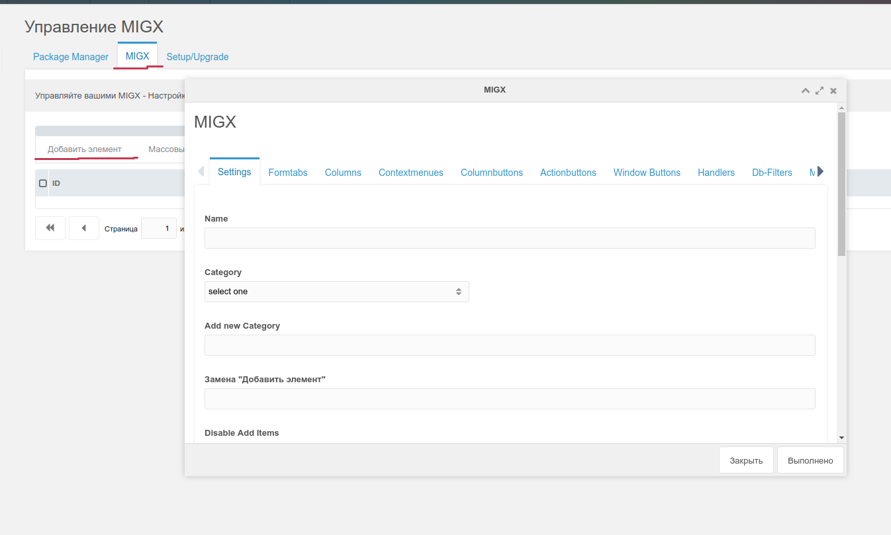
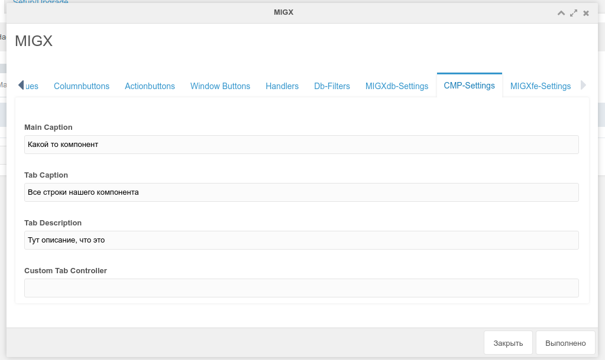
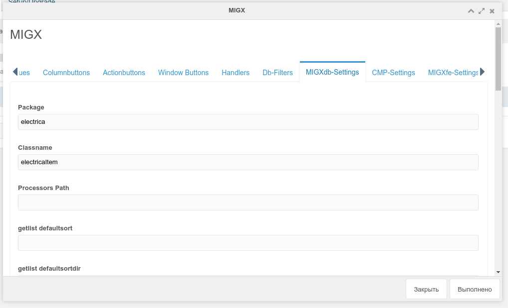
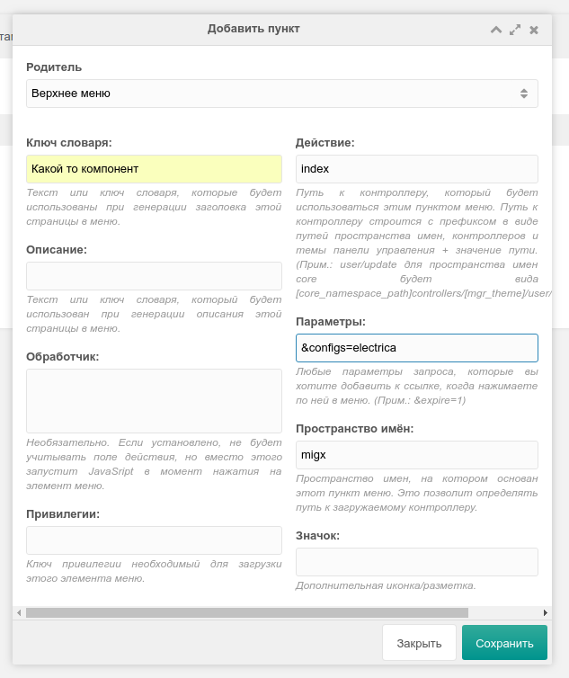
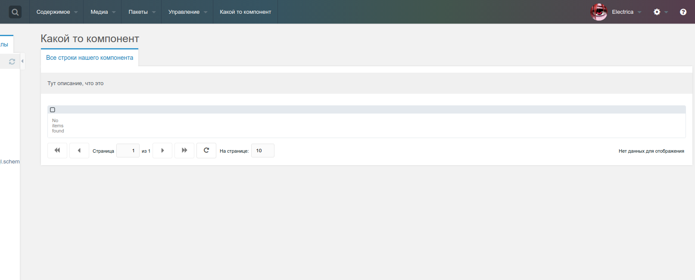
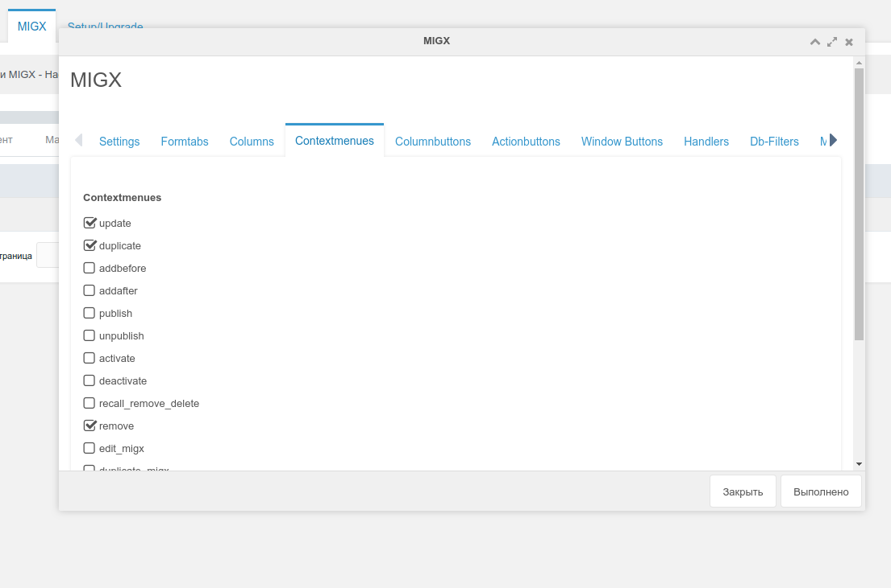
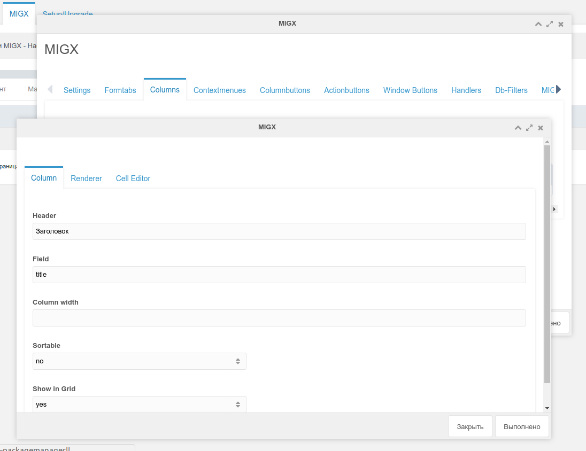
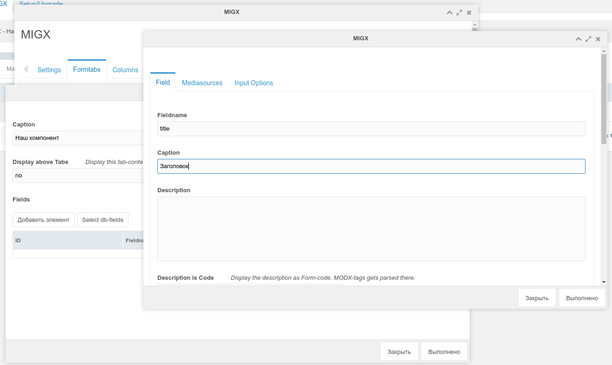
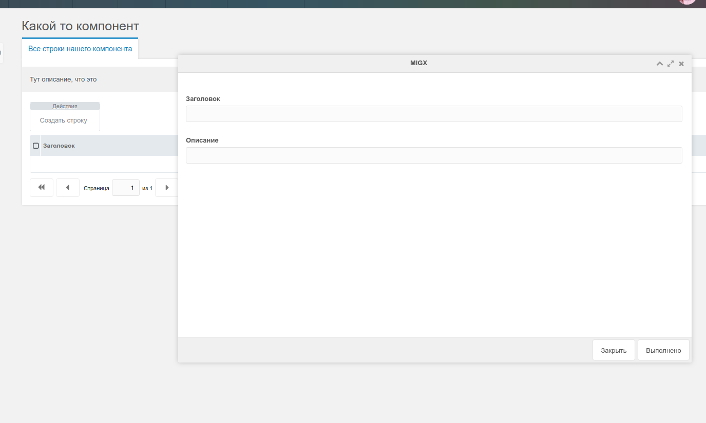
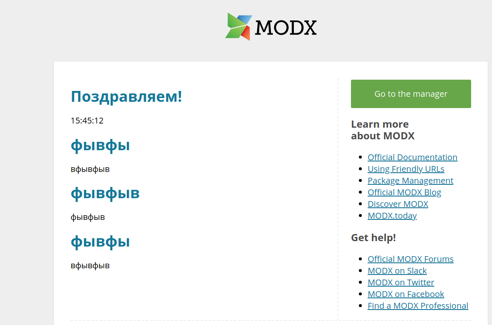

In the last article I explained how you can create your component using MIGX. Now I will show how you can create and edit data in the admin panel.

Who does not know what it is about, link to [first article](extras/migx/migx.tutorials/creating-tables-through-migx).

In fact, creating your own page is essentially no different from creating the usual MIGX TV.

Go to the tab MIGX:



Fill:

**Name**: electrica
**Add item replacement**: Create string
**unique MIGX ID**: electrica

Then open the CMP-Settings tab and fill in:



Then go to the tab **MIGXdb-Settings** and fill **package** (package name with XML markup) and **Classname**:



Push **Save**.

Then go to settings - Menu. Create found menu:



In the parameters we write your customization of your component, as you called it.

Well, that's all, we can now open it:



We continue to display all our fields.

Editing our MIGX configuration, adding a contextmenus:



In the tab **Columns** fill in our fields:

**IMPORTANT!!!** In the columns you need to create the id field, otherwise you will not be able to edit the data



In the Formtabs tab, fill in our fields:



That's all!



Well, the output on the front has already been described in [previous article](extras/migx/migx.tutorials/creating-tables-through-migx). Create a snippet and make the selection or sampling we need.

Well, or you can use **snippet**:

``` php
[[!migxLoopCollection?
    &packageName=`electrica`
    &classname=`electricaItem`
    &tpl=`testTPL`
]]
```

**Chunk**:

``` php
<h1>[[+title]]</h1>
<p>[[+description]]</p>
```

And that's what we got:


