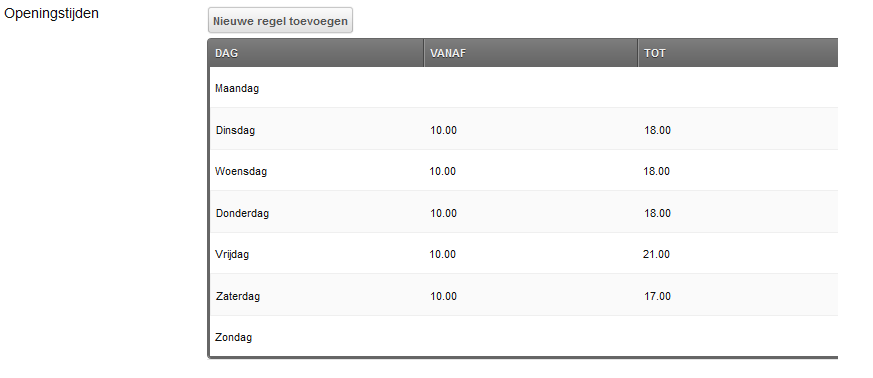
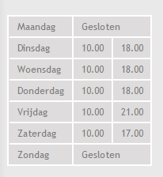

To allow a flexible table layout displaying opening hours, you could use MIGX.

## The MIGX TV Configuration

We're just going to assume we want a simple table with the day, the time the store opens and the time it closes.

Create a new TV (we called it "operatingHours") using the MIGX TV Input Type (that assumes you installed the package via System -> Package Manger), and use the following code for the Form Tabs. You'll see I write out JSON differently then the author of the MIGX plugin, but as long as it is valid JSON syntax that's fine.

So for the Form Tabs:

``` json
[{
  "caption": "Operating Hours",
  "fields": [{
      "field": "day",
      "caption": "Day"
    },
    {
      "field": "from",
      "caption": "From"
    },
    {
      "field": "until",
      "caption": "Until"
    }
  ]
}]
```

We're giving the tab (we need one) the caption of "Operating Hours", and then add three fields to it. The day, the from time, and the until time. As we're not specifying an input type it will just assume a textfield.

Now to display this in the resource panel, we will need to set up the Grid Columns too. We're using this:

``` json
[{
    "header": "Day",
    "width": "60",
    "sortable": "false",
    "dataIndex": "day"
  },
  {
    "header": "From",
    "width": "50",
    "sortable": "false",
    "dataIndex": "from"
  },
  {
    "header": "Until",
    "width": "50",
    "sortable": "false",
    "dataIndex": "until"
  }
]
```

We're setting three columns ("Day", "From", and "Until") and giving them a width, the proper dataIndex (which needs to be the same as the "field" value in the form) and we're also saying we don't want them to be sortable.

Finally we're setting an "Add Item" Replacement, in my case it was set to "Add new line".

You should now be able to get the following in the Manager (though the image has terms in Dutch). 

## Parsing the Data

Now in the front-end we'll need to display that, using the getImageList snippet that comes packed with the MIGX package.

Here's the snippet call to put in your template where you want it to appear:

``` php
<table>
[[getImageList?
  &tvname=`operatingHours`
  &tpl=`operatingHoursTpl`
]]
</table>
```

This will check the operatingHours TV, and parse its values with the operatingHoursTpl chunk.

Here's the chunk we used:

``` php
<tr>
  <td>[[+day]]</td>
  [[+from:notempty=`<td>[[+from]]</td><td>[[+until]]</td>`:default=`<td colspan="2">Closed</td>`]]
</tr>
```

Whoah! What's going on there?

Basically we're outputting a table row for every row of the TV, and we're simply putting the day in. But when that's done, we want to check if there is a value for the "from" row, so that the user filled in a time the shop opens. If there is a value (it is not empty) it will output two more cells, one with the from time and one with the until time.

If there isn't a value it will use the default output modifier, which means it will set a cell covering two columns with the text "Closed".

## The Result

See the image below for the result. (Though we have replaced the texts with Dutch here and added some styling to the table)
And that's just another example of what you can do with MIGX! Of course you could go much further in this, adding more columns, multiple forms etc etc.


