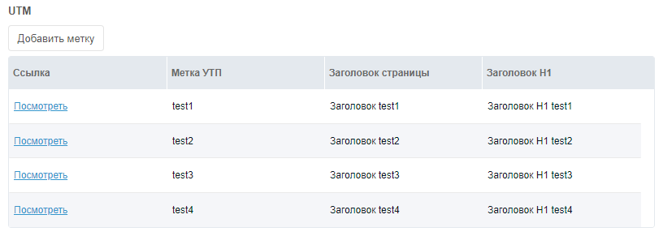

## Why we need UTM tags

Suppose you have a task to make sure that your site displays different content depending on the GET parameter.

You should get something like this:



This method is good because we will be able to create as many fields as you like.

## How to implement

We need to go to the MIGX component page and create a configuration.

**All that is not indicated by me, skip!**

Tab **Settings**

- **Name** — utm
- **Replace "Add Item"** — Add tag
- **Form Caption** — Add/Edit Tag
- **Window Title** — Add/Edit Tag

Tab **Formtabs**

Fields — We create 1 tab and in the Fields field we create several fields.

1. Label itself
   - **Fieldname** — utm
   - **Caption** — UTM label

2. Page title
    - **Fieldname** — title
    - **Caption** — Page title

3. Headline H1
    - **Fieldname** — pagetitle
    - **Caption** — Headline H1

Tab **Columns**

- Field **Columns**

1 Link (will be needed so that the click manager can see how the page will look, this is convenient)

- Tab **Column**
    - **Header** — Link
    - **Field** — link
- Tab **Renderer**
    - **Renderer** — this.renderChunk
    - **renderChunk template** — `<a href="[[~[[#GET.id]]]]?utm=[[+utm]]" target="_blank">Look</a>`

2 Label

- Tab **Column**
    - **Header** — Label UTM
    - **Field** — utm
- Tab **Cell Editor**
    - **Editor** — this.textEditor

3 Page title

- Tab **Column**
    - **Header** — Page title
    - **Field** — title
- Tab **Cell Editor**
**Editor** — this.textEditor

4 Headline H1

- Tab **Column**
    - **Header** — Headline H1
    - **Field** — pagetitle
- Tab **Cell Editor**
    - **Editor** — this.textEditor

We go and create TV utm with the type of input migx, in the Configuration field we write the name of our configuration, i.e. utm, assign the necessary templates and open the resource for editing, or create it.

### Snippet utm

Create a snippet and specify the name utm with this code:

``` php
<?php
$utm_point = $modx->stripTags($_GET['utm']);
$migx = $modx->resource->getTVValue('utm');
$array = $modx->fromJSON($migx);

if(!empty($input)) {
    foreach($array as $utm) {
        if($utm['utm'] == $utm_point && !empty($utm[$input])) return $utm[$input];
    }
}
return;
```

### How to withdraw?

Very simple, here are some examples:

#### MODX Syntax

``` php
<head>
    <title>[[!utm:default=`Default page title`? &input=`title`]]</title>
</head>

<body>
    <h1>[[!utm:default=`Default H1 Header`? &input=`pagetitle`]]</h1>
</body>
```

#### Fenom

``` php
<head>
    <title>{('title' | utm) ?: 'Default page title'}</title>
</head>

<body>
    <h1>{('pagetitle' | utm) ?: 'Default H1 Header'}</h1>
</body>
```

This is the simple way to achieve our goal. If you have not yet understood, we can create as many fields as you like, images, whole contents, descriptions, and generally change the whole page depending on the utm tag.
