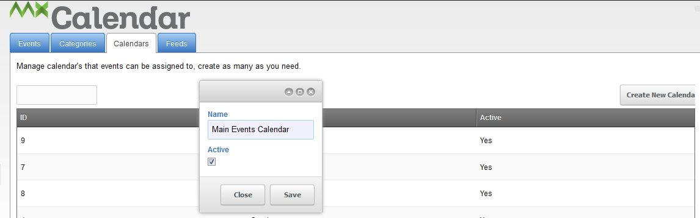
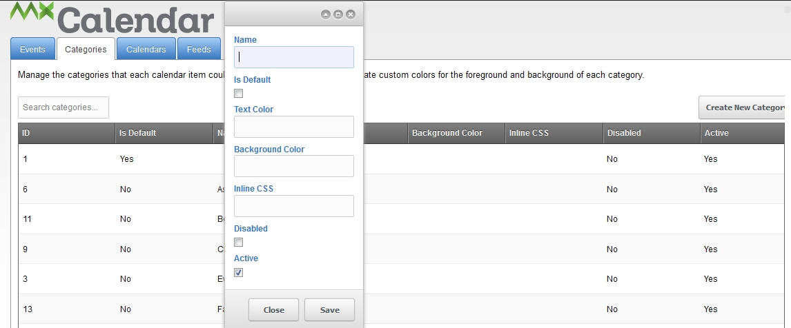
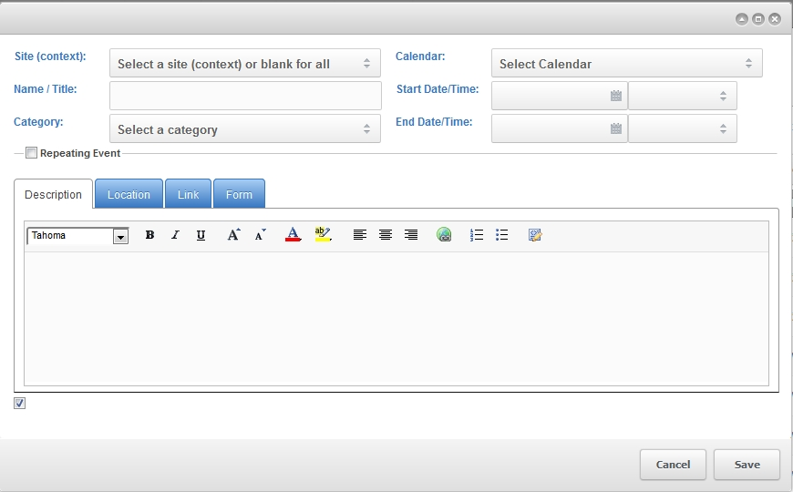
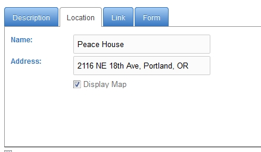
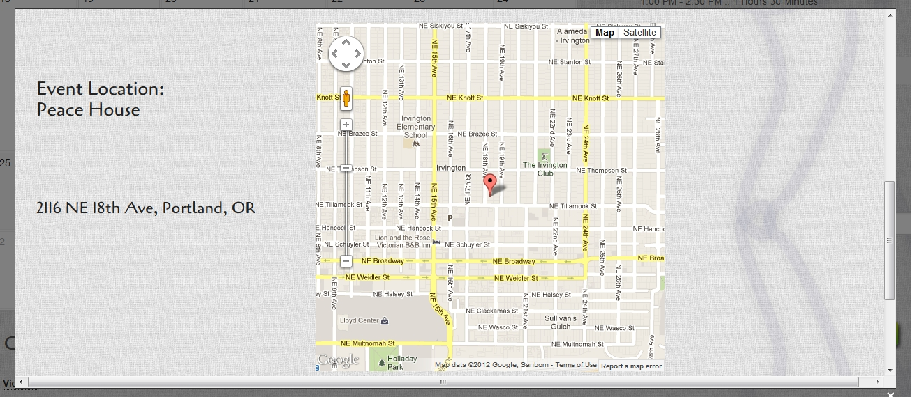
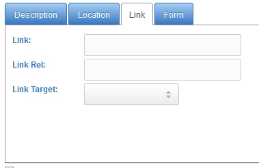

##### Working on finishing documentation, please visit <http://charlesmx.com/software/mxcalendar-revo.html> in the meantime, or if you have access feel free to help update

## About mxCalendar

mxCalendar is a extra created for both Evolution and Revolution to allow for full calendar editing using the native Manager of ModX. The calendar supports various views including calendar, list, and detail of which all views support the ModX template standards for fully customizing your themes. In addition mxCalendar supports feature rich calendar functions such as repeating events, Google Maps, cateogries, context, and unique calendars.

## Installation

### ModX Revolution

It can be downloaded from within the MODX Revolution manager via [Package Management](developing-in-modx/advanced-development/package-management "Package Management"), or from the MODX Extras Repository, here: <http://modx.com/extras/package/mxcalendar2>. When using the Package Management for direct download you can simply click on the "Install" button after download completes. If you choose to download from the extras site you will then need to FTP, or otherwise move, the transport package zip file to your "/core/packages/" folder first. After you have copied the transport zip file to your packages folder you will then need to launch Package Management from inside the Manager (ver 2.2.x) and then select the down arrow next to "Download Extras" and select the last option "Search Locally for Packages" and then find "mxcalendars" in the list of packages and choose "install".

### ModX Evolution

You will need to download from the ModX Extras Repository, here <http://modx.com/extras/package/mxcalendar>. After you have downloaded you will need to follow these steps.

1. Unzip folder to your favorite place
2. Upload mxCalendar folder to your sites root /assets/modules/ folder
3. Copy contents of "snippets/mxCalendar.module.txt" file from the unzipped folder
4. Log into your Manager interface and goto the Modules > Manage Modules section
5. Select the New Module button
6. In the Module name field place mxcalendar
7. Past the content of "snippets/mxCalendar.module.txt" into the Module code (php) section
8. Select Save
9. Click the gear icon next to the new entry "mxcalendar" and select Run Module
10. You should see a screen saying the installation was successful, so click the Start button
11. Now you are in the new manager

## Creating Calendars

**\*Note**: Calendars are only supported in the Revo version of mxCalendar

In the manager menu, select **Components** -> **mxCalendar**. Select the **Calendars** tab, click **Create New Calendar**. Name your calendar, check the active checkbox (if unchecked) and save.



## Creating Categories

In the manager menu, select **Components** -> **mxCalendar**. Select the **Categories** tab, click **Create New Category**. Name the category and enter options, save.



## Creating New Events

In the manager menu, select **Components** -> **mxCalendar**. Select the **Events** tab, click **Create New Calendar Item**.

Select a context. Leave blank for all contexts. Give the event a name, select a calendar to associate the event with, a category, and start and end date/times.

Enter your event description in the rich text editor. This populates the `[[*content]]` for the event detail view.


In the Location tab, name the location and enter the address. Check "Display Map" to output a Google Map for the address that you entered.
The example shown is the default Google Map display in a styled modal window (tplDetail or tplDetailModal).





In the event tab, enter the event link URL.



Form Tab documentation forthcoming...

## Using mxCalendar

Now to the best part, using mxCalendar to manage and display events.

## Basic Use

After installation you should be able to call the default view (calendar) in your resource using:

``` php
[[!mxcalendar?]]
```

This should provide you with the calendar view and full page load on navigation. If you want to step things up a notch to use the AJAX navigation and modal view of event details we'd add two additional parameters to the snippet call. The first is the "ajaxResourceId" which should be a new resource (page) that is created using the (blank) template since we are returning this in the ajax response and simply modifying the DOM. The next thing we want to add is the "modalView" set to true to enable the modal display of the event details.

``` php
[[!mxcalendar?
&ajaxResourceId=`43`
&modalView=`1`
]]
```

Now when you reload your primary page with the mxcalendar snippet call, not the ajax one, you shoudl see the same display however now when you click on the arrows for previous and next months the content is loaded via ajax and not an entire URL page reload. The second thing you should notice is now when you click on and event title in the calendar view it displayes the event detail view in a nice modal window. ah... that's nice

## Parameters / Properties / Settings

| **Parameters**                         | **Type**                                     | **Default**                                                        | **Scope**                    | **Description**                                                                                                                                                                                                                                                                                |
| -------------------------------------- | -------------------------------------------- | ------------------------------------------------------------------ | ---------------------------- | ---------------------------------------------------------------------------------------------------------------------------------------------------------------------------------------------------------------------------------------------------------------------------------------------- |
| theme                                  | string                                       | default                                                            | calendar, mini, list, detail | Set the theme to use; looks for theme files in the “/assets/components/mxcalendars/theme/” folder. You can create a new one by simply copying the default or traditional folder and modify then update the parater to your folder name.                                                        |
| resourceId                             | int                                          | (current resource)                                                 | calendar, mini, list, detail | This sets the resource ID to use when creating links that use the non-ajax parameter                                                                                                                                                                                                           |
| isLocked                               | boolean                                      | 0 (FALSE)                                                          | calendar, mini, list, detail | When set to true the display type for this snippet call will not be changed regardless of any passed parameters or query string values; used when you have multiple snippet calls on a single page                                                                                             |
| displayType                            | string                                       | calendar                                                           | default                      | Set the default display mode when not passed in snippet call or query string                                                                                                                                                                                                                   |
| elStartDate                            | date                                         | now                                                                | list                         | Uses PHP strtotime to set as the minimum date start listing                                                                                                                                                                                                                                    |
| elEndDate                              | date                                         | +4 weeks                                                           | list                         | Set the last date you want as the filter for returning dates in the future; uses PHP strtotime function                                                                                                                                                                                        |
| tplListItem                            | String (chunk)                               | el.itemclean                                                       | list                         | The chunk you want to use for each individual event item returned in the list                                                                                                                                                                                                                  |
| tplListHeading                         | String (chunk)                               | el.listheading                                                     | list                         | The chunk you want to use for month heading sperator in list view; to display the monthly heading make it empty                                                                                                                                                                                |
| tplListWrap                            | String (chunk)                               | el.wrap                                                            | list                         | The chunk that is the outer most wrapper for the list view, often contains the global heading “Upcoming Events”                                                                                                                                                                                |
| eventListlimit                         | int                                          | 5                                                                  | list                         | Set the max number of event items to display in the events list this includes the repeating events for a given event                                                                                                                                                                           |
| sort                                   | string (column name)                         | startdate                                                          | calendar, mini, list, detail | Set the default sorting order, often this is not modified and helps performance when dealing with the limits                                                                                                                                                                                   |
| dir                                    | string (ASC, DESC)                           | ASC                                                                | calendar, mini, list, detail | Set the sort direction to use                                                                                                                                                                                                                                                                  |
| limit                                  | int                                          | 99                                                                 | calendar, mini, list, detail | Sets the max number of items to return from the data base query                                                                                                                                                                                                                                |
| contextFilter                          | string (comma seperated)                     | empty; ?all + current context                                      | calendar, mini, list, detail | Sets which context to filter out events for, by defaullt it list global events where no context has been set plus the current context. In order to disable the global events from display you have to set the contextFilter value to the current context, thus over writing the default value. |
| calendarFilter                         | string (comma seperated list of category id) | null                                                               | calendar, mini               | Sets a calendar filter based on the events associated calendar. By default all events are displayed regardless of the calendar they are associated to. You must set this to the value of a category id or multiple category id's separated by a comma (,).                                     |
| elDirectional                          | date                                         | future                                                             | calendar, mini, list, detail | Sets the direction of the list based on the elStartDate parameter. By default, all listed events are future events. To show a list of past events, set this to `past` (make sure to include the elStartDate=`now` for a past event list display.)                                              |
|                                        |                                              |                                                                    |                              |                                                                                                                                                                                                                                                                                                |
| **Text and Date Formatting**           |                                              |
| dateformat                             | strftime                                     | %Y%m-%d                                                            | calendar, mini, list, detail | Uses the PHP strftime to return a pre-formatted date stamp; Extended value of %O to replace the date(S) type. English ordinal suffix for the day of the month, 2 characters (_st_, _nd_, _rd_ or _th_). Use this to help speed up render time.                                                 |
| timeformat                             | strftime                                     | %H:%M %p                                                           | calendar, mini, list, detail | Uses the PHP strftime to return a pre-formatted time stamp; Extended value of %O to replace the date(S) type. English ordinal suffix for the day of the month, 2 characters (_st_, _nd_, _rd_ or _th_). Use this to help speed up render time.                                                 |
| dateseperator                          | string                                       | /                                                                  | calendar, mini, list, detail | Set the date seperator string to use in date stamps                                                                                                                                                                                                                                            |
|                                        |                                              |                                                                    |                              |                                                                                                                                                                                                                                                                                                |
| **Calendar view**                      |                                              |
| activeMonthOnlyEvents                  | boolean                                      | 0 (FALSE)                                                          | calendar                     | Display only events in the days of the current month                                                                                                                                                                                                                                           |
| highlightToday                         | boolean                                      | 1 (TRUE)                                                           | calendar                     | Adds the value of @todayClass to the current date                                                                                                                                                                                                                                              |
| todayClass                             | String                                       | today                                                              | calendar, mini               | Set the CSS class name to use for the current date                                                                                                                                                                                                                                             |
| noEventsClass                          | String                                       | mxcDayNoEvents                                                     | calendar,mini                | Set the CSS class name to apply to date containers where no events are found                                                                                                                                                                                                                   |
| hasEventsClass                         | String                                       | mxcEvents                                                          | calendar, mini               | Set the CSS class name to apply to date containers where events are found                                                                                                                                                                                                                      |
| tplEvent                               | String (chunk)                               | tplEvent                                                           | calendar, mini               | Set the template chunk name to use for each event                                                                                                                                                                                                                                              |
| tplDay                                 | String (chunk)                               | tplDay                                                             | calendar, mini               | Set the template chunk name to use for each day of the month, wrapper chunk for the tplEvent                                                                                                                                                                                                   |
| tplWeek                                | String (chunk)                               | tplWeek                                                            | calendar, mini               | Set the template chunk name to use for each week of the month, outer wrapper for the tplDay                                                                                                                                                                                                    |
| tplMonth                               | String (chunk)                               | tplMonth                                                           | calendar, mini               | Set the template chunk name to use for the month, outer wrapper for the tplWeek                                                                                                                                                                                                                |
| tplHeading                             | String (chunk)                               | tplHeading                                                         | calendar, mini               | Set the template chunk name to use for the calendar heading, this chunk contains the calendar navigation controls                                                                                                                                                                              |
|                                        |                                              |                                                                    |                              |                                                                                                                                                                                                                                                                                                |
| **Detail view**                        |                                              |
| tplDetail                              | String (chunk)                               | tplDetail                                                          | all                          | Set the template chunk to display the event details                                                                                                                                                                                                                                            |
| tplDetailModal                         | String (chunk)                               | tplDetailModal                                                     | all                          | Set the template chunk to display the event details in a modal view only                                                                                                                                                                                                                       |
| mapHeight                              | String/Int                                   | 500px                                                              | all                          | Set the Google Map height in the event details                                                                                                                                                                                                                                                 |
| mapWidth                               | String/Int                                   | 500px                                                              | all                          | Set the Google Map width in the event details                                                                                                                                                                                                                                                  |
|                                        |                                              |                                                                    |                              |                                                                                                                                                                                                                                                                                                |
| **Categories list**                    |                                              |
| showCategories                         | boolean                                      | 1 (TRUE)                                                           | calendar, mini               | Set to true to enable the listing of categories to filter events by; set to false to disable listing of categories                                                                                                                                                                             |
| tplCategoryWrap                        | String (chunk)                               | tplCategoryWrap                                                    | calendar, mini               | Set the chunk to wrap all the category listing output in                                                                                                                                                                                                                                       |
| tplCategoryItem                        | String (chunk)                               | tplCategoryItem                                                    | calendar, mini               | Set the template chunk to use for the category listing items                                                                                                                                                                                                                                   |
| labelCategoryHeading                   | String                                       | lexicon: mxcalendars.label\_category\_heading                      | calendar, mini               | Set the category listing heading label text                                                                                                                                                                                                                                                    |
|                                        |                                              |                                                                    |                              |                                                                                                                                                                                                                                                                                                |
| **Aux Parameters/Properties (global)** |                                              |
| addJQ                                  | boolean                                      | 1 (TRUE)                                                           | all                          | Add the jQuery library source JS file as defined in the @jqLibSrc property                                                                                                                                                                                                                     |
| jqLibSrc                               | String                                       | <https://ajax.googleapis.com/ajax/libs/jquery/1.7.1/jquery.min.js> | all                          | Set the URL to the jQuery library you would like mxCalendar to load                                                                                                                                                                                                                            |
| usemxcLib                              | boolean                                      | 1 (TRUE)                                                           | all                          | Use the stand-a-lone modal windows JS library packaged with mxCalendar                                                                                                                                                                                                                         |
| ajaxResourceId                         | int                                          | null                                                               | all                          | Set the document resource id that you has the base mxcalendars snippet call and **_blank template_** defined for use with the modal display                                                                                                                                                    |
| modalView                              | boolean                                      | 0 (FALSE)                                                          | all                          | Enable or disable the modal view of events                                                                                                                                                                                                                                                     |
| modalSetWidth                          | String/Int                                   | 80.00%                                                             | all                          | Set the value for the modal windows display width, supports percents (%) and fixed width (500px)                                                                                                                                                                                               |
| modalSetHeight                         | String/Int                                   | 70.00%                                                             | all                          | Set the value for the modal windows display height, supports percents (%) and fixed width (500px)                                                                                                                                                                                              |
|                                        |                                              |                                                                    |                              |                                                                                                                                                                                                                                                                                                |
| **Google Map**                         |                                              |
| gmapLib                                | String                                       | <http://maps.google.com/maps/api/js?sensor=false>                  | detail                       | Set the Google Map API URL to use for your site                                                                                                                                                                                                                                                |
| gmapId                                 | String                                       | map                                                                | detail                       | Set the node id where the Google Map object should be displayed                                                                                                                                                                                                                                |
| gmapDefaultZoom                        | Int                                          | 13                                                                 | detail                       | Set the Google Map display default zoom level                                                                                                                                                                                                                                                  |
| gmapAPIKey                             | String                                       | null                                                               | detail                       | Set the Google Map API key to your registered API for additional tracking and increased request (higher limits)                                                                                                                                                                                |
|                                        |                                              |                                                                    |                              |                                                                                                                                                                                                                                                                                                |
| **Holiday (coming soon)**              |                                              |
| holidays                               | Struct                                       | null                                                               | all                          | coming soon                                                                                                                                                                                                                                                                                    |
| holidayDisplayEvents                   | Boolean                                      | 1 (TRUE)                                                           | all                          | coming soon                                                                                                                                                                                                                                                                                    |
|                                        |                                              |                                                                    |                              |                                                                                                                                                                                                                                                                                                |
| **Debugging**                          |                                              |
|                                        |                                              |                                                                    |                              | use with caution, so not listed and not recommended to use                                                                                                                                                                                                                                     |
| debugTimezone                          | boolean                                      | 0 (FALSE)                                                          | all                          | Set to true to see how your dates are being processed for your server settings                                                                                                                                                                                                                 |
| debug                                  | boolean                                      | 0 (FALSE)                                                          | all                          | Set to true to enable all kids of fun output of the calendar processing, helps to trouble shoot any issues with the calendar                                                                                                                                                                   |
