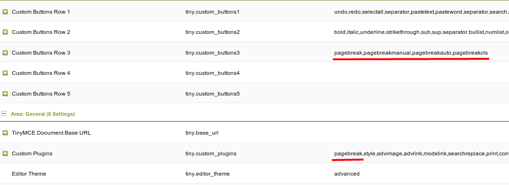
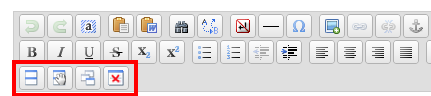

## Description

PageBreaker is a plugin, than allows you to show big texts splitted to pages.
It is searching for special string in text (**<!- splitter ->**) and splitting text on it. Also included pagination and friendly urls for pages of text.

You can manually enter splitters in text or use plugin for TinyMCE for it (see below).

Splitted page must be not cacheable. Otherwise you will see the same text on changing pages.

### Requirements

- MODX Revolution 2.1 or later
- PHP5 or later

### Homepage and Demo

<http://bezumkin.ru/modx/pagebreaker/>

### Download

It can be downloaded from within the MODX Revolution manager via [Package Management](developing-in-modx/advanced-development/package-management "Package Management"), or from the MODX Extras Repository, here: <http://modx.com/extras/package/pagebreaker>

## Usage

By default you need only to set splitters in the content of resource and disable its caching. Then plugin will do everything himself.

PageBreaker currently comes with one Plugin:

- [PageBreaker](extras/pagebreaker/pagebreaker.pagebreaker "PageBreaker.PageBreaker")

And two Chunks:

- [tpl.PageBreaker.navigation](extras/pagebreaker/tpl.pagebreaker.navigation "tpl.PageBreaker.navigation") - here is the english version of this chunk.
- [tpl.PageBreaker.ajax](extras/pagebreaker/tpl.pagebreaker.ajax "tpl.PageBreaker.ajax") - this is need only if you will enable changing pages trought ajax.

## Integration with TinyMCE

When you installed pagebreaker, it is overwrite built-in TinyMCE plugin [pagebreak](http://www.tinymce.com/wiki.php/Plugin:pagebreak).



You need to enable this plugin and additional buttons in in system settings.
Go to **System** -> **System Settings**, switch filter of namespaces to **timymce** and enter to **Custom Buttons Row 3**

``` php
pagebreak,pagebreakmanual,pagebreakauto,pagebreakcls
```

Then add in **Custom Plugins**

``` php
pagebreak
```



Now we have 4 new additional buttons in TinyMCE:
If you have only one button - you just need to reinstall Pagebreaker. It happends when you install TinyMCE **after** Pagebreaker.

What is this buttons?

On left to right:

- Split page on current place of cursor
- Enter number of symbols and split text automaticly.
- Automaticly split text for every 2000 symbols.
- Remove all splitters on the page.

After uninstalling PageBreaker you need to reinstall TinyMCE, because plugin pagebreak will be deleted and TinyMCE may be damaged.

## See Also

1. [PageBreaker.PageBreaker](extras/pagebreaker/pagebreaker.pagebreaker)
2. [tpl.PageBreaker.ajax](extras/pagebreaker/tpl.pagebreaker.ajax)
3. [tpl.PageBreaker.navigation](extras/pagebreaker/tpl.pagebreaker.navigation)
